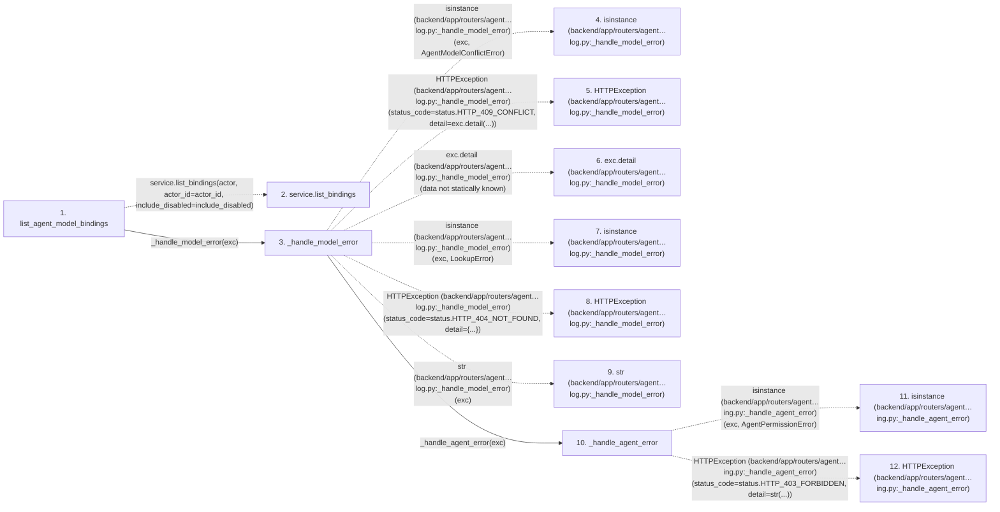

# list_agent_model_bindings

**Entry point:** `list_agent_model_bindings` (`http`)
**Source:** [agent_catalog](../modules/agent_catalog.md)
**Modules touched:** [agent_catalog](../modules/agent_catalog.md), [routers_agent_planning](../modules/routers_agent_planning.md)

## Call sequence

```mermaid
sequenceDiagram
    participant p0 as list_agent_model_bindings
    participant p1 as service.list_bindings
    participant p2 as _handle_model_error
    participant p3 as isinstance (backend/app/routers/agent…log.py:_handle_model_error)
    participant p4 as HTTPException (backend/app/routers/agent…log.py:_handle_model_error)
    participant p5 as exc.detail (backend/app/routers/agent…log.py:_handle_model_error)
    participant p6 as str (backend/app/routers/agent…log.py:_handle_model_error)
    participant p7 as _handle_agent_error
    participant p8 as isinstance (backend/app/routers/agent…ing.py:_handle_agent_error)
    participant p9 as HTTPException (backend/app/routers/agent…ing.py:_handle_agent_error)
    participant p10 as str (backend/app/routers/agent…ing.py:_handle_agent_error)
    participant p11 as exc.detail (backend/app/routers/agent…ing.py:_handle_agent_error)
    p0-->>p1: service.list_bindings
    p0->>p2: _handle_model_error
    p2-->>p3: isinstance (backend/app/routers/agent…log.py:_handle_model_error)
    p2-->>p4: HTTPException (backend/app/routers/agent…log.py:_handle_model_error)
    p2-->>p5: exc.detail (backend/app/routers/agent…log.py:_handle_model_error)
    p2-->>p3: isinstance (backend/app/routers/agent…log.py:_handle_model_error)
    p2-->>p4: HTTPException (backend/app/routers/agent…log.py:_handle_model_error)
    p2-->>p6: str (backend/app/routers/agent…log.py:_handle_model_error)
    p2->>p7: _handle_agent_error
    p7-->>p8: isinstance (backend/app/routers/agent…ing.py:_handle_agent_error)
    p7-->>p9: HTTPException (backend/app/routers/agent…ing.py:_handle_agent_error)
    p7-->>p10: str (backend/app/routers/agent…ing.py:_handle_agent_error)
    p7-->>p8: isinstance (backend/app/routers/agent…ing.py:_handle_agent_error)
    p7-->>p9: HTTPException (backend/app/routers/agent…ing.py:_handle_agent_error)
    p7-->>p11: exc.detail (backend/app/routers/agent…ing.py:_handle_agent_error)
    p7-->>p8: isinstance (backend/app/routers/agent…ing.py:_handle_agent_error)
    p7-->>p9: HTTPException (backend/app/routers/agent…ing.py:_handle_agent_error)
    p7-->>p11: exc.detail (backend/app/routers/agent…ing.py:_handle_agent_error)
    p7-->>p8: isinstance (backend/app/routers/agent…ing.py:_handle_agent_error)
    p7-->>p9: HTTPException (backend/app/routers/agent…ing.py:_handle_agent_error)
    p7-->>p10: str (backend/app/routers/agent…ing.py:_handle_agent_error)
    p7-->>p8: isinstance (backend/app/routers/agent…ing.py:_handle_agent_error)
    p7-->>p9: HTTPException (backend/app/routers/agent…ing.py:_handle_agent_error)
    p7-->>p10: str (backend/app/routers/agent…ing.py:_handle_agent_error)
    p7-->>p8: isinstance (backend/app/routers/agent…ing.py:_handle_agent_error)
    p7-->>p9: HTTPException (backend/app/routers/agent…ing.py:_handle_agent_error)
    p7-->>p10: str (backend/app/routers/agent…ing.py:_handle_agent_error)
    p7-->>p8: isinstance (backend/app/routers/agent…ing.py:_handle_agent_error)
    p7-->>p9: HTTPException (backend/app/routers/agent…ing.py:_handle_agent_error)
    p7-->>p10: str (backend/app/routers/agent…ing.py:_handle_agent_error)
```

<!-- Auto-generated from static call edges. Dashed arrows are external or unresolved calls. Reviewed runtime conditions and side effects belong in Behavior. -->

## Data flow

<!-- Auto-generated static analysis. Treat values and boundaries as best-effort hints, not runtime proof. -->

### Step data

| Step | Inputs | Reads | Writes | Returns |
|---|---|---|---|---|
| `list_agent_model_bindings` | `actor: Annotated[AgentActor, Depends(get_agent_actor)]`, `service: Annotated[AgentModelCatalogService, Depends(get_agent_model_catalog_service)]`, `actor_id: Annotated[int \| None, Query(ge=1)]`, `include_disabled: Annotated[bool, Query()]` | - | - | `...` |
| `service.list_bindings` | - | - | - | - |
| `_handle_model_error` | `exc: Exception` | `AgentModelConflictError`, `status`, `status` | - | - |
| `isinstance (backend/app/routers/agent…log.py:_handle_model_error)` | - | - | - | - |
| `HTTPException (backend/app/routers/agent…log.py:_handle_model_error)` | - | - | - | - |
| `exc.detail (backend/app/routers/agent…log.py:_handle_model_error)` | - | - | - | - |
| `isinstance (backend/app/routers/agent…log.py:_handle_model_error)` | - | - | - | - |
| `HTTPException (backend/app/routers/agent…log.py:_handle_model_error)` | - | - | - | - |
| `str (backend/app/routers/agent…log.py:_handle_model_error)` | - | - | - | - |
| `_handle_agent_error` | `exc: Exception` | `AgentPermissionError`, `status`, `AgentRoutingConflictError`, `status`, `TaskVersionConflictError`, `status`, `AgentConflictError`, `status` | - | - |
| `isinstance (backend/app/routers/agent…ing.py:_handle_agent_error)` | - | - | - | - |
| `HTTPException (backend/app/routers/agent…ing.py:_handle_agent_error)` | - | - | - | - |

### Call data

| From | To | Line | Call |
|---|---|---:|---|
| list_agent_model_bindings | service.list_bindings | 278 | `service.list_bindings(actor, actor_id=actor_id, include_disabled=include_disabled)` |
| list_agent_model_bindings | _handle_model_error | 284 | `_handle_model_error(exc)` |
| _handle_model_error | isinstance (backend/app/routers/agent…log.py:_handle_model_error) | 51 | `isinstance(exc, AgentModelConflictError)` |
| _handle_model_error | HTTPException (backend/app/routers/agent…log.py:_handle_model_error) | 52 | `HTTPException(status_code=status.HTTP_409_CONFLICT, detail=exc.detail(...))` |
| _handle_model_error | exc.detail (backend/app/routers/agent…log.py:_handle_model_error) | 54 | `exc.detail(data not statically known)` |
| _handle_model_error | isinstance (backend/app/routers/agent…log.py:_handle_model_error) | 56 | `isinstance(exc, LookupError)` |
| _handle_model_error | HTTPException (backend/app/routers/agent…log.py:_handle_model_error) | 57 | `HTTPException(status_code=status.HTTP_404_NOT_FOUND, detail={...})` |
| _handle_model_error | str (backend/app/routers/agent…log.py:_handle_model_error) | 61 | `str(exc)` |
| _handle_model_error | _handle_agent_error | 64 | `_handle_agent_error(exc)` |
| _handle_agent_error | isinstance (backend/app/routers/agent…ing.py:_handle_agent_error) | 102 | `isinstance(exc, AgentPermissionError)` |
| _handle_agent_error | HTTPException (backend/app/routers/agent…ing.py:_handle_agent_error) | 103 | `HTTPException(status_code=status.HTTP_403_FORBIDDEN, detail=str(...))` |

### Boundary effects

*No boundary effects detected.*

### Static analysis gaps

| Kind | Step | Target | Line |
|---|---|---|---:|
| unresolved_call | `list_agent_model_bindings` | `service.list_bindings` | 278 |
| external_call | `_handle_model_error` | `isinstance` | 51 |
| external_call | `_handle_model_error` | `HTTPException` | 52 |
| unresolved_call | `_handle_model_error` | `exc.detail` | 54 |
| external_call | `_handle_model_error` | `isinstance` | 56 |
| external_call | `_handle_model_error` | `HTTPException` | 57 |
| external_call | `_handle_agent_error` | `isinstance` | 102 |
| external_call | `_handle_agent_error` | `HTTPException` | 103 |
| step_limit | `list_agent_model_bindings` | `first 12 steps` | 0 |

## Behavior

This flow starts at `list_agent_model_bindings` and is classified as `http`. The generated call and data-flow sections are bounded static projections; runtime conditions and side effects require source-level confirmation.
