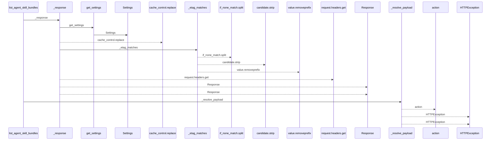
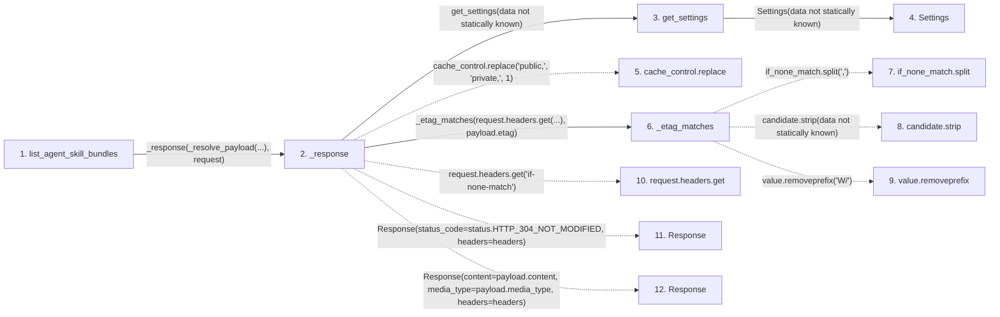

# list_agent_skill_bundles

**Entry point:** `list_agent_skill_bundles` (`http`)
**Source:** [agent_skill_bundles](../modules/agent_skill_bundles.md)
**Modules touched:** [agent_skill_bundles](../modules/agent_skill_bundles.md), [config](../modules/config.md)

## Call sequence

<!-- Auto-generated from static call edges. Dashed arrows are external or unresolved calls. Reviewed runtime conditions and side effects belong in Behavior. -->

## Data flow

<!-- Auto-generated static analysis. Treat values and boundaries as best-effort hints, not runtime proof. -->

### Step data

| Step | Inputs | Reads | Writes | Returns |
|---|---|---|---|---|
| `list_agent_skill_bundles` | `request: Request`, `service: Annotated[AgentSkillBundleService, Depends(get_agent_skill_bundle_service)]`, `_access: Annotated[None, Depends(require_agent_skill_bundle_access)]` | - | - | `_response(...)` |
| `_response` | `payload: SkillBundlePayload`, `request: Request` | `status` | `headers[...]` | `Response(...)`, `Response(...)` |
| `get_settings` | - | - | - | `Settings(...)` |
| `Settings` | - | - | - | - |
| `cache_control.replace` | - | - | - | - |
| `_etag_matches` | `if_none_match: str \| None`, `etag: str` | - | - | `False`, `True`, `False` |
| `if_none_match.split` | - | - | - | - |
| `candidate.strip` | - | - | - | - |
| `value.removeprefix` | - | - | - | - |
| `request.headers.get` | - | - | - | - |
| `Response` | - | - | - | - |
| `Response` | - | - | - | - |

### Call data

| From | To | Line | Call |
|---|---|---:|---|
| list_agent_skill_bundles | _response | 131 | `_response(_resolve_payload(...), request)` |
| _response | get_settings | 92 | `get_settings(data not statically known)` |
| get_settings | Settings | 479 | `Settings(data not statically known)` |
| _response | cache_control.replace | 93 | `cache_control.replace('public,', 'private,', 1)` |
| _response | _etag_matches | 102 | `_etag_matches(request.headers.get(...), payload.etag)` |
| _etag_matches | if_none_match.split | 83 | `if_none_match.split(',')` |
| _etag_matches | candidate.strip | 84 | `candidate.strip(data not statically known)` |
| _etag_matches | value.removeprefix | 85 | `value.removeprefix('W/')` |
| _response | request.headers.get | 102 | `request.headers.get('if-none-match')` |
| _response | Response | 103 | `Response(status_code=status.HTTP_304_NOT_MODIFIED, headers=headers)` |
| _response | Response | 104 | `Response(content=payload.content, media_type=payload.media_type, headers=headers)` |

### Boundary effects

*No boundary effects detected.*

### Static analysis gaps

| Kind | Step | Target | Line |
|---|---|---|---:|
| unresolved_call | `_response` | `cache_control.replace` | 93 |
| unresolved_call | `_etag_matches` | `if_none_match.split` | 83 |
| unresolved_call | `_etag_matches` | `candidate.strip` | 84 |
| unresolved_call | `_etag_matches` | `value.removeprefix` | 85 |
| unresolved_call | `_response` | `request.headers.get` | 102 |
| external_call | `_response` | `Response` | 103 |
| external_call | `_response` | `Response` | 104 |
| step_limit | `list_agent_skill_bundles` | `first 12 steps` | 0 |

## Behavior

This flow starts at `list_agent_skill_bundles` and is classified as `http`. The generated call and data-flow sections are bounded static projections; runtime conditions and side effects require source-level confirmation.
