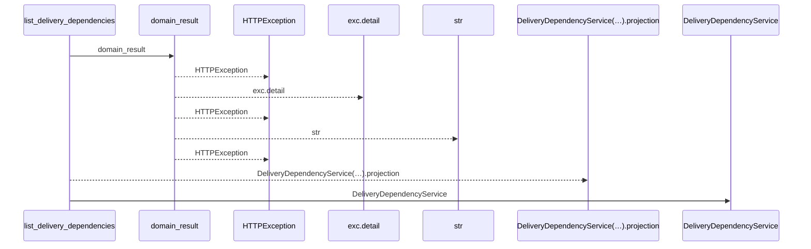
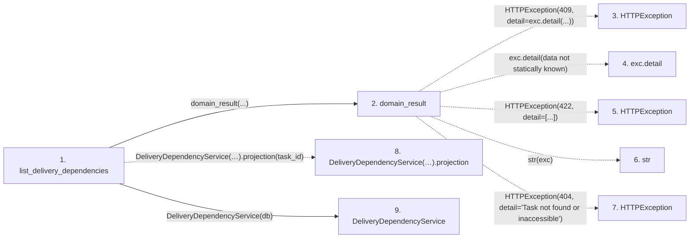

# list_delivery_dependencies

**Entry point:** `list_delivery_dependencies` (`http`)
**Source:** [delivery_dependencies](../modules/delivery_dependencies.md)
**Modules touched:** [delivery_dependencies](../modules/delivery_dependencies.md), [delivery_dependency_service](../modules/delivery_dependency_service.md), [routers_task_domain](../modules/routers_task_domain.md)

## Call sequence

<!-- Auto-generated from static call edges. Dashed arrows are external or unresolved calls. Reviewed runtime conditions and side effects belong in Behavior. -->

## Data flow

<!-- Auto-generated static analysis. Treat values and boundaries as best-effort hints, not runtime proof. -->

### Step data

| Step | Inputs | Reads | Writes | Returns |
|---|---|---|---|---|
| `list_delivery_dependencies` | `task_id: int`, `db: DeliveryDatabase` | - | - | `...` |
| `domain_result` | `awaitable` | `TaskVersionConflictError` | - | `result` |
| `HTTPException` | - | - | - | - |
| `exc.detail` | - | - | - | - |
| `HTTPException` | - | - | - | - |
| `str` | - | - | - | - |
| `HTTPException` | - | - | - | - |
| `DeliveryDependencyService(…).projection` | - | - | - | - |
| `DeliveryDependencyService` | - | - | - | - |

### Call data

| From | To | Line | Call |
|---|---|---:|---|
| list_delivery_dependencies | domain_result | 25 | `domain_result(...)` |
| domain_result | HTTPException | 29 | `HTTPException(409, detail=exc.detail(...))` |
| domain_result | exc.detail | 29 | `exc.detail(data not statically known)` |
| domain_result | HTTPException | 31 | `HTTPException(422, detail=[...])` |
| domain_result | str | 31 | `str(exc)` |
| domain_result | HTTPException | 33 | `HTTPException(404, detail='Task not found or inaccessible')` |
| list_delivery_dependencies | DeliveryDependencyService(…).projection | 25 | `DeliveryDependencyService(db).projection(task_id)` |
| list_delivery_dependencies | DeliveryDependencyService | 25 | `DeliveryDependencyService(db)` |

### Boundary effects

*No boundary effects detected.*

### Static analysis gaps

| Kind | Step | Target | Line |
|---|---|---|---:|
| external_call | `domain_result` | `HTTPException` | 29 |
| unresolved_call | `domain_result` | `exc.detail` | 29 |
| external_call | `domain_result` | `HTTPException` | 31 |
| external_call | `domain_result` | `HTTPException` | 33 |
| unresolved_call | `list_delivery_dependencies` | `DeliveryDependencyService(db).projection` | 25 |

## Behavior

Shows current delivery readiness for an authorized task. A target must have current attributed acceptance; hidden or missing targets expose a generic unavailable blocker without target identity or status.
