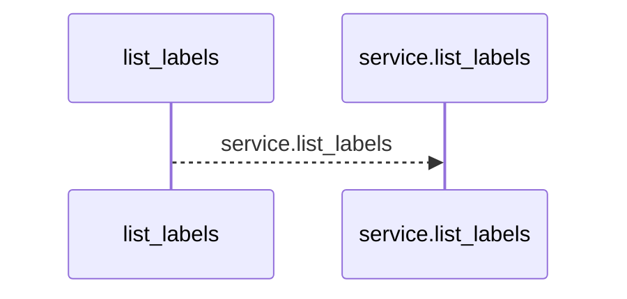
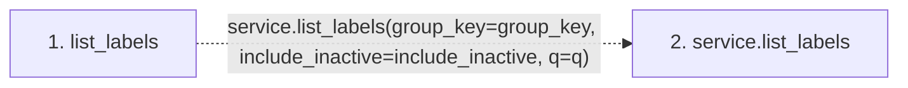

# list_labels

**Entry point:** `list_labels` (`http`)
**Source:** [labels](../modules/labels.md)
**Modules touched:** [labels](../modules/labels.md)

## Call sequence

<!-- Auto-generated from static call edges. Dashed arrows are external or unresolved calls. Reviewed runtime conditions and side effects belong in Behavior. -->

## Data flow

<!-- Auto-generated static analysis. Treat values and boundaries as best-effort hints, not runtime proof. -->

### Step data

| Step | Inputs | Reads | Writes | Returns |
|---|---|---|---|---|
| `list_labels` | `service: Annotated[LabelService, Depends(get_label_service)]`, `group_key: Annotated[Optional[str], Query()]`, `include_inactive: bool`, `q: Annotated[Optional[str], Query()]` | - | - | `...` |
| `service.list_labels` | - | - | - | - |

### Call data

| From | To | Line | Call |
|---|---|---:|---|
| list_labels | service.list_labels | 83 | `service.list_labels(group_key=group_key, include_inactive=include_inactive, q=q)` |

### Boundary effects

*No boundary effects detected.*

### Static analysis gaps

| Kind | Step | Target | Line |
|---|---|---|---:|
| unresolved_call | `list_labels` | `service.list_labels` | 83 |

## Behavior

This flow starts at `list_labels` and is classified as `http`. The generated call and data-flow sections are bounded static projections; runtime conditions and side effects require source-level confirmation.
