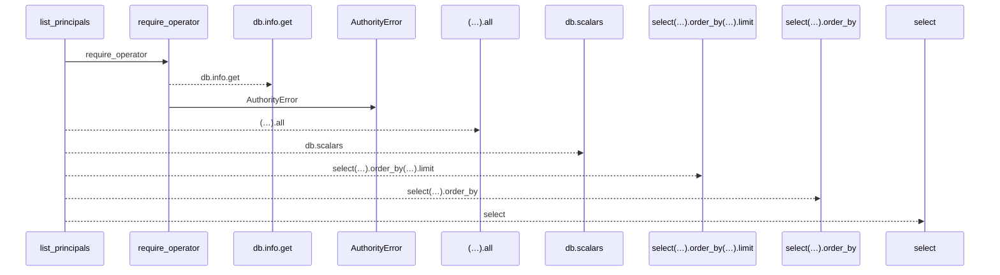
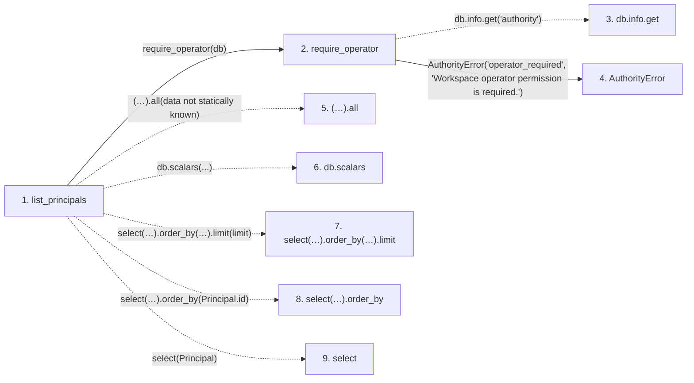

# list_principals

**Entry point:** `list_principals` (`http`)
**Source:** [routers_identity](../modules/routers_identity.md)
**Modules touched:** [authority](../modules/authority.md), [routers_identity](../modules/routers_identity.md)

## Call sequence

<!-- Auto-generated from static call edges. Dashed arrows are external or unresolved calls. Reviewed runtime conditions and side effects belong in Behavior. -->

## Data flow

<!-- Auto-generated static analysis. Treat values and boundaries as best-effort hints, not runtime proof. -->

### Step data

| Step | Inputs | Reads | Writes | Returns |
|---|---|---|---|---|
| `list_principals` | `db: Database`, `limit: int` | - | - | `...` |
| `require_operator` | `db` | - | - | - |
| `db.info.get` | - | - | - | - |
| `AuthorityError` | - | - | - | - |
| `(…).all` | - | - | - | - |
| `db.scalars` | - | - | - | - |
| `select(…).order_by(…).limit` | - | - | - | - |
| `select(…).order_by` | - | - | - | - |
| `select` | - | - | - | - |

### Call data

| From | To | Line | Call |
|---|---|---:|---|
| list_principals | require_operator | 201 | `require_operator(db)` |
| require_operator | db.info.get | 79 | `db.info.get('authority')` |
| require_operator | AuthorityError | 81 | `AuthorityError('operator_required', 'Workspace operator permission is required.')` |
| list_principals | (…).all | 202 | `(await db.scalars(select(Principal).order_by(Principal.id).limit(limit))).all(data not statically known)` |
| list_principals | db.scalars | 202 | `db.scalars(...)` |
| list_principals | select(…).order_by(…).limit | 202 | `select(Principal).order_by(Principal.id).limit(limit)` |
| list_principals | select(…).order_by | 202 | `select(Principal).order_by(Principal.id)` |
| list_principals | select | 202 | `select(Principal)` |

### Boundary effects

*No boundary effects detected.*

### Static analysis gaps

| Kind | Step | Target | Line |
|---|---|---|---:|
| unresolved_call | `require_operator` | `db.info.get` | 79 |
| unresolved_call | `list_principals` | `(await db.scalars(select(Principal).order_by(Principal.id).limit(limit))).all` | 202 |
| unresolved_call | `list_principals` | `db.scalars` | 202 |
| unresolved_call | `list_principals` | `select(Principal).order_by(Principal.id).limit` | 202 |
| unresolved_call | `list_principals` | `select(Principal).order_by` | 202 |
| external_call | `list_principals` | `select` | 202 |

## Behavior

This flow starts at `list_principals` and is classified as `http`. The generated call and data-flow sections are bounded static projections; runtime conditions and side effects require source-level confirmation.
