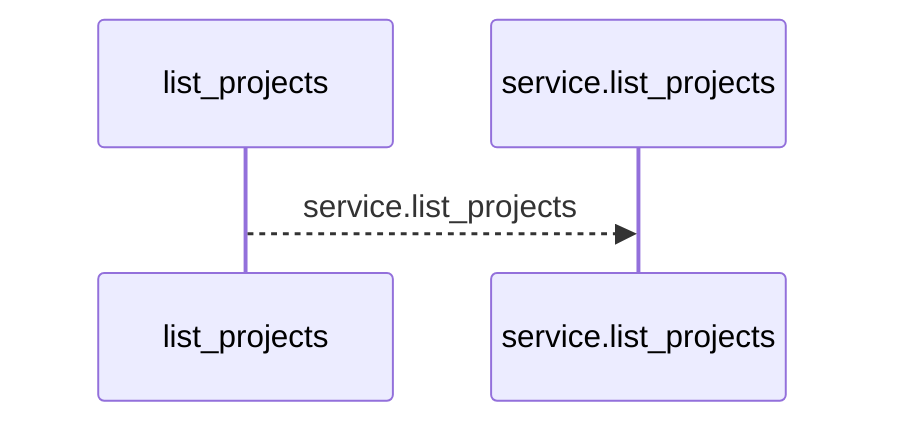
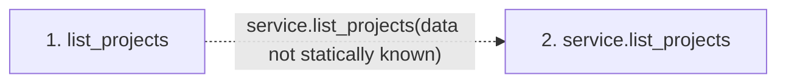

# list_projects

**Entry point:** `list_projects` (`http`)
**Source:** [projects](../modules/projects.md)
**Modules touched:** [projects](../modules/projects.md)

## Call sequence

<!-- Auto-generated from static call edges. Dashed arrows are external or unresolved calls. Reviewed runtime conditions and side effects belong in Behavior. -->

## Data flow

<!-- Auto-generated static analysis. Treat values and boundaries as best-effort hints, not runtime proof. -->

### Step data

| Step | Inputs | Reads | Writes | Returns |
|---|---|---|---|---|
| `list_projects` | `service: Annotated[ProjectService, Depends(get_project_service)]` | - | - | `...` |
| `service.list_projects` | - | - | - | - |

### Call data

| From | To | Line | Call |
|---|---|---:|---|
| list_projects | service.list_projects | 106 | `service.list_projects(data not statically known)` |

### Boundary effects

*No boundary effects detected.*

### Static analysis gaps

| Kind | Step | Target | Line |
|---|---|---|---:|
| unresolved_call | `list_projects` | `service.list_projects` | 106 |

## Behavior

This flow starts at `list_projects` and is classified as `http`. The generated call and data-flow sections are bounded static projections; runtime conditions and side effects require source-level confirmation.
