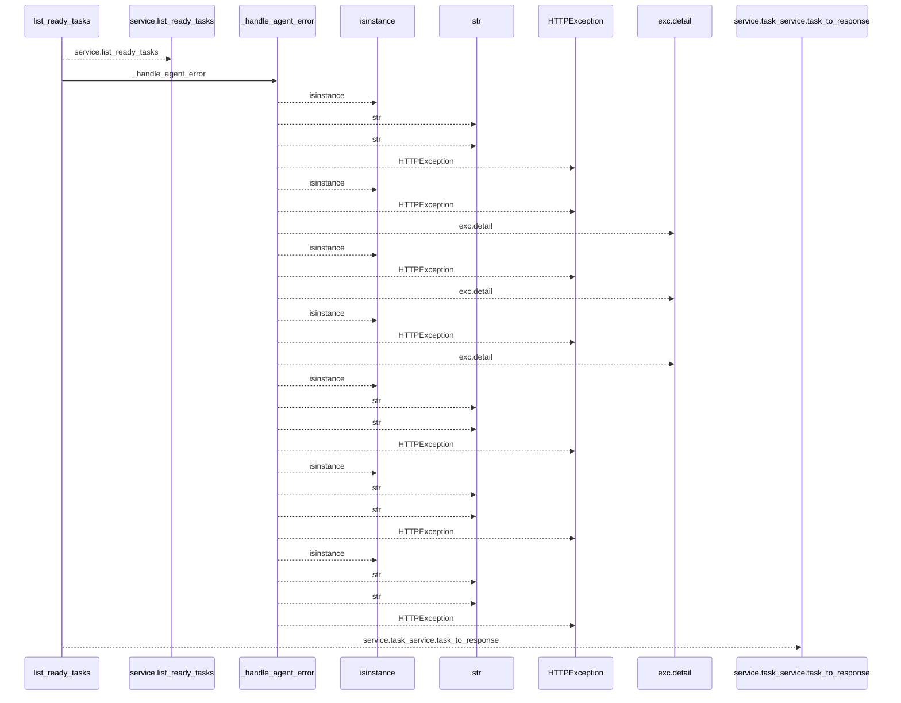
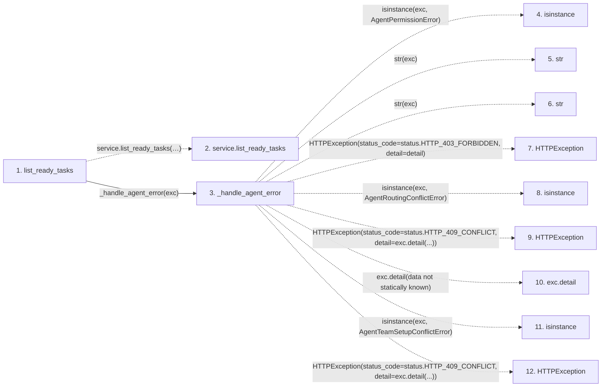

# list_ready_tasks

**Entry point:** `list_ready_tasks` (`http`)
**Source:** [routers_agent](../modules/routers_agent.md)
**Modules touched:** [routers_agent](../modules/routers_agent.md)

## Call sequence

<!-- Auto-generated from static call edges. Dashed arrows are external or unresolved calls. Reviewed runtime conditions and side effects belong in Behavior. -->

## Data flow

<!-- Auto-generated static analysis. Treat values and boundaries as best-effort hints, not runtime proof. -->

### Step data

| Step | Inputs | Reads | Writes | Returns |
|---|---|---|---|---|
| `list_ready_tasks` | `actor: Annotated[AgentActor, Depends(get_agent_actor)]`, `service: Annotated[AgentService, Depends(get_agent_service)]`, `iteration_id: Optional[int]`, `tags: Annotated[Optional[list[str]], Query()]`, `priority_min: Optional[int]`, `priority_max: Optional[int]`, `assignee_id: Optional[int]`, `capabilities: Annotated[Optional[list[str]], Query()]` | - | - | `...` |
| `service.list_ready_tasks` | - | - | - | - |
| `_handle_agent_error` | `exc: Exception`, `structured: bool` | `AgentPermissionError`, `status`, `AgentRoutingConflictError`, `status`, `AgentTeamSetupConflictError`, `status`, `TaskVersionConflictError`, `status` | - | - |
| `isinstance` | - | - | - | - |
| `str` | - | - | - | - |
| `str` | - | - | - | - |
| `HTTPException` | - | - | - | - |
| `isinstance` | - | - | - | - |
| `HTTPException` | - | - | - | - |
| `exc.detail` | - | - | - | - |
| `isinstance` | - | - | - | - |
| `HTTPException` | - | - | - | - |

### Call data

| From | To | Line | Call |
|---|---|---:|---|
| list_ready_tasks | service.list_ready_tasks | 755 | `service.list_ready_tasks(actor, iteration_id=iteration_id, tags=tags, priority_min=priority_min, priority_max=priority_max, assignee_id=assignee_id, capabilities=capabilities, limit=limit)` |
| list_ready_tasks | _handle_agent_error | 766 | `_handle_agent_error(exc)` |
| _handle_agent_error | isinstance | 254 | `isinstance(exc, AgentPermissionError)` |
| _handle_agent_error | str | 256 | `str(exc)` |
| _handle_agent_error | str | 258 | `str(exc)` |
| _handle_agent_error | HTTPException | 260 | `HTTPException(status_code=status.HTTP_403_FORBIDDEN, detail=detail)` |
| _handle_agent_error | isinstance | 261 | `isinstance(exc, AgentRoutingConflictError)` |
| _handle_agent_error | HTTPException | 262 | `HTTPException(status_code=status.HTTP_409_CONFLICT, detail=exc.detail(...))` |
| _handle_agent_error | exc.detail | 262 | `exc.detail(data not statically known)` |
| _handle_agent_error | isinstance | 263 | `isinstance(exc, AgentTeamSetupConflictError)` |
| _handle_agent_error | HTTPException | 264 | `HTTPException(status_code=status.HTTP_409_CONFLICT, detail=exc.detail(...))` |

### Boundary effects

*No boundary effects detected.*

### Static analysis gaps

| Kind | Step | Target | Line |
|---|---|---|---:|
| unresolved_call | `list_ready_tasks` | `service.list_ready_tasks` | 755 |
| external_call | `_handle_agent_error` | `isinstance` | 254 |
| external_call | `_handle_agent_error` | `HTTPException` | 260 |
| external_call | `_handle_agent_error` | `isinstance` | 261 |
| external_call | `_handle_agent_error` | `HTTPException` | 262 |
| unresolved_call | `_handle_agent_error` | `exc.detail` | 262 |
| external_call | `_handle_agent_error` | `isinstance` | 263 |
| external_call | `_handle_agent_error` | `HTTPException` | 264 |
| step_limit | `list_ready_tasks` | `first 12 steps` | 0 |

## Behavior

This flow starts at `list_ready_tasks` and is classified as `http`. The generated call and data-flow sections are bounded static projections; runtime conditions and side effects require source-level confirmation.
