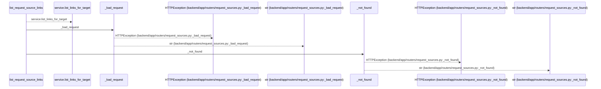
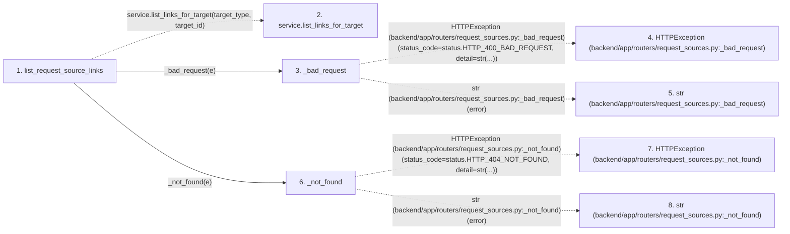

# list_request_source_links

**Entry point:** `list_request_source_links` (`http`)
**Source:** [request_sources](../modules/request_sources.md)
**Modules touched:** [request_sources](../modules/request_sources.md)

## Call sequence

<!-- Auto-generated from static call edges. Dashed arrows are external or unresolved calls. Reviewed runtime conditions and side effects belong in Behavior. -->

## Data flow

<!-- Auto-generated static analysis. Treat values and boundaries as best-effort hints, not runtime proof. -->

### Step data

| Step | Inputs | Reads | Writes | Returns |
|---|---|---|---|---|
| `list_request_source_links` | `service: Annotated[RequestSourceService, Depends(get_request_source_service)]`, `target_type: str`, `target_id: int` | `RequestSourceValidationError`, `RequestSourceTargetNotFoundError` | - | `...` |
| `service.list_links_for_target` | - | - | - | - |
| `_bad_request` | `error: Exception` | `status` | - | `HTTPException(...)` |
| `HTTPException (backend/app/routers/request_sources.py:_bad_request)` | - | - | - | - |
| `str (backend/app/routers/request_sources.py:_bad_request)` | - | - | - | - |
| `_not_found` | `error: Exception` | `status` | - | `HTTPException(...)` |
| `HTTPException (backend/app/routers/request_sources.py:_not_found)` | - | - | - | - |
| `str (backend/app/routers/request_sources.py:_not_found)` | - | - | - | - |

### Call data

| From | To | Line | Call |
|---|---|---:|---|
| list_request_source_links | service.list_links_for_target | 66 | `service.list_links_for_target(target_type, target_id)` |
| list_request_source_links | _bad_request | 68 | `_bad_request(e)` |
| _bad_request | HTTPException (backend/app/routers/request_sources.py:_bad_request) | 34 | `HTTPException(status_code=status.HTTP_400_BAD_REQUEST, detail=str(...))` |
| _bad_request | str (backend/app/routers/request_sources.py:_bad_request) | 34 | `str(error)` |
| list_request_source_links | _not_found | 70 | `_not_found(e)` |
| _not_found | HTTPException (backend/app/routers/request_sources.py:_not_found) | 38 | `HTTPException(status_code=status.HTTP_404_NOT_FOUND, detail=str(...))` |
| _not_found | str (backend/app/routers/request_sources.py:_not_found) | 38 | `str(error)` |

### Boundary effects

*No boundary effects detected.*

### Static analysis gaps

| Kind | Step | Target | Line |
|---|---|---|---:|
| unresolved_call | `list_request_source_links` | `service.list_links_for_target` | 66 |
| external_call | `_bad_request` | `HTTPException` | 34 |
| external_call | `_not_found` | `HTTPException` | 38 |

## Behavior

This flow starts at `list_request_source_links` and is classified as `http`. The generated call and data-flow sections are bounded static projections; runtime conditions and side effects require source-level confirmation.
