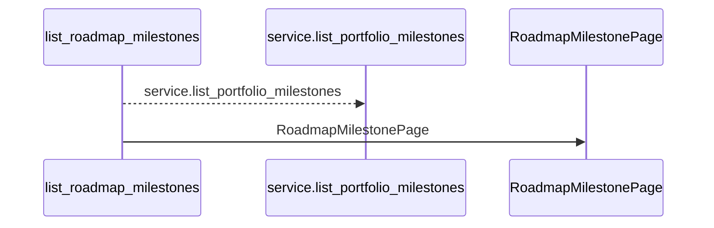
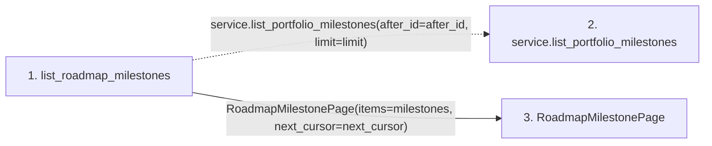

# list_roadmap_milestones

**Entry point:** `list_roadmap_milestones` (`http`)
**Source:** [projects](../modules/projects.md)
**Modules touched:** [projects](../modules/projects.md), [schemas_project](../modules/schemas_project.md)

## Call sequence

<!-- Auto-generated from static call edges. Dashed arrows are external or unresolved calls. Reviewed runtime conditions and side effects belong in Behavior. -->

## Data flow

<!-- Auto-generated static analysis. Treat values and boundaries as best-effort hints, not runtime proof. -->

### Step data

| Step | Inputs | Reads | Writes | Returns |
|---|---|---|---|---|
| `list_roadmap_milestones` | `service: Annotated[ProjectService, Depends(get_project_service)]`, `after_id: Annotated[int \| None, Query(ge=0)]`, `limit: Annotated[int, Query(ge=1, le=MAX_BOUNDED_LIST_ITEMS)]` | - | - | `RoadmapMilestonePage(...)` |
| `service.list_portfolio_milestones` | - | - | - | - |
| `RoadmapMilestonePage` | - | - | - | - |

### Call data

| From | To | Line | Call |
|---|---|---:|---|
| list_roadmap_milestones | service.list_portfolio_milestones | 112 | `service.list_portfolio_milestones(after_id=after_id, limit=limit)` |
| list_roadmap_milestones | RoadmapMilestonePage | 116 | `RoadmapMilestonePage(items=milestones, next_cursor=next_cursor)` |

### Boundary effects

*No boundary effects detected.*

### Static analysis gaps

| Kind | Step | Target | Line |
|---|---|---|---:|
| unresolved_call | `list_roadmap_milestones` | `service.list_portfolio_milestones` | 112 |

## Behavior

This flow starts at `list_roadmap_milestones` and is classified as `http`. The generated call and data-flow sections are bounded static projections; runtime conditions and side effects require source-level confirmation.
