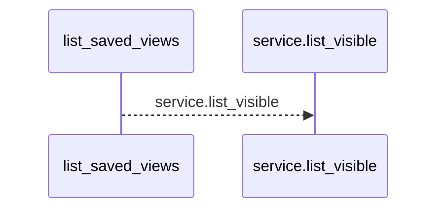
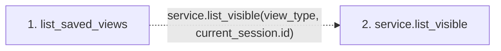

# list_saved_views

**Entry point:** `list_saved_views` (`http`)
**Source:** [saved_views](../modules/saved_views.md)
**Modules touched:** [saved_views](../modules/saved_views.md)

## Call sequence

<!-- Auto-generated from static call edges. Dashed arrows are external or unresolved calls. Reviewed runtime conditions and side effects belong in Behavior. -->

## Data flow

<!-- Auto-generated static analysis. Treat values and boundaries as best-effort hints, not runtime proof. -->

### Step data

| Step | Inputs | Reads | Writes | Returns |
|---|---|---|---|---|
| `list_saved_views` | `service: Annotated[SavedViewService, Depends(get_saved_view_service)]`, `current_session: Annotated[UserSession, Depends(session_service.get_current_session)]`, `view_type: Annotated[SavedViewType, Query()]` | - | - | `...` |
| `service.list_visible` | - | - | - | - |

### Call data

| From | To | Line | Call |
|---|---|---:|---|
| list_saved_views | service.list_visible | 60 | `service.list_visible(view_type, current_session.id)` |

### Boundary effects

*No boundary effects detected.*

### Static analysis gaps

| Kind | Step | Target | Line |
|---|---|---|---:|
| unresolved_call | `list_saved_views` | `service.list_visible` | 60 |

## Behavior

This flow starts at `list_saved_views` and is classified as `http`. The generated call and data-flow sections are bounded static projections; runtime conditions and side effects require source-level confirmation.
