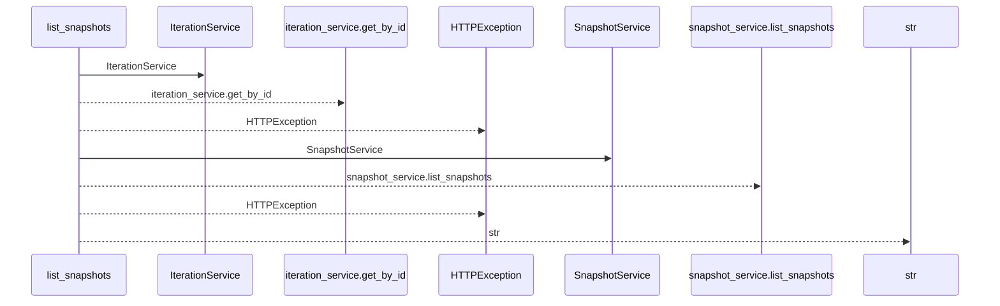
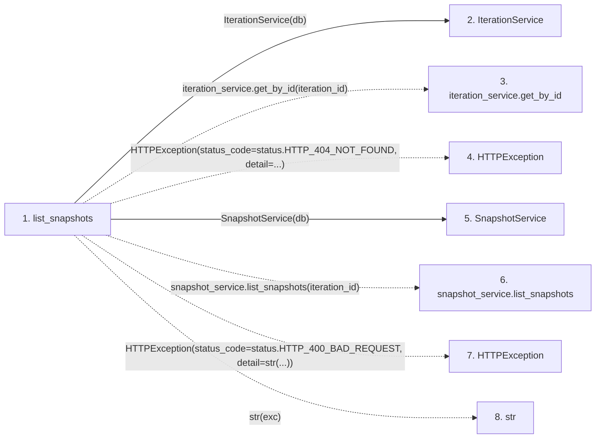

# list_snapshots

**Entry point:** `list_snapshots` (`http`)
**Source:** [snapshots](../modules/snapshots.md)
**Modules touched:** [iteration_service](../modules/iteration_service.md), [snapshot_service](../modules/snapshot_service.md), [snapshots](../modules/snapshots.md)

## Call sequence

<!-- Auto-generated from static call edges. Dashed arrows are external or unresolved calls. Reviewed runtime conditions and side effects belong in Behavior. -->

## Data flow

<!-- Auto-generated static analysis. Treat values and boundaries as best-effort hints, not runtime proof. -->

### Step data

| Step | Inputs | Reads | Writes | Returns |
|---|---|---|---|---|
| `list_snapshots` | `iteration_id: int`, `db: Annotated[AsyncSession, Depends(get_db)]` | `status`, `SnapshotPathError`, `status` | - | `snapshot_service.list_snapshots(...)` |
| `IterationService` | - | - | - | - |
| `iteration_service.get_by_id` | - | - | - | - |
| `HTTPException` | - | - | - | - |
| `SnapshotService` | - | - | - | - |
| `snapshot_service.list_snapshots` | - | - | - | - |
| `HTTPException` | - | - | - | - |
| `str` | - | - | - | - |

### Call data

| From | To | Line | Call |
|---|---|---:|---|
| list_snapshots | IterationService | 188 | `IterationService(db)` |
| list_snapshots | iteration_service.get_by_id | 189 | `iteration_service.get_by_id(iteration_id)` |
| list_snapshots | HTTPException | 192 | `HTTPException(status_code=status.HTTP_404_NOT_FOUND, detail=...)` |
| list_snapshots | SnapshotService | 197 | `SnapshotService(db)` |
| list_snapshots | snapshot_service.list_snapshots | 199 | `snapshot_service.list_snapshots(iteration_id)` |
| list_snapshots | HTTPException | 201 | `HTTPException(status_code=status.HTTP_400_BAD_REQUEST, detail=str(...))` |
| list_snapshots | str | 201 | `str(exc)` |

### Boundary effects

*No boundary effects detected.*

### Static analysis gaps

| Kind | Step | Target | Line |
|---|---|---|---:|
| unresolved_call | `list_snapshots` | `iteration_service.get_by_id` | 189 |
| external_call | `list_snapshots` | `HTTPException` | 192 |
| unresolved_call | `list_snapshots` | `snapshot_service.list_snapshots` | 199 |
| external_call | `list_snapshots` | `HTTPException` | 201 |

## Behavior

This flow starts at `list_snapshots` and is classified as `http`. The generated call and data-flow sections are bounded static projections; runtime conditions and side effects require source-level confirmation.
