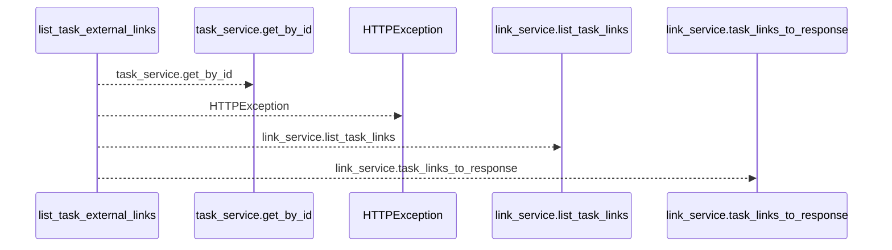
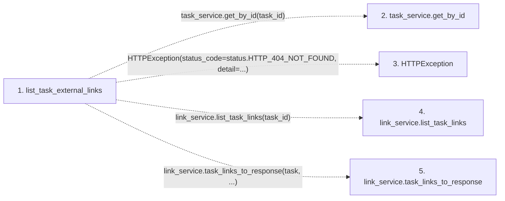

# list_task_external_links

**Entry point:** `list_task_external_links` (`http`)
**Source:** [tasks](../modules/tasks.md)
**Modules touched:** [tasks](../modules/tasks.md)

## Call sequence

<!-- Auto-generated from static call edges. Dashed arrows are external or unresolved calls. Reviewed runtime conditions and side effects belong in Behavior. -->

## Data flow

<!-- Auto-generated static analysis. Treat values and boundaries as best-effort hints, not runtime proof. -->

### Step data

| Step | Inputs | Reads | Writes | Returns |
|---|---|---|---|---|
| `list_task_external_links` | `task_id: int`, `task_service: Annotated[TaskService, Depends(get_task_service)]`, `link_service: Annotated[ExternalLinkService, Depends(get_external_link_service)]` | `status` | - | `link_service.task_links_to_response(...)` |
| `task_service.get_by_id` | - | - | - | - |
| `HTTPException` | - | - | - | - |
| `link_service.list_task_links` | - | - | - | - |
| `link_service.task_links_to_response` | - | - | - | - |

### Call data

| From | To | Line | Call |
|---|---|---:|---|
| list_task_external_links | task_service.get_by_id | 415 | `task_service.get_by_id(task_id)` |
| list_task_external_links | HTTPException | 417 | `HTTPException(status_code=status.HTTP_404_NOT_FOUND, detail=...)` |
| list_task_external_links | link_service.list_task_links | 422 | `link_service.list_task_links(task_id)` |
| list_task_external_links | link_service.task_links_to_response | 423 | `link_service.task_links_to_response(task, ...)` |

### Boundary effects

*No boundary effects detected.*

### Static analysis gaps

| Kind | Step | Target | Line |
|---|---|---|---:|
| unresolved_call | `list_task_external_links` | `task_service.get_by_id` | 415 |
| external_call | `list_task_external_links` | `HTTPException` | 417 |
| unresolved_call | `list_task_external_links` | `link_service.list_task_links` | 422 |
| unresolved_call | `list_task_external_links` | `link_service.task_links_to_response` | 423 |

## Behavior

This flow starts at `list_task_external_links` and is classified as `http`. The generated call and data-flow sections are bounded static projections; runtime conditions and side effects require source-level confirmation.
