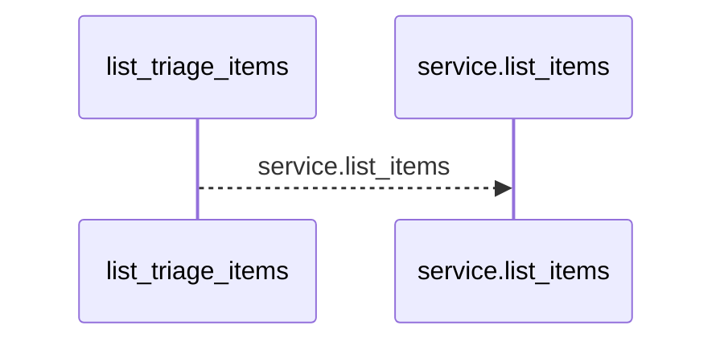
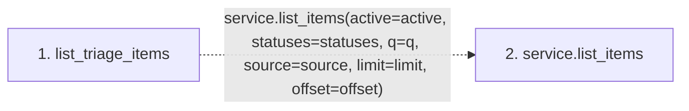

# list_triage_items

**Entry point:** `list_triage_items` (`http`)
**Source:** [routers_triage](../modules/routers_triage.md)
**Modules touched:** [routers_triage](../modules/routers_triage.md)

## Call sequence

<!-- Auto-generated from static call edges. Dashed arrows are external or unresolved calls. Reviewed runtime conditions and side effects belong in Behavior. -->

## Data flow

<!-- Auto-generated static analysis. Treat values and boundaries as best-effort hints, not runtime proof. -->

### Step data

| Step | Inputs | Reads | Writes | Returns |
|---|---|---|---|---|
| `list_triage_items` | `service: Annotated[TriageService, Depends(get_triage_service)]`, `active: Annotated[Optional[bool], Query()]`, `statuses: Annotated[Optional[list[TriageItemStatus]], Query(alias='status')]`, `q: Optional[str]`, `source: Optional[str]`, `limit: int`, `offset: int` | - | - | `...` |
| `service.list_items` | - | - | - | - |

### Call data

| From | To | Line | Call |
|---|---|---:|---|
| list_triage_items | service.list_items | 88 | `service.list_items(active=active, statuses=statuses, q=q, source=source, limit=limit, offset=offset)` |

### Boundary effects

*No boundary effects detected.*

### Static analysis gaps

| Kind | Step | Target | Line |
|---|---|---|---:|
| unresolved_call | `list_triage_items` | `service.list_items` | 88 |

## Behavior

This flow starts at `list_triage_items` and is classified as `http`. The generated call and data-flow sections are bounded static projections; runtime conditions and side effects require source-level confirmation.
