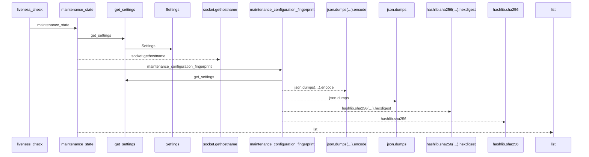
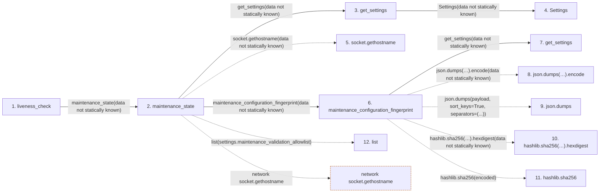

# liveness_check

**Entry point:** `liveness_check` (`http`)
**Source:** [app_main](../modules/app_main.md)
**Modules touched:** [app_main](../modules/app_main.md), [config](../modules/config.md), [maintenance](../modules/maintenance.md)

## Call sequence

<!-- Auto-generated from static call edges. Dashed arrows are external or unresolved calls. Reviewed runtime conditions and side effects belong in Behavior. -->

## Data flow

<!-- Auto-generated static analysis. Treat values and boundaries as best-effort hints, not runtime proof. -->

### Step data

| Step | Inputs | Reads | Writes | Returns |
|---|---|---|---|---|
| `liveness_check` | - | - | - | `{...}` |
| `maintenance_state` | - | - | - | `{...}` |
| `get_settings` | - | - | - | `Settings(...)` |
| `Settings` | - | - | - | - |
| `socket.gethostname` | - | - | - | - |
| `maintenance_configuration_fingerprint` | - | - | - | `...` |
| `get_settings` | - | - | - | `Settings(...)` |
| `json.dumps(…).encode` | - | - | - | - |
| `json.dumps` | - | - | - | - |
| `hashlib.sha256(…).hexdigest` | - | - | - | - |
| `hashlib.sha256` | - | - | - | - |
| `list` | - | - | - | - |

### Call data

| From | To | Line | Call |
|---|---|---:|---|
| liveness_check | maintenance_state | 242 | `maintenance_state(data not statically known)` |
| maintenance_state | get_settings | 57 | `get_settings(data not statically known)` |
| get_settings | Settings | 479 | `Settings(data not statically known)` |
| maintenance_state | socket.gethostname | 59 | `socket.gethostname(data not statically known)` |
| maintenance_state | maintenance_configuration_fingerprint | 68 | `maintenance_configuration_fingerprint(data not statically known)` |
| maintenance_configuration_fingerprint | get_settings | 46 | `get_settings(data not statically known)` |
| maintenance_configuration_fingerprint | json.dumps(…).encode | 52 | `json.dumps(payload, sort_keys=True, separators=(',', ':')).encode(data not statically known)` |
| maintenance_configuration_fingerprint | json.dumps | 52 | `json.dumps(payload, sort_keys=True, separators=(...))` |
| maintenance_configuration_fingerprint | hashlib.sha256(…).hexdigest | 53 | `hashlib.sha256(encoded).hexdigest(data not statically known)` |
| maintenance_configuration_fingerprint | hashlib.sha256 | 53 | `hashlib.sha256(encoded)` |
| maintenance_state | list | 69 | `list(settings.maintenance_validation_allowlist)` |

### Boundary effects

| Kind | Target | Step | Line |
|---|---|---|---:|
| network | `socket.gethostname` | `maintenance_state` | 59 |

### Static analysis gaps

| Kind | Step | Target | Line |
|---|---|---|---:|
| unresolved_call | `maintenance_configuration_fingerprint` | `json.dumps(payload, sort_keys=True, separators=(',', ':')).encode` | 52 |
| external_call | `maintenance_configuration_fingerprint` | `json.dumps` | 52 |
| unresolved_call | `maintenance_configuration_fingerprint` | `hashlib.sha256(encoded).hexdigest` | 53 |
| external_call | `maintenance_configuration_fingerprint` | `hashlib.sha256` | 53 |

## Behavior

This flow starts at `liveness_check` and is classified as `http`. The generated call and data-flow sections are bounded static projections; runtime conditions and side effects require source-level confirmation.
