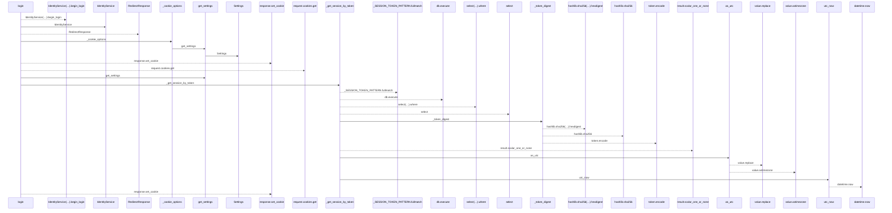
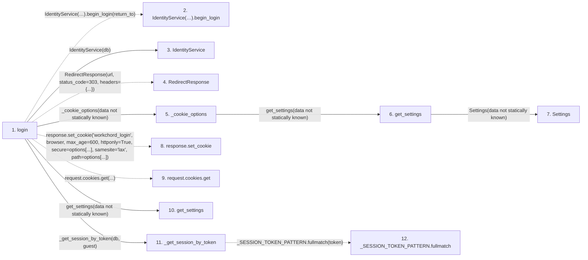

# login

**Entry point:** `login` (`http`)
**Source:** [routers_identity](../modules/routers_identity.md)
**Modules touched:** [config](../modules/config.md), [identity_service](../modules/identity_service.md), [routers_identity](../modules/routers_identity.md), [session_service](../modules/session_service.md), [time](../modules/time.md)

## Call sequence

<!-- Auto-generated from static call edges. Dashed arrows are external or unresolved calls. Reviewed runtime conditions and side effects belong in Behavior. -->

## Data flow

<!-- Auto-generated static analysis. Treat values and boundaries as best-effort hints, not runtime proof. -->

### Step data

| Step | Inputs | Reads | Writes | Returns |
|---|---|---|---|---|
| `login` | `request: Request`, `db: Database`, `return_to: str` | - | - | `response` |
| `IdentityService(…).begin_login` | - | - | - | - |
| `IdentityService` | - | - | - | - |
| `RedirectResponse` | - | - | - | - |
| `_cookie_options` | - | - | - | `{...}` |
| `get_settings` | - | - | - | `Settings(...)` |
| `Settings` | - | - | - | - |
| `response.set_cookie` | - | - | - | - |
| `request.cookies.get` | - | - | - | - |
| `get_settings` | - | - | - | `Settings(...)` |
| `_get_session_by_token` | `db: AsyncSession`, `token: str \| None` | `UserSession` | - | `None`, `None`, `None`, `session` |
| `_SESSION_TOKEN_PATTERN.fullmatch` | - | - | - | - |

### Call data

| From | To | Line | Call |
|---|---|---:|---|
| login | IdentityService(…).begin_login | 152 | `IdentityService(db).begin_login(return_to)` |
| login | IdentityService | 152 | `IdentityService(db)` |
| login | RedirectResponse | 153 | `RedirectResponse(url, status_code=303, headers={...})` |
| login | _cookie_options | 154 | `_cookie_options(data not statically known)` |
| _cookie_options | get_settings | 37 | `get_settings(data not statically known)` |
| get_settings | Settings | 479 | `Settings(data not statically known)` |
| login | response.set_cookie | 155 | `response.set_cookie('workchord_login', browser, max_age=600, httponly=True, secure=options[...], samesite='lax', path=options[...])` |
| login | request.cookies.get | 156 | `request.cookies.get(...)` |
| login | get_settings | 156 | `get_settings(data not statically known)` |
| login | _get_session_by_token | 158 | `_get_session_by_token(db, guest)` |
| _get_session_by_token | _SESSION_TOKEN_PATTERN.fullmatch | 73 | `_SESSION_TOKEN_PATTERN.fullmatch(token)` |

### Boundary effects

*No boundary effects detected.*

### Static analysis gaps

| Kind | Step | Target | Line |
|---|---|---|---:|
| unresolved_call | `login` | `IdentityService(db).begin_login` | 152 |
| external_call | `login` | `RedirectResponse` | 153 |
| unresolved_call | `login` | `response.set_cookie` | 155 |
| unresolved_call | `login` | `request.cookies.get` | 156 |
| unresolved_call | `_get_session_by_token` | `_SESSION_TOKEN_PATTERN.fullmatch` | 73 |
| step_limit | `login` | `first 12 steps` | 0 |

## Behavior

This flow starts at `login` and is classified as `http`. The generated call and data-flow sections are bounded static projections; runtime conditions and side effects require source-level confirmation.

Starts trusted OIDC sign-in using browser state, nonce and PKCE. The response redirects to the configured provider and permits only a safe application return path.
