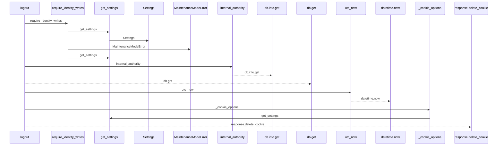
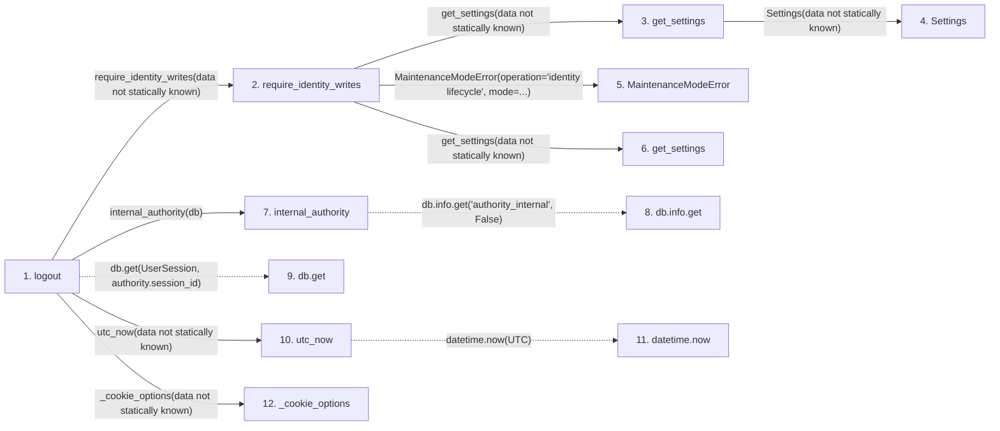

# logout

**Entry point:** `logout` (`http`)
**Source:** [routers_identity](../modules/routers_identity.md)
**Modules touched:** [authority](../modules/authority.md), [config](../modules/config.md), [identity_service](../modules/identity_service.md), [maintenance](../modules/maintenance.md), and 3 more

**Complete modules touched:**

- [authority](../modules/authority.md)
- [config](../modules/config.md)
- [identity_service](../modules/identity_service.md)
- [maintenance](../modules/maintenance.md)
- [routers_identity](../modules/routers_identity.md)
- [session_service](../modules/session_service.md)
- [time](../modules/time.md)

## Call sequence

<!-- Auto-generated from static call edges. Dashed arrows are external or unresolved calls. Reviewed runtime conditions and side effects belong in Behavior. -->

## Data flow

<!-- Auto-generated static analysis. Treat values and boundaries as best-effort hints, not runtime proof. -->

### Step data

| Step | Inputs | Reads | Writes | Returns |
|---|---|---|---|---|
| `logout` | `response: Response`, `db: Database` | `UserSession` | `session.revoked_at`, `session.csrf_token`, `response.headers[...]` | `{...}` |
| `require_identity_writes` | - | - | - | - |
| `get_settings` | - | - | - | `Settings(...)` |
| `Settings` | - | - | - | - |
| `MaintenanceModeError` | - | - | - | - |
| `get_settings` | - | - | - | `Settings(...)` |
| `internal_authority` | `db` | - | `db.info[...]`, `db.info[...]` | - |
| `db.info.get` | - | - | - | - |
| `db.get` | - | - | - | - |
| `utc_now` | - | `UTC` | - | `datetime.now(...)` |
| `datetime.now` | - | - | - | - |
| `_cookie_options` | - | - | - | `{...}` |

### Call data

| From | To | Line | Call |
|---|---|---:|---|
| logout | require_identity_writes | 326 | `require_identity_writes(data not statically known)` |
| require_identity_writes | get_settings | 31 | `get_settings(data not statically known)` |
| get_settings | Settings | 480 | `Settings(data not statically known)` |
| require_identity_writes | MaintenanceModeError | 32 | `MaintenanceModeError(operation='identity lifecycle', mode=...)` |
| require_identity_writes | get_settings | 32 | `get_settings(data not statically known)` |
| logout | internal_authority | 329 | `internal_authority(db)` |
| internal_authority | db.info.get | 87 | `db.info.get('authority_internal', False)` |
| logout | db.get | 330 | `db.get(UserSession, authority.session_id)` |
| logout | utc_now | 331 | `utc_now(data not statically known)` |
| utc_now | datetime.now | 13 | `datetime.now(UTC)` |
| logout | _cookie_options | 332 | `_cookie_options(data not statically known)` |

### Boundary effects

*No boundary effects detected.*

### Static analysis gaps

| Kind | Step | Target | Line |
|---|---|---|---:|
| unresolved_call | `internal_authority` | `db.info.get` | 87 |
| unresolved_call | `logout` | `db.get` | 330 |
| external_call | `utc_now` | `datetime.now` | 13 |
| step_limit | `logout` | `first 12 steps` | 0 |

## Behavior

This flow starts at `logout` and is classified as `http`. The generated call and data-flow sections are bounded static projections; runtime conditions and side effects require source-level confirmation.
