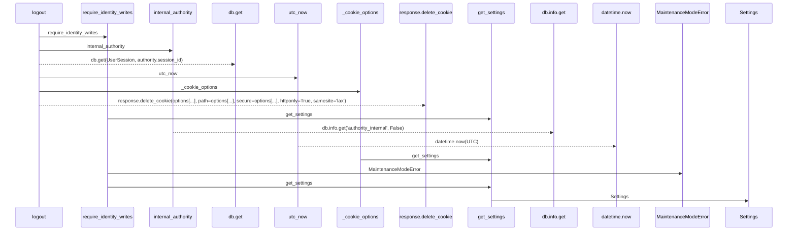
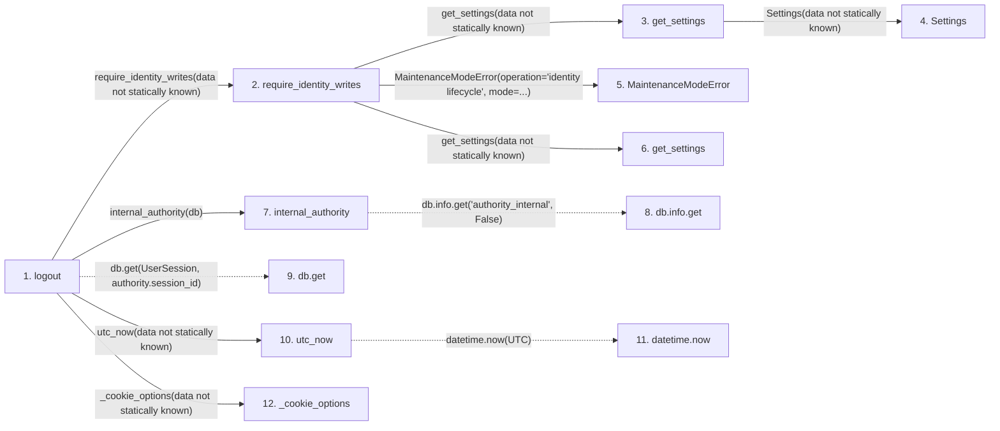

# logout

**Entry point:** `logout` (`http`)
**Source:** [routers_identity](../modules/routers_identity.md)
**Modules touched:** [authority](../modules/authority.md), [config](../modules/config.md), [identity_service](../modules/identity_service.md), [maintenance](../modules/maintenance.md), and 3 more

**Complete modules touched:**

- [authority](../modules/authority.md)
- [config](../modules/config.md)
- [identity_service](../modules/identity_service.md)
- [maintenance](../modules/maintenance.md)
- [routers_identity](../modules/routers_identity.md)
- [session_service](../modules/session_service.md)
- [time](../modules/time.md)

## Call sequence

> Static overview in presentation order, not runtime execution order. Arrows retain captured callers; representative internal continuations and boundary examples precede repeated helper detail.

<!-- Auto-generated from static call edges. Dashed arrows are external or unresolved calls. Reviewed runtime conditions and side effects belong in Behavior. -->

```mermaid
sequenceDiagram
    participant p0 as logout
    participant p1 as require_identity_writes
    participant p2 as internal_authority
    participant p3 as db.get
    participant p4 as utc_now
    participant p5 as _cookie_options
    participant p6 as response.delete_cookie
    participant p7 as get_settings
    participant p8 as db.info.get
    participant p9 as datetime.now
    participant p10 as MaintenanceModeError
    participant p11 as Settings
    p0->>p1: require_identity_writes
    p0->>p2: internal_authority
    p0-->>p3: db.get(UserSession, authority.session_id)
    p0->>p4: utc_now
    p0->>p5: _cookie_options
    p0-->>p6: response.delete_cookie(options[...], path=options[...], secure=options[...], httponly=True, samesite='lax')
    p1->>p7: get_settings
    p2-->>p8: db.info.get('authority_internal', False)
    p4-->>p9: datetime.now(UTC)
    p5->>p7: get_settings
    p1->>p10: MaintenanceModeError
    p1->>p7: get_settings
    p7->>p11: Settings
```

> Call sequence diagram shows 13 of 13 interactions; 0 omitted to keep the visualization within the 30-interaction and generated-diagram limits, with uncertain identities omitted rather than inferred.

> Captured boundary calls: external 1 of 1 (0 omitted); unresolved 3 of 3 (0 omitted). These counts cover the captured static trace.
> Detailed flow queries retain their own coverage and limits; omitted paths may execute at runtime.

## Data flow

<!-- Auto-generated static analysis. Treat values and boundaries as best-effort hints, not runtime proof. -->

### Analysis coverage

**Effect analysis partially available.** Flow assembly and source effect analysis are separate; empty observations do not prove an empty handler body.

Source steps: 10; effect analysis evaluated: 8, partial: 0, unavailable: 2. Counts include steps omitted from the displayed trace.

Collector observations for 8 source steps with known totals: observed: 16, emitted: 16, omitted: 0. Unavailable totals are excluded.

- Callable record unavailable for one or more source steps; those steps have no represented callable body.
- Effect collector totals unavailable; observed counts cover captured records only.

| Step | Callable record | Effect analysis | Collector totals | Observed | Emitted | Omitted |
|---|---|---|---|---:|---:|---:|
| `logout` | `available` | `evaluated` | `available` | `7` | `7` | `0` |
| `require_identity_writes` | `available` | `evaluated` | `available` | `0` | `0` | `0` |
| `get_settings` | `available` | `evaluated` | `available` | `1` | `1` | `0` |
| `Settings` | `unavailable` | `unavailable` | `unavailable` | — | — | — |
| `MaintenanceModeError` | `unavailable` | `unavailable` | `unavailable` | — | — | — |
| `get_settings` | `available` | `evaluated` | `available` | `1` | `1` | `0` |
| `internal_authority` | `available` | `evaluated` | `available` | `3` | `3` | `0` |
| `db.info.get` | `not_applicable` | `not_applicable` | `not_applicable` | — | — | — |
| `db.get` | `not_applicable` | `not_applicable` | `not_applicable` | — | — | — |
| `utc_now` | `available` | `evaluated` | `available` | `2` | `2` | `0` |
| `datetime.now` | `not_applicable` | `not_applicable` | `not_applicable` | — | — | — |
| `_cookie_options` | `available` | `evaluated` | `available` | `1` | `1` | `0` |

```mermaid
flowchart LR
    s1["1. logout"]
    s2["2. require_identity_writes"]
    s3["3. get_settings"]
    s4["4. Settings"]
    s5["5. MaintenanceModeError"]
    s6["6. get_settings"]
    s7["7. internal_authority"]
    s8["8. db.info.get"]
    s9["9. db.get"]
    s10["10. utc_now"]
    s11["11. datetime.now"]
    s12["12. _cookie_options"]
    s1 -->|"require_identity_writes(data not statically known)"| s2
    s2 -->|"get_settings(data not statically known)"| s3
    s3 -->|"Settings(data not statically known)"| s4
    s2 -->|"MaintenanceModeError(operation='identity lifecycle', mode=...)"| s5
    s2 -->|"get_settings(data not statically known)"| s6
    s1 -->|"internal_authority(db)"| s7
    s7 -. "db.info.get('authority_internal', False)" .-> s8
    s1 -. "db.get(UserSession, authority.session_id)" .-> s9
    s1 -->|"utc_now(data not statically known)"| s10
    s10 -. "datetime.now(UTC)" .-> s11
    s1 -->|"_cookie_options(data not statically known)"| s12
    click s1 "../modules/routers_identity.md"
    click s2 "../modules/identity_service.md"
    click s3 "../modules/config.md"
    click s4 "../modules/config.md"
    click s5 "../modules/maintenance.md"
    click s6 "../modules/config.md"
    click s7 "../modules/authority.md"
    click s10 "../modules/time.md"
    click s12 "../modules/session_service.md"
```

### Step data

| Step | Inputs | Reads | Writes | Returns |
|---|---|---|---|---|
| `logout` | `response: Response`, `db: Database` | `UserSession` | `session.revoked_at`, `session.csrf_token`, `response.headers[...]` | `{...}` |
| `require_identity_writes` | - | - | - | - |
| `get_settings` | - | - | - | `Settings(...)` |
| `Settings` | - | - | - | - |
| `MaintenanceModeError` | - | - | - | - |
| `get_settings` | - | - | - | `Settings(...)` |
| `internal_authority` | `db` | - | `db.info[...]`, `db.info[...]` | - |
| `db.info.get` | - | - | - | - |
| `db.get` | - | - | - | - |
| `utc_now` | - | `UTC` | - | `datetime.now(...)` |
| `datetime.now` | - | - | - | - |
| `_cookie_options` | - | - | - | `{...}` |

### Call data

| From | To | Line | Call |
|---|---|---:|---|
| logout | require_identity_writes | 326 | `require_identity_writes(data not statically known)` |
| require_identity_writes | get_settings | 31 | `get_settings(data not statically known)` |
| get_settings | Settings | 481 | `Settings(data not statically known)` |
| require_identity_writes | MaintenanceModeError | 32 | `MaintenanceModeError(operation='identity lifecycle', mode=...)` |
| require_identity_writes | get_settings | 32 | `get_settings(data not statically known)` |
| logout | internal_authority | 329 | `internal_authority(db)` |
| internal_authority | db.info.get | 87 | `db.info.get('authority_internal', False)` |
| logout | db.get | 330 | `db.get(UserSession, authority.session_id)` |
| logout | utc_now | 331 | `utc_now(data not statically known)` |
| utc_now | datetime.now | 13 | `datetime.now(UTC)` |
| logout | _cookie_options | 332 | `_cookie_options(data not statically known)` |

### Boundary effects

*No boundary-effect observations were captured in this static trace.*

### Static analysis gaps

| Kind | Step | Target | Line |
|---|---|---|---:|
| unresolved_call | `internal_authority` | `db.info.get` | 87 |
| unresolved_call | `logout` | `db.get` | 330 |
| external_call | `utc_now` | `datetime.now` | 13 |
| step_limit | `logout` | `first 12 steps` | 0 |

## Behavior

This flow starts at `logout` and is classified as `http`. The generated call and data-flow sections are bounded static projections; runtime conditions and side effects require source-level confirmation.
