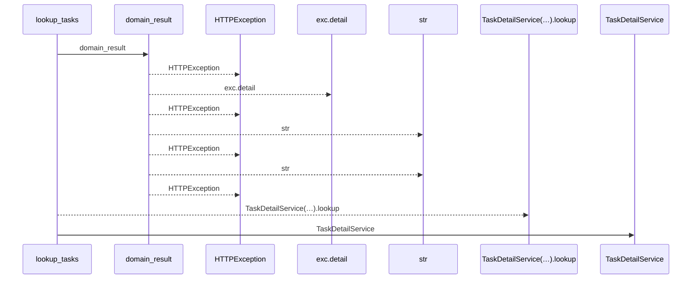
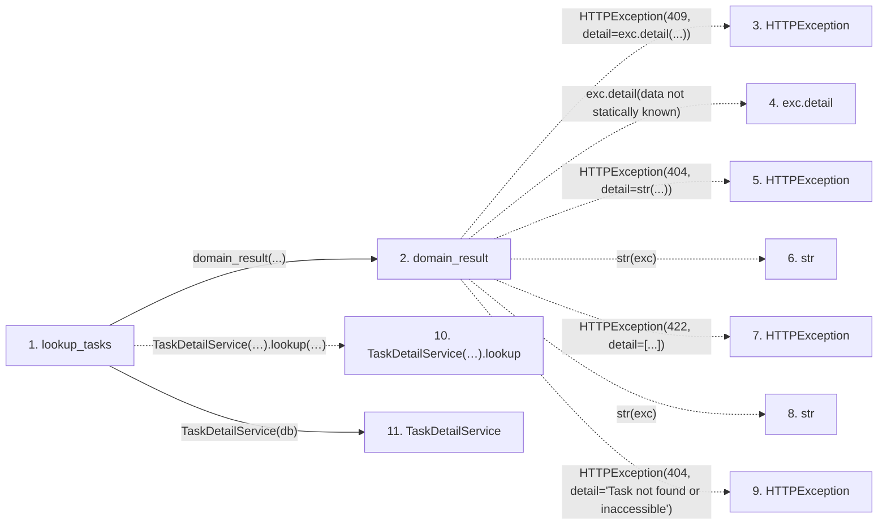

# lookup_tasks

**Entry point:** `lookup_tasks` (`http`)
**Source:** [routers_task_domain](../modules/routers_task_domain.md)
**Modules touched:** [routers_task_domain](../modules/routers_task_domain.md), [task_detail_service](../modules/task_detail_service.md)

## Call sequence

<!-- Auto-generated from static call edges. Dashed arrows are external or unresolved calls. Reviewed runtime conditions and side effects belong in Behavior. -->

## Data flow

<!-- Auto-generated static analysis. Treat values and boundaries as best-effort hints, not runtime proof. -->

### Step data

| Step | Inputs | Reads | Writes | Returns |
|---|---|---|---|---|
| `lookup_tasks` | `db: DB`, `project_id: int \| None`, `iteration_id: int \| None`, `q: str \| None`, `backlog_only: bool`, `limit: int`, `after_id: int`, `task_status: str \| None` | - | - | `...` |
| `domain_result` | `awaitable` | `TaskVersionConflictError` | - | `result` |
| `HTTPException` | - | - | - | - |
| `exc.detail` | - | - | - | - |
| `HTTPException` | - | - | - | - |
| `str` | - | - | - | - |
| `HTTPException` | - | - | - | - |
| `str` | - | - | - | - |
| `HTTPException` | - | - | - | - |
| `TaskDetailService(…).lookup` | - | - | - | - |
| `TaskDetailService` | - | - | - | - |

### Call data

| From | To | Line | Call |
|---|---|---:|---|
| lookup_tasks | domain_result | 78 | `domain_result(...)` |
| domain_result | HTTPException | 42 | `HTTPException(409, detail=exc.detail(...))` |
| domain_result | exc.detail | 42 | `exc.detail(data not statically known)` |
| domain_result | HTTPException | 44 | `HTTPException(404, detail=str(...))` |
| domain_result | str | 44 | `str(exc)` |
| domain_result | HTTPException | 46 | `HTTPException(422, detail=[...])` |
| domain_result | str | 46 | `str(exc)` |
| domain_result | HTTPException | 48 | `HTTPException(404, detail='Task not found or inaccessible')` |
| lookup_tasks | TaskDetailService(…).lookup | 78 | `TaskDetailService(db).lookup(project_id=project_id, iteration_id=iteration_id, query=q, backlog_only=backlog_only, limit=limit, after_id=after_id, status=task_status, parent_id=parent_id, roots_only=roots_only)` |
| lookup_tasks | TaskDetailService | 78 | `TaskDetailService(db)` |

### Boundary effects

*No boundary effects detected.*

### Static analysis gaps

| Kind | Step | Target | Line |
|---|---|---|---:|
| external_call | `domain_result` | `HTTPException` | 42 |
| unresolved_call | `domain_result` | `exc.detail` | 42 |
| external_call | `domain_result` | `HTTPException` | 44 |
| external_call | `domain_result` | `HTTPException` | 46 |
| external_call | `domain_result` | `HTTPException` | 48 |
| unresolved_call | `lookup_tasks` | `TaskDetailService(db).lookup` | 78 |

## Behavior

This flow starts at `lookup_tasks` and is classified as `http`. The generated call and data-flow sections are bounded static projections; runtime conditions and side effects require source-level confirmation.
