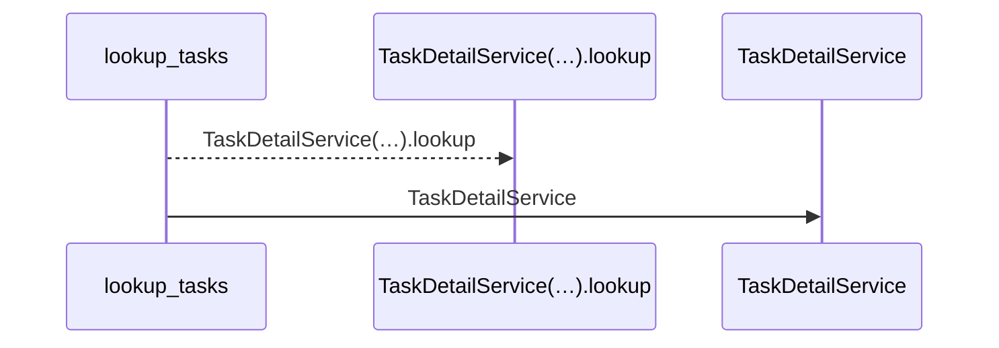
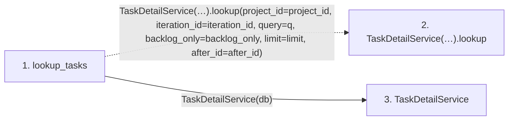

# lookup_tasks

**Entry point:** `lookup_tasks` (`http`)
**Source:** [routers_task_domain](../modules/routers_task_domain.md)
**Modules touched:** [routers_task_domain](../modules/routers_task_domain.md), [task_detail_service](../modules/task_detail_service.md)

## Call sequence

<!-- Auto-generated from static call edges. Dashed arrows are external or unresolved calls. Reviewed runtime conditions and side effects belong in Behavior. -->

## Data flow

<!-- Auto-generated static analysis. Treat values and boundaries as best-effort hints, not runtime proof. -->

### Step data

| Step | Inputs | Reads | Writes | Returns |
|---|---|---|---|---|
| `lookup_tasks` | `db: DB`, `project_id: int \| None`, `iteration_id: int \| None`, `q: str \| None`, `backlog_only: bool`, `limit: int`, `after_id: int` | - | - | `...` |
| `TaskDetailService(…).lookup` | - | - | - | - |
| `TaskDetailService` | - | - | - | - |

### Call data

| From | To | Line | Call |
|---|---|---:|---|
| lookup_tasks | TaskDetailService(…).lookup | 64 | `TaskDetailService(db).lookup(project_id=project_id, iteration_id=iteration_id, query=q, backlog_only=backlog_only, limit=limit, after_id=after_id)` |
| lookup_tasks | TaskDetailService | 64 | `TaskDetailService(db)` |

### Boundary effects

*No boundary effects detected.*

### Static analysis gaps

| Kind | Step | Target | Line |
|---|---|---|---:|
| unresolved_call | `lookup_tasks` | `TaskDetailService(db).lookup` | 64 |

## Behavior

This flow starts at `lookup_tasks` and is classified as `http`. The generated call and data-flow sections are bounded static projections; runtime conditions and side effects require source-level confirmation.
