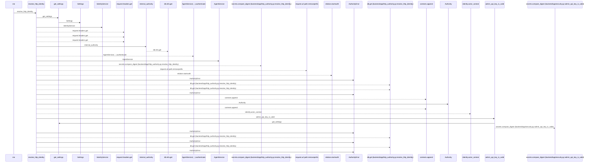
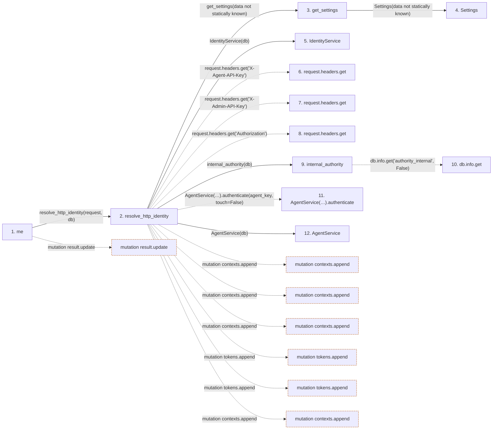

# me

**Entry point:** `me` (`http`)
**Source:** [routers_identity](../modules/routers_identity.md)
**Modules touched:** [agent_service](../modules/agent_service.md), [authority](../modules/authority.md), [config](../modules/config.md), [http_authority](../modules/http_authority.md), and 5 more

**Complete modules touched:**

- [agent_service](../modules/agent_service.md)
- [authority](../modules/authority.md)
- [config](../modules/config.md)
- [http_authority](../modules/http_authority.md)
- [identity_service](../modules/identity_service.md)
- [routers_identity](../modules/routers_identity.md)
- [security](../modules/security.md)
- [session_service](../modules/session_service.md)
- [time](../modules/time.md)

## Call sequence

<!-- Auto-generated from static call edges. Dashed arrows are external or unresolved calls. Reviewed runtime conditions and side effects belong in Behavior. -->

> Call sequence diagram shows 30 of 84 interactions; 54 omitted to keep the visualization within the 30-interaction and generated-diagram limits.

## Data flow

<!-- Auto-generated static analysis. Treat values and boundaries as best-effort hints, not runtime proof. -->

### Step data

| Step | Inputs | Reads | Writes | Returns |
|---|---|---|---|---|
| `me` | `request: Request`, `response: Response`, `db: Database` | `AuthorityError`, `Principal`, `UserSession` | `response.headers[...]`, `result[...]`, `result[...]` | `result` |
| `resolve_http_identity` | `request`, `db` | `WorkspaceAuthorityState`, `Principal`, `WorkspaceAuthorityState`, `Principal`, `Principal` | - | `authority` |
| `get_settings` | - | - | - | `Settings(...)` |
| `Settings` | - | - | - | - |
| `IdentityService` | - | - | - | - |
| `request.headers.get` | - | - | - | - |
| `request.headers.get` | - | - | - | - |
| `request.headers.get` | - | - | - | - |
| `internal_authority` | `db` | - | `db.info[...]`, `db.info[...]` | - |
| `db.info.get` | - | - | - | - |
| `AgentService(…).authenticate` | - | - | - | - |
| `AgentService` | - | - | - | - |

### Call data

| From | To | Line | Call |
|---|---|---:|---|
| me | resolve_http_identity | 55 | `resolve_http_identity(request, db)` |
| resolve_http_identity | get_settings | 39 | `get_settings(data not statically known)` |
| get_settings | Settings | 479 | `Settings(data not statically known)` |
| resolve_http_identity | IdentityService | 41 | `IdentityService(db)` |
| resolve_http_identity | request.headers.get | 42 | `request.headers.get('X-Agent-API-Key')` |
| resolve_http_identity | request.headers.get | 43 | `request.headers.get('X-Admin-API-Key')` |
| resolve_http_identity | request.headers.get | 44 | `request.headers.get('Authorization')` |
| resolve_http_identity | internal_authority | 45 | `internal_authority(db)` |
| internal_authority | db.info.get | 87 | `db.info.get('authority_internal', False)` |
| resolve_http_identity | AgentService(…).authenticate | 48 | `AgentService(db).authenticate(agent_key, touch=False)` |
| resolve_http_identity | AgentService | 48 | `AgentService(db)` |

### Boundary effects

| Kind | Target | Step | Line |
|---|---|---|---:|
| mutation | `result.update` | `me` | 66 |
| mutation | `contexts.append` | `resolve_http_identity` | 59 |
| mutation | `contexts.append` | `resolve_http_identity` | 61 |
| mutation | `contexts.append` | `resolve_http_identity` | 71 |
| mutation | `tokens.append` | `resolve_http_identity` | 82 |
| mutation | `tokens.append` | `resolve_http_identity` | 90 |
| mutation | `contexts.append` | `resolve_http_identity` | 95 |

### Static analysis gaps

| Kind | Step | Target | Line |
|---|---|---|---:|
| unresolved_call | `resolve_http_identity` | `request.headers.get` | 42 |
| unresolved_call | `resolve_http_identity` | `request.headers.get` | 43 |
| unresolved_call | `resolve_http_identity` | `request.headers.get` | 44 |
| unresolved_call | `internal_authority` | `db.info.get` | 87 |
| unresolved_call | `resolve_http_identity` | `AgentService(db).authenticate` | 48 |
| step_limit | `me` | `first 12 steps` | 0 |

## Behavior

This flow starts at `me` and is classified as `http`. The generated call and data-flow sections are bounded static projections; runtime conditions and side effects require source-level confirmation.
