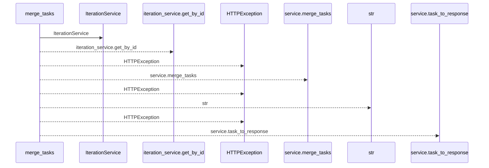
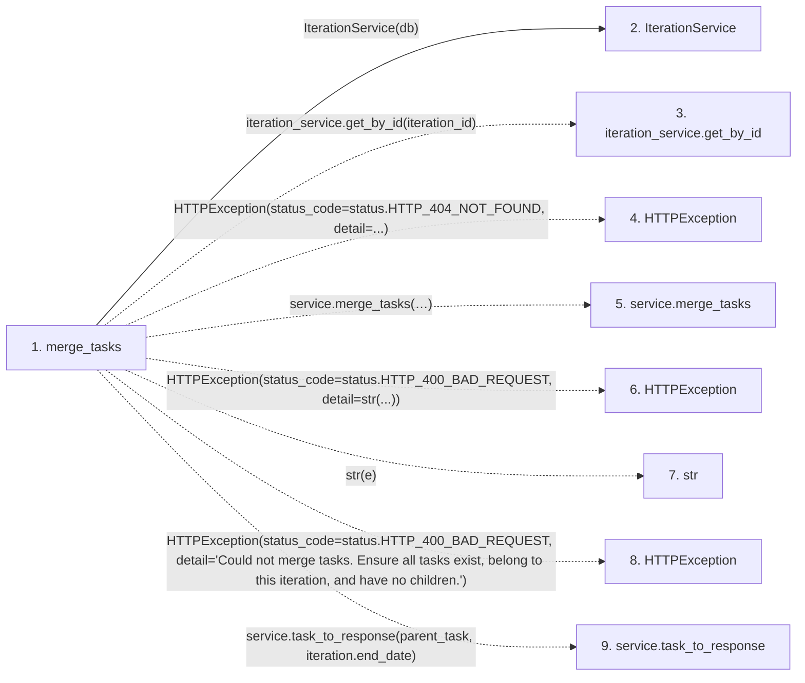

# merge_tasks

**Entry point:** `merge_tasks` (`http`)
**Source:** [tasks](../modules/tasks.md)
**Modules touched:** [iteration_service](../modules/iteration_service.md), [tasks](../modules/tasks.md)

## Call sequence

<!-- Auto-generated from static call edges. Dashed arrows are external or unresolved calls. Reviewed runtime conditions and side effects belong in Behavior. -->

## Data flow

<!-- Auto-generated static analysis. Treat values and boundaries as best-effort hints, not runtime proof. -->

### Step data

| Step | Inputs | Reads | Writes | Returns |
|---|---|---|---|---|
| `merge_tasks` | `iteration_id: int`, `data: TaskMerge`, `service: Annotated[TaskService, Depends(get_task_service)]`, `db: Annotated[AsyncSession, Depends(get_db, scope='function')]` | `status`, `status`, `status` | - | `service.task_to_response(...)` |
| `IterationService` | - | - | - | - |
| `iteration_service.get_by_id` | - | - | - | - |
| `HTTPException` | - | - | - | - |
| `service.merge_tasks` | - | - | - | - |
| `HTTPException` | - | - | - | - |
| `str` | - | - | - | - |
| `HTTPException` | - | - | - | - |
| `service.task_to_response` | - | - | - | - |

### Call data

| From | To | Line | Call |
|---|---|---:|---|
| merge_tasks | IterationService | 700 | `IterationService(db)` |
| merge_tasks | iteration_service.get_by_id | 701 | `iteration_service.get_by_id(iteration_id)` |
| merge_tasks | HTTPException | 704 | `HTTPException(status_code=status.HTTP_404_NOT_FOUND, detail=...)` |
| merge_tasks | service.merge_tasks | 710 | `service.merge_tasks(iteration_id=iteration_id, task_ids=data.task_ids, parent_title=data.parent_title, parent_description=data.parent_description, expected_revision=data.expected_revision)` |
| merge_tasks | HTTPException | 718 | `HTTPException(status_code=status.HTTP_400_BAD_REQUEST, detail=str(...))` |
| merge_tasks | str | 720 | `str(e)` |
| merge_tasks | HTTPException | 724 | `HTTPException(status_code=status.HTTP_400_BAD_REQUEST, detail='Could not merge tasks. Ensure all tasks exist, belong to this iteration, and have no children.')` |
| merge_tasks | service.task_to_response | 729 | `service.task_to_response(parent_task, iteration.end_date)` |

### Boundary effects

*No boundary effects detected.*

### Static analysis gaps

| Kind | Step | Target | Line |
|---|---|---|---:|
| unresolved_call | `merge_tasks` | `iteration_service.get_by_id` | 701 |
| external_call | `merge_tasks` | `HTTPException` | 704 |
| unresolved_call | `merge_tasks` | `service.merge_tasks` | 710 |
| external_call | `merge_tasks` | `HTTPException` | 718 |
| external_call | `merge_tasks` | `HTTPException` | 724 |
| unresolved_call | `merge_tasks` | `service.task_to_response` | 729 |

## Behavior

This flow starts at `merge_tasks` and is classified as `http`. The generated call and data-flow sections are bounded static projections; runtime conditions and side effects require source-level confirmation.
