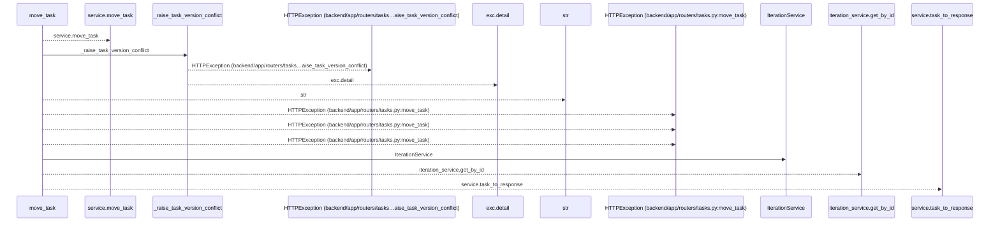
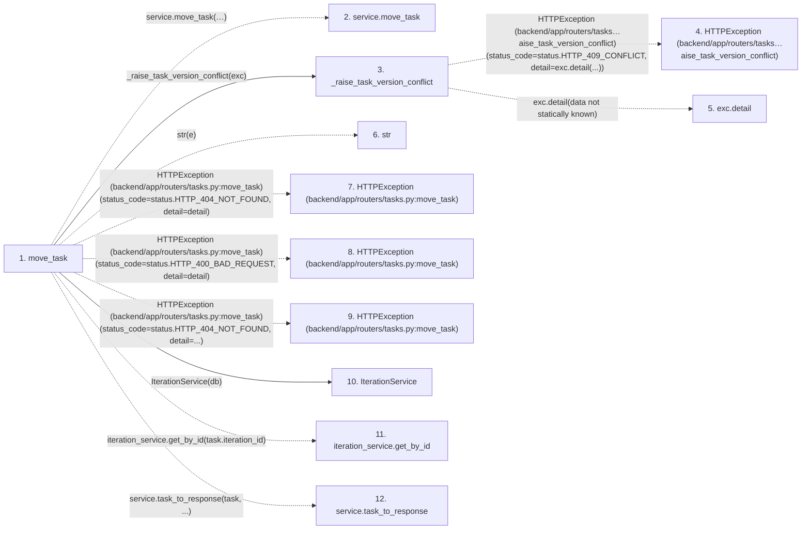

# move_task

**Entry point:** `move_task` (`http`)
**Source:** [tasks](../modules/tasks.md)
**Modules touched:** [iteration_service](../modules/iteration_service.md), [tasks](../modules/tasks.md)

## Call sequence

<!-- Auto-generated from static call edges. Dashed arrows are external or unresolved calls. Reviewed runtime conditions and side effects belong in Behavior. -->

## Data flow

<!-- Auto-generated static analysis. Treat values and boundaries as best-effort hints, not runtime proof. -->

### Step data

| Step | Inputs | Reads | Writes | Returns |
|---|---|---|---|---|
| `move_task` | `task_id: int`, `data: TaskMoveRequest`, `service: Annotated[TaskService, Depends(get_task_service)]`, `db: Annotated[AsyncSession, Depends(get_db, scope='function')]` | `TaskVersionConflictError`, `status`, `status`, `status` | - | `service.task_to_response(...)` |
| `service.move_task` | - | - | - | - |
| `_raise_task_version_conflict` | `exc: TaskVersionConflictError` | `status` | - | - |
| `HTTPException (backend/app/routers/tasks…aise_task_version_conflict)` | - | - | - | - |
| `exc.detail` | - | - | - | - |
| `str` | - | - | - | - |
| `HTTPException (backend/app/routers/tasks.py:move_task)` | - | - | - | - |
| `HTTPException (backend/app/routers/tasks.py:move_task)` | - | - | - | - |
| `HTTPException (backend/app/routers/tasks.py:move_task)` | - | - | - | - |
| `IterationService` | - | - | - | - |
| `iteration_service.get_by_id` | - | - | - | - |
| `service.task_to_response` | - | - | - | - |

### Call data

| From | To | Line | Call |
|---|---|---:|---|
| move_task | service.move_task | 360 | `service.move_task(task_id, target_iteration_id=data.iteration_id, parent_id=data.parent_id, expected_version=data.expected_version, expected_revisions=data.expected_revisions)` |
| move_task | _raise_task_version_conflict | 368 | `_raise_task_version_conflict(exc)` |
| _raise_task_version_conflict | HTTPException (backend/app/routers/tasks…aise_task_version_conflict) | 56 | `HTTPException(status_code=status.HTTP_409_CONFLICT, detail=exc.detail(...))` |
| _raise_task_version_conflict | exc.detail | 58 | `exc.detail(data not statically known)` |
| move_task | str | 370 | `str(e)` |
| move_task | HTTPException (backend/app/routers/tasks.py:move_task) | 372 | `HTTPException(status_code=status.HTTP_404_NOT_FOUND, detail=detail)` |
| move_task | HTTPException (backend/app/routers/tasks.py:move_task) | 376 | `HTTPException(status_code=status.HTTP_400_BAD_REQUEST, detail=detail)` |
| move_task | HTTPException (backend/app/routers/tasks.py:move_task) | 381 | `HTTPException(status_code=status.HTTP_404_NOT_FOUND, detail=...)` |
| move_task | IterationService | 386 | `IterationService(db)` |
| move_task | iteration_service.get_by_id | 387 | `iteration_service.get_by_id(task.iteration_id)` |
| move_task | service.task_to_response | 388 | `service.task_to_response(task, ...)` |

### Boundary effects

*No boundary effects detected.*

### Static analysis gaps

| Kind | Step | Target | Line |
|---|---|---|---:|
| unresolved_call | `move_task` | `service.move_task` | 360 |
| external_call | `_raise_task_version_conflict` | `HTTPException` | 56 |
| unresolved_call | `_raise_task_version_conflict` | `exc.detail` | 58 |
| external_call | `move_task` | `HTTPException` | 372 |
| external_call | `move_task` | `HTTPException` | 376 |
| external_call | `move_task` | `HTTPException` | 381 |
| unresolved_call | `move_task` | `iteration_service.get_by_id` | 387 |
| unresolved_call | `move_task` | `service.task_to_response` | 388 |

## Behavior

This flow starts at `move_task` and is classified as `http`. The generated call and data-flow sections are bounded static projections; runtime conditions and side effects require source-level confirmation.
