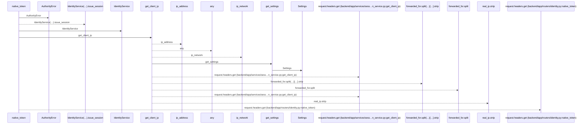
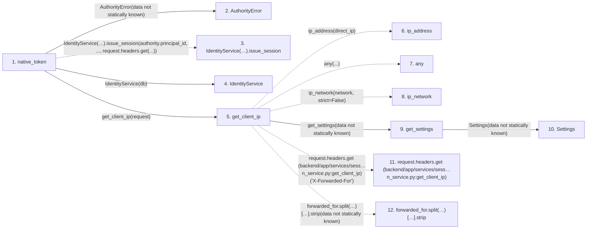

# native_token

**Entry point:** `native_token` (`http`)
**Source:** [routers_identity](../modules/routers_identity.md)
**Modules touched:** [authority](../modules/authority.md), [config](../modules/config.md), [identity_service](../modules/identity_service.md), [routers_identity](../modules/routers_identity.md), and 1 more

**Complete modules touched:**

- [authority](../modules/authority.md)
- [config](../modules/config.md)
- [identity_service](../modules/identity_service.md)
- [routers_identity](../modules/routers_identity.md)
- [session_service](../modules/session_service.md)

## Call sequence

<!-- Auto-generated from static call edges. Dashed arrows are external or unresolved calls. Reviewed runtime conditions and side effects belong in Behavior. -->

## Data flow

<!-- Auto-generated static analysis. Treat values and boundaries as best-effort hints, not runtime proof. -->

### Step data

| Step | Inputs | Reads | Writes | Returns |
|---|---|---|---|---|
| `native_token` | `request: Request`, `response: Response`, `db: Database` | - | `response.headers[...]` | `{...}` |
| `AuthorityError` | - | - | - | - |
| `IdentityService(…).issue_session` | - | - | - | - |
| `IdentityService` | - | - | - | - |
| `get_client_ip` | `request: Request` | - | - | `...`, `real_ip.strip(...)`, `direct_ip` |
| `ip_address` | - | - | - | - |
| `any` | - | - | - | - |
| `ip_network` | - | - | - | - |
| `get_settings` | - | - | - | `Settings(...)` |
| `Settings` | - | - | - | - |
| `request.headers.get (backend/app/services/sess…n_service.py:get_client_ip)` | - | - | - | - |
| `forwarded_for.split(…)[…].strip` | - | - | - | - |

### Call data

| From | To | Line | Call |
|---|---|---:|---|
| native_token | AuthorityError | 296 | `AuthorityError(data not statically known)` |
| native_token | IdentityService(…).issue_session | 297 | `IdentityService(db).issue_session(authority.principal_id, ..., request.headers.get(...))` |
| native_token | IdentityService | 297 | `IdentityService(db)` |
| native_token | get_client_ip | 297 | `get_client_ip(request)` |
| get_client_ip | ip_address | 52 | `ip_address(direct_ip)` |
| get_client_ip | any | 53 | `any(...)` |
| get_client_ip | ip_network | 54 | `ip_network(network, strict=False)` |
| get_client_ip | get_settings | 55 | `get_settings(data not statically known)` |
| get_settings | Settings | 480 | `Settings(data not statically known)` |
| get_client_ip | request.headers.get (backend/app/services/sess…n_service.py:get_client_ip) | 60 | `request.headers.get('X-Forwarded-For')` |
| get_client_ip | forwarded_for.split(…)[…].strip | 62 | `forwarded_for.split(',')[0].strip(data not statically known)` |

### Boundary effects

*No boundary effects detected.*

### Static analysis gaps

| Kind | Step | Target | Line |
|---|---|---|---:|
| unresolved_call | `native_token` | `IdentityService(db).issue_session` | 297 |
| external_call | `get_client_ip` | `ip_address` | 52 |
| external_call | `get_client_ip` | `any` | 53 |
| external_call | `get_client_ip` | `ip_network` | 54 |
| unresolved_call | `get_client_ip` | `request.headers.get` | 60 |
| unresolved_call | `get_client_ip` | `forwarded_for.split(',')[0].strip` | 62 |
| step_limit | `native_token` | `first 12 steps` | 0 |

## Behavior

This flow starts at `native_token` and is classified as `http`. The generated call and data-flow sections are bounded static projections; runtime conditions and side effects require source-level confirmation.
