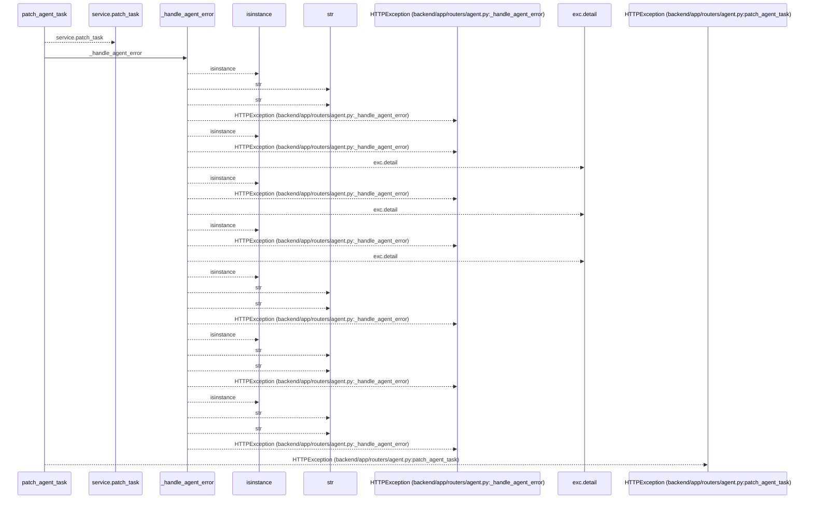
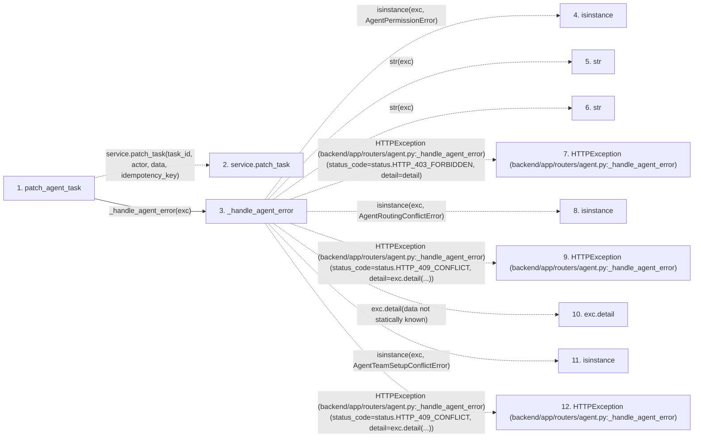

# patch_agent_task

**Entry point:** `patch_agent_task` (`http`)
**Source:** [routers_agent](../modules/routers_agent.md)
**Modules touched:** [routers_agent](../modules/routers_agent.md)

## Call sequence

<!-- Auto-generated from static call edges. Dashed arrows are external or unresolved calls. Reviewed runtime conditions and side effects belong in Behavior. -->

## Data flow

<!-- Auto-generated static analysis. Treat values and boundaries as best-effort hints, not runtime proof. -->

### Step data

| Step | Inputs | Reads | Writes | Returns |
|---|---|---|---|---|
| `patch_agent_task` | `task_id: int`, `data: AgentTaskPatch`, `actor: Annotated[AgentActor, Depends(get_agent_actor)]`, `service: Annotated[AgentService, Depends(get_agent_service)]`, `idempotency_key: Annotated[Optional[str], Header(alias='Idempotency-Key')]` | `status` | - | `task` |
| `service.patch_task` | - | - | - | - |
| `_handle_agent_error` | `exc: Exception`, `structured: bool` | `AgentPermissionError`, `status`, `AgentRoutingConflictError`, `status`, `AgentTeamSetupConflictError`, `status`, `TaskVersionConflictError`, `status` | - | - |
| `isinstance` | - | - | - | - |
| `str` | - | - | - | - |
| `str` | - | - | - | - |
| `HTTPException (backend/app/routers/agent.py:_handle_agent_error)` | - | - | - | - |
| `isinstance` | - | - | - | - |
| `HTTPException (backend/app/routers/agent.py:_handle_agent_error)` | - | - | - | - |
| `exc.detail` | - | - | - | - |
| `isinstance` | - | - | - | - |
| `HTTPException (backend/app/routers/agent.py:_handle_agent_error)` | - | - | - | - |

### Call data

| From | To | Line | Call |
|---|---|---:|---|
| patch_agent_task | service.patch_task | 1133 | `service.patch_task(task_id, actor, data, idempotency_key)` |
| patch_agent_task | _handle_agent_error | 1135 | `_handle_agent_error(exc)` |
| _handle_agent_error | isinstance | 254 | `isinstance(exc, AgentPermissionError)` |
| _handle_agent_error | str | 256 | `str(exc)` |
| _handle_agent_error | str | 258 | `str(exc)` |
| _handle_agent_error | HTTPException (backend/app/routers/agent.py:_handle_agent_error) | 260 | `HTTPException(status_code=status.HTTP_403_FORBIDDEN, detail=detail)` |
| _handle_agent_error | isinstance | 261 | `isinstance(exc, AgentRoutingConflictError)` |
| _handle_agent_error | HTTPException (backend/app/routers/agent.py:_handle_agent_error) | 262 | `HTTPException(status_code=status.HTTP_409_CONFLICT, detail=exc.detail(...))` |
| _handle_agent_error | exc.detail | 262 | `exc.detail(data not statically known)` |
| _handle_agent_error | isinstance | 263 | `isinstance(exc, AgentTeamSetupConflictError)` |
| _handle_agent_error | HTTPException (backend/app/routers/agent.py:_handle_agent_error) | 264 | `HTTPException(status_code=status.HTTP_409_CONFLICT, detail=exc.detail(...))` |

### Boundary effects

*No boundary effects detected.*

### Static analysis gaps

| Kind | Step | Target | Line |
|---|---|---|---:|
| unresolved_call | `patch_agent_task` | `service.patch_task` | 1133 |
| external_call | `_handle_agent_error` | `isinstance` | 254 |
| external_call | `_handle_agent_error` | `HTTPException` | 260 |
| external_call | `_handle_agent_error` | `isinstance` | 261 |
| external_call | `_handle_agent_error` | `HTTPException` | 262 |
| unresolved_call | `_handle_agent_error` | `exc.detail` | 262 |
| external_call | `_handle_agent_error` | `isinstance` | 263 |
| external_call | `_handle_agent_error` | `HTTPException` | 264 |
| step_limit | `patch_agent_task` | `first 12 steps` | 0 |

## Behavior

This flow starts at `patch_agent_task` and is classified as `http`. The generated call and data-flow sections are bounded static projections; runtime conditions and side effects require source-level confirmation.
