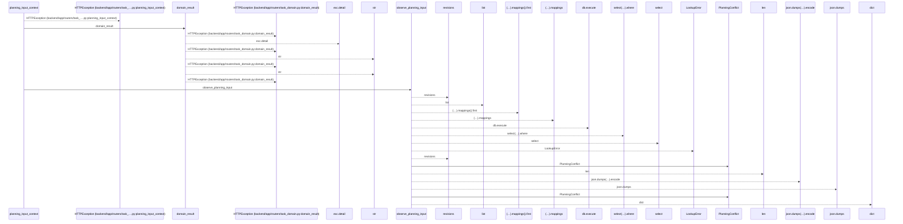
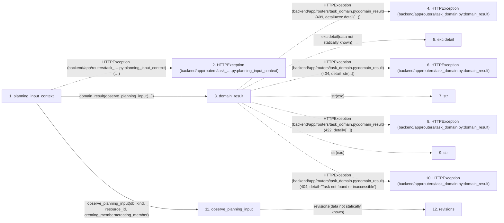

# planning_input_context

**Entry point:** `planning_input_context` (`http`)
**Source:** [routers_task_domain](../modules/routers_task_domain.md)
**Modules touched:** [commands](../modules/commands.md), [planning_input_context](../modules/planning_input_context.md), [routers_task_domain](../modules/routers_task_domain.md)

## Call sequence

<!-- Auto-generated from static call edges. Dashed arrows are external or unresolved calls. Reviewed runtime conditions and side effects belong in Behavior. -->

## Data flow

<!-- Auto-generated static analysis. Treat values and boundaries as best-effort hints, not runtime proof. -->

### Step data

| Step | Inputs | Reads | Writes | Returns |
|---|---|---|---|---|
| `planning_input_context` | `kind: Literal['calendar', 'project', 'iteration', 'profile', 'member', 'vacation']`, `resource_id: int`, `db: DB`, `creating_member: bool` | - | - | `...` |
| `HTTPException (backend/app/routers/task_….py:planning_input_context)` | - | - | - | - |
| `domain_result` | `awaitable` | `TaskVersionConflictError` | - | `result` |
| `HTTPException (backend/app/routers/task_domain.py:domain_result)` | - | - | - | - |
| `exc.detail` | - | - | - | - |
| `HTTPException (backend/app/routers/task_domain.py:domain_result)` | - | - | - | - |
| `str` | - | - | - | - |
| `HTTPException (backend/app/routers/task_domain.py:domain_result)` | - | - | - | - |
| `str` | - | - | - | - |
| `HTTPException (backend/app/routers/task_domain.py:domain_result)` | - | - | - | - |
| `observe_planning_input` | `db`, `kind`, `resource_id`, `creating_member` | - | - | `{...}` |
| `revisions` | - | - | - | - |

### Call data

| From | To | Line | Call |
|---|---|---:|---|
| planning_input_context | HTTPException (backend/app/routers/task_….py:planning_input_context) | 33 | `HTTPException(422, detail='Use a positive planning resource identity and a supported member-create context.')` |
| planning_input_context | domain_result | 35 | `domain_result(observe_planning_input(...))` |
| domain_result | HTTPException (backend/app/routers/task_domain.py:domain_result) | 42 | `HTTPException(409, detail=exc.detail(...))` |
| domain_result | exc.detail | 42 | `exc.detail(data not statically known)` |
| domain_result | HTTPException (backend/app/routers/task_domain.py:domain_result) | 44 | `HTTPException(404, detail=str(...))` |
| domain_result | str | 44 | `str(exc)` |
| domain_result | HTTPException (backend/app/routers/task_domain.py:domain_result) | 46 | `HTTPException(422, detail=[...])` |
| domain_result | str | 46 | `str(exc)` |
| domain_result | HTTPException (backend/app/routers/task_domain.py:domain_result) | 48 | `HTTPException(404, detail='Task not found or inaccessible')` |
| planning_input_context | observe_planning_input | 35 | `observe_planning_input(db, kind, resource_id, creating_member=creating_member)` |
| observe_planning_input | revisions | 87 | `revisions(data not statically known)` |

### Boundary effects

*No boundary effects detected.*

### Static analysis gaps

| Kind | Step | Target | Line |
|---|---|---|---:|
| external_call | `planning_input_context` | `HTTPException` | 33 |
| external_call | `domain_result` | `HTTPException` | 42 |
| unresolved_call | `domain_result` | `exc.detail` | 42 |
| external_call | `domain_result` | `HTTPException` | 44 |
| external_call | `domain_result` | `HTTPException` | 46 |
| external_call | `domain_result` | `HTTPException` | 48 |
| unresolved_call | `observe_planning_input` | `revisions` | 87 |
| step_limit | `planning_input_context` | `first 12 steps` | 0 |

## Behavior

This flow starts at `planning_input_context` and is classified as `http`. The generated call and data-flow sections are bounded static projections; runtime conditions and side effects require source-level confirmation.
