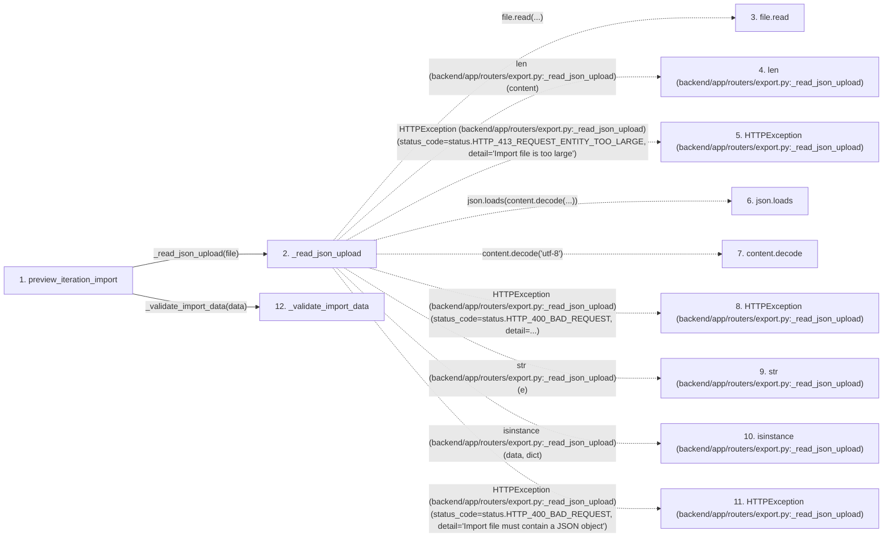

# preview_iteration_import

**Entry point:** `preview_iteration_import` (`http`)
**Source:** [export](../modules/export.md)
**Modules touched:** [commands](../modules/commands.md), [export](../modules/export.md), [import_planning_service](../modules/import_planning_service.md), [iteration_service](../modules/iteration_service.md)

## Call sequence

```mermaid
sequenceDiagram
    participant p0 as preview_iteration_import
    participant p1 as _read_json_upload
    participant p2 as file.read
    participant p3 as len (backend/app/routers/export.py:_read_json_upload)
    participant p4 as HTTPException (backend/app/routers/export.py:_read_json_upload)
    participant p5 as json.loads
    participant p6 as content.decode
    participant p7 as str (backend/app/routers/export.py:_read_json_upload)
    participant p8 as isinstance (backend/app/routers/export.py:_read_json_upload)
    participant p9 as _validate_import_data
    participant p10 as data.get
    participant p11 as isinstance (backend/app/routers/export.py:_validate_import_data)
    participant p12 as HTTPException (backend/app/routers/export.py:_validate_import_data)
    participant p13 as _validate_import_task_tree
    participant p14 as stack.pop
    participant p15 as isinstance (backend/app/routers/expor…_validate_import_task_tree)
    participant p16 as ValueError (backend/app/routers/expor…_validate_import_task_tree)
    participant p17 as current.get
    participant p18 as stack.extend
    participant p19 as reversed
    participant p20 as len (backend/app/routers/export.py:_validate_import_data)
    participant p21 as any
    participant p22 as ValueError (backend/app/routers/export.py:_validate_import_data)
    p0->>p1: _read_json_upload
    p1-->>p2: file.read
    p1-->>p3: len (backend/app/routers/export.py:_read_json_upload)
    p1-->>p4: HTTPException (backend/app/routers/export.py:_read_json_upload)
    p1-->>p5: json.loads
    p1-->>p6: content.decode
    p1-->>p4: HTTPException (backend/app/routers/export.py:_read_json_upload)
    p1-->>p7: str (backend/app/routers/export.py:_read_json_upload)
    p1-->>p8: isinstance (backend/app/routers/export.py:_read_json_upload)
    p1-->>p4: HTTPException (backend/app/routers/export.py:_read_json_upload)
    p0->>p9: _validate_import_data
    p9-->>p10: data.get
    p9-->>p11: isinstance (backend/app/routers/export.py:_validate_import_data)
    p9-->>p12: HTTPException (backend/app/routers/export.py:_validate_import_data)
    p9->>p13: _validate_import_task_tree
    p13-->>p14: stack.pop
    p13-->>p15: isinstance (backend/app/routers/expor…_validate_import_task_tree)
    p13-->>p16: ValueError (backend/app/routers/expor…_validate_import_task_tree)
    p13-->>p16: ValueError (backend/app/routers/expor…_validate_import_task_tree)
    p13-->>p17: current.get
    p13-->>p15: isinstance (backend/app/routers/expor…_validate_import_task_tree)
    p13-->>p16: ValueError (backend/app/routers/expor…_validate_import_task_tree)
    p13-->>p18: stack.extend
    p13-->>p19: reversed
    p9-->>p10: data.get
    p9-->>p11: isinstance (backend/app/routers/export.py:_validate_import_data)
    p9-->>p20: len (backend/app/routers/export.py:_validate_import_data)
    p9-->>p21: any
    p9-->>p11: isinstance (backend/app/routers/export.py:_validate_import_data)
    p9-->>p22: ValueError (backend/app/routers/export.py:_validate_import_data)
```

<!-- Auto-generated from static call edges. Dashed arrows are external or unresolved calls. Reviewed runtime conditions and side effects belong in Behavior. -->

> Call sequence diagram shows 30 of 47 interactions; 17 omitted to keep the visualization within the 30-interaction and generated-diagram limits.

## Data flow

<!-- Auto-generated static analysis. Treat values and boundaries as best-effort hints, not runtime proof. -->

### Step data

| Step | Inputs | Reads | Writes | Returns |
|---|---|---|---|---|
| `preview_iteration_import` | `file: Annotated[UploadFile, File(...)]`, `db: Annotated[AsyncSession, Depends(get_db, scope='function')]`, `iteration_id: int \| None` | - | - | `...` |
| `_read_json_upload` | `file: UploadFile` | `MAX_JSON_IMPORT_BYTES`, `MAX_JSON_IMPORT_BYTES`, `status`, `json`, `status`, `status` | - | `data` |
| `file.read` | - | - | - | - |
| `len (backend/app/routers/export.py:_read_json_upload)` | - | - | - | - |
| `HTTPException (backend/app/routers/export.py:_read_json_upload)` | - | - | - | - |
| `json.loads` | - | - | - | - |
| `content.decode` | - | - | - | - |
| `HTTPException (backend/app/routers/export.py:_read_json_upload)` | - | - | - | - |
| `str (backend/app/routers/export.py:_read_json_upload)` | - | - | - | - |
| `isinstance (backend/app/routers/export.py:_read_json_upload)` | - | - | - | - |
| `HTTPException (backend/app/routers/export.py:_read_json_upload)` | - | - | - | - |
| `_validate_import_data` | `data` | - | - | - |

### Call data

| From | To | Line | Call |
|---|---|---:|---|
| preview_iteration_import | _read_json_upload | 263 | `_read_json_upload(file)` |
| _read_json_upload | file.read | 38 | `file.read(...)` |
| _read_json_upload | len (backend/app/routers/export.py:_read_json_upload) | 39 | `len(content)` |
| _read_json_upload | HTTPException (backend/app/routers/export.py:_read_json_upload) | 40 | `HTTPException(status_code=status.HTTP_413_REQUEST_ENTITY_TOO_LARGE, detail='Import file is too large')` |
| _read_json_upload | json.loads | 45 | `json.loads(content.decode(...))` |
| _read_json_upload | content.decode | 45 | `content.decode('utf-8')` |
| _read_json_upload | HTTPException (backend/app/routers/export.py:_read_json_upload) | 47 | `HTTPException(status_code=status.HTTP_400_BAD_REQUEST, detail=...)` |
| _read_json_upload | str (backend/app/routers/export.py:_read_json_upload) | 49 | `str(e)` |
| _read_json_upload | isinstance (backend/app/routers/export.py:_read_json_upload) | 51 | `isinstance(data, dict)` |
| _read_json_upload | HTTPException (backend/app/routers/export.py:_read_json_upload) | 52 | `HTTPException(status_code=status.HTTP_400_BAD_REQUEST, detail='Import file must contain a JSON object')` |
| preview_iteration_import | _validate_import_data | 264 | `_validate_import_data(data)` |

### Boundary effects

*No boundary effects detected.*

### Static analysis gaps

| Kind | Step | Target | Line |
|---|---|---|---:|
| unresolved_call | `_read_json_upload` | `file.read` | 38 |
| external_call | `_read_json_upload` | `HTTPException` | 40 |
| external_call | `_read_json_upload` | `json.loads` | 45 |
| unresolved_call | `_read_json_upload` | `content.decode` | 45 |
| external_call | `_read_json_upload` | `HTTPException` | 47 |
| external_call | `_read_json_upload` | `isinstance` | 51 |
| external_call | `_read_json_upload` | `HTTPException` | 52 |
| step_limit | `preview_iteration_import` | `first 12 steps` | 0 |

## Behavior

This flow starts at `preview_iteration_import` and is classified as `http`. The generated call and data-flow sections are bounded static projections; runtime conditions and side effects require source-level confirmation.
