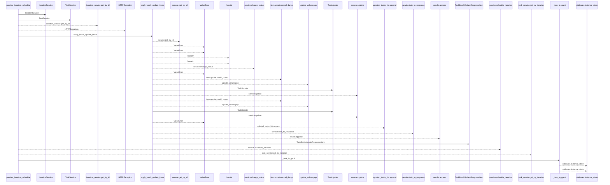
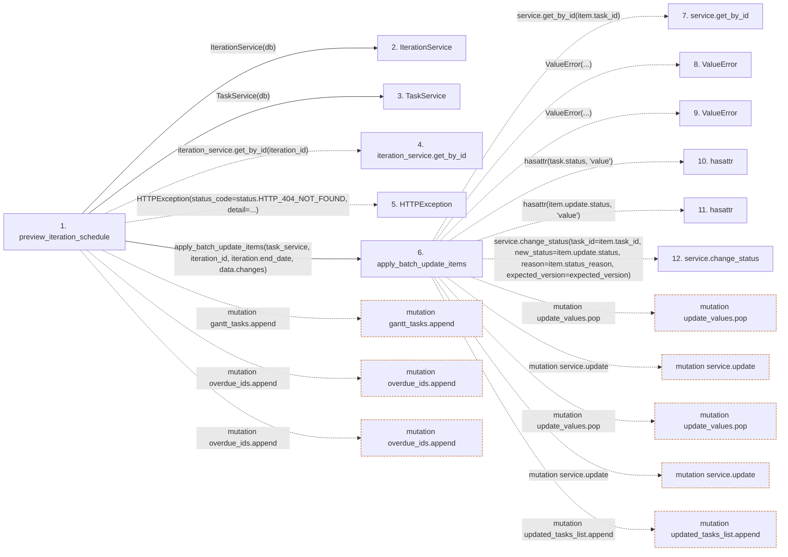

# preview_iteration_schedule

**Entry point:** `preview_iteration_schedule` (`http`)
**Source:** [routers_gantt](../modules/routers_gantt.md)
**Modules touched:** [iteration_service](../modules/iteration_service.md), [routers_gantt](../modules/routers_gantt.md), [schemas_gantt](../modules/schemas_gantt.md), [schemas_task](../modules/schemas_task.md), and 2 more

**Complete modules touched:**

- [iteration_service](../modules/iteration_service.md)
- [routers_gantt](../modules/routers_gantt.md)
- [schemas_gantt](../modules/schemas_gantt.md)
- [schemas_task](../modules/schemas_task.md)
- [task_service](../modules/task_service.md)
- [tasks](../modules/tasks.md)

## Call sequence

<!-- Auto-generated from static call edges. Dashed arrows are external or unresolved calls. Reviewed runtime conditions and side effects belong in Behavior. -->

> Call sequence diagram shows 30 of 60 interactions; 30 omitted to keep the visualization within the 30-interaction and generated-diagram limits.

## Data flow

<!-- Auto-generated static analysis. Treat values and boundaries as best-effort hints, not runtime proof. -->

### Step data

| Step | Inputs | Reads | Writes | Returns |
|---|---|---|---|---|
| `preview_iteration_schedule` | `iteration_id: int`, `data: SchedulePreviewRequest`, `service: Annotated[SchedulerService, Depends(get_scheduler_service)]`, `db: Annotated[AsyncSession, Depends(get_db)]` | `status`, `status`, `status` | `db.commit`, `db.commit` | `SchedulePreviewResponse(...)` |
| `IterationService` | - | - | - | - |
| `TaskService` | - | - | - | - |
| `iteration_service.get_by_id` | - | - | - | - |
| `HTTPException` | - | - | - | - |
| `apply_batch_update_items` | `service: TaskService`, `iteration_id: int`, `iteration_end_date`, `items` | - | `update_values[...]`, `update_values[...]` | `(...)` |
| `service.get_by_id` | - | - | - | - |
| `ValueError` | - | - | - | - |
| `ValueError` | - | - | - | - |
| `hasattr` | - | - | - | - |
| `hasattr` | - | - | - | - |
| `service.change_status` | - | - | - | - |

### Call data

| From | To | Line | Call |
|---|---|---:|---|
| preview_iteration_schedule | IterationService | 68 | `IterationService(db)` |
| preview_iteration_schedule | TaskService | 69 | `TaskService(db)` |
| preview_iteration_schedule | iteration_service.get_by_id | 70 | `iteration_service.get_by_id(iteration_id)` |
| preview_iteration_schedule | HTTPException | 72 | `HTTPException(status_code=status.HTTP_404_NOT_FOUND, detail=...)` |
| preview_iteration_schedule | apply_batch_update_items | 86 | `apply_batch_update_items(task_service, iteration_id, iteration.end_date, data.changes)` |
| apply_batch_update_items | service.get_by_id | 175 | `service.get_by_id(item.task_id)` |
| apply_batch_update_items | ValueError | 177 | `ValueError(...)` |
| apply_batch_update_items | ValueError | 179 | `ValueError(...)` |
| apply_batch_update_items | hasattr | 182 | `hasattr(task.status, 'value')` |
| apply_batch_update_items | hasattr | 183 | `hasattr(item.update.status, 'value')` |
| apply_batch_update_items | service.change_status | 192 | `service.change_status(task_id=item.task_id, new_status=item.update.status, reason=item.status_reason, expected_version=expected_version)` |

### Boundary effects

| Kind | Target | Step | Line |
|---|---|---|---:|
| mutation | `gantt_tasks.append` | `preview_iteration_schedule` | 101 |
| mutation | `overdue_ids.append` | `preview_iteration_schedule` | 103 |
| mutation | `overdue_ids.append` | `preview_iteration_schedule` | 106 |
| mutation | `update_values.pop` | `apply_batch_update_items` | 203 |
| mutation | `service.update` | `apply_batch_update_items` | 207 |
| mutation | `update_values.pop` | `apply_batch_update_items` | 211 |
| mutation | `service.update` | `apply_batch_update_items` | 215 |
| mutation | `updated_tasks_list.append` | `apply_batch_update_items` | 221 |

### Static analysis gaps

| Kind | Step | Target | Line |
|---|---|---|---:|
| unresolved_call | `preview_iteration_schedule` | `iteration_service.get_by_id` | 70 |
| external_call | `preview_iteration_schedule` | `HTTPException` | 72 |
| unresolved_call | `apply_batch_update_items` | `service.get_by_id` | 175 |
| external_call | `apply_batch_update_items` | `ValueError` | 177 |
| external_call | `apply_batch_update_items` | `ValueError` | 179 |
| external_call | `apply_batch_update_items` | `hasattr` | 182 |
| external_call | `apply_batch_update_items` | `hasattr` | 183 |
| unresolved_call | `apply_batch_update_items` | `service.change_status` | 192 |
| step_limit | `preview_iteration_schedule` | `first 12 steps` | 0 |

## Behavior

This flow starts at `preview_iteration_schedule` and is classified as `http`. The generated call and data-flow sections are bounded static projections; runtime conditions and side effects require source-level confirmation.
