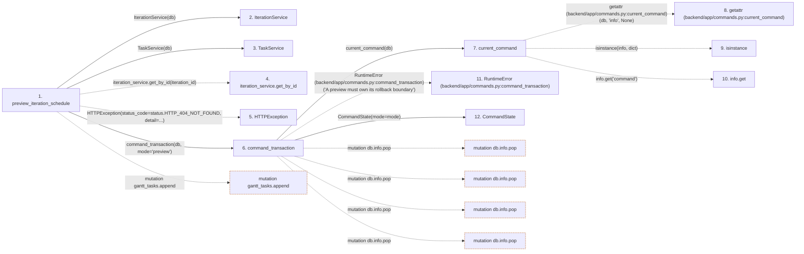

# preview_iteration_schedule

**Entry point:** `preview_iteration_schedule` (`http`)
**Source:** [routers_gantt](../modules/routers_gantt.md)
**Modules touched:** [authority](../modules/authority.md), [commands](../modules/commands.md), [config](../modules/config.md), [delivery_dependency_service](../modules/delivery_dependency_service.md), and 10 more

**Complete modules touched:**

- [authority](../modules/authority.md)
- [commands](../modules/commands.md)
- [config](../modules/config.md)
- [delivery_dependency_service](../modules/delivery_dependency_service.md)
- [discussion_service](../modules/discussion_service.md)
- [iteration_service](../modules/iteration_service.md)
- [mutation_versions](../modules/mutation_versions.md)
- [routers_gantt](../modules/routers_gantt.md)
- [schemas_gantt](../modules/schemas_gantt.md)
- [schemas_task](../modules/schemas_task.md)
- [services_work_metrics](../modules/services_work_metrics.md)
- [task_service](../modules/task_service.md)
- [tasks](../modules/tasks.md)
- [time](../modules/time.md)

## Call sequence

```mermaid
sequenceDiagram
    participant p0 as preview_iteration_schedule
    participant p1 as IterationService
    participant p2 as TaskService
    participant p3 as iteration_service.get_by_id
    participant p4 as HTTPException
    participant p5 as command_transaction
    participant p6 as current_command
    participant p7 as getattr (backend/app/commands.py:current_command)
    participant p8 as isinstance
    participant p9 as info.get
    participant p10 as RuntimeError (backend/app/commands.py:command_transaction)
    participant p11 as CommandState
    participant p12 as db.flush
    participant p13 as db.info.get (backend/app/commands.py:command_transaction)
    participant p14 as DeliveryDependencyService(…).reconcile
    participant p15 as DeliveryDependencyService
    participant p16 as sorted (backend/app/commands.py:command_transaction)
    participant p17 as db.info.pop
    participant p18 as set (backend/app/commands.py:command_transaction)
    participant p19 as DiscussionService(…).enqueue
    participant p20 as DiscussionService
    participant p21 as db.rollback
    participant p22 as db.commit
    p0->>p1: IterationService
    p0->>p2: TaskService
    p0-->>p3: iteration_service.get_by_id
    p0-->>p4: HTTPException
    p0->>p5: command_transaction
    p5->>p6: current_command
    p6-->>p7: getattr (backend/app/commands.py:current_command)
    p6-->>p8: isinstance
    p6-->>p9: info.get
    p5-->>p10: RuntimeError (backend/app/commands.py:command_transaction)
    p5->>p11: CommandState
    p5-->>p10: RuntimeError (backend/app/commands.py:command_transaction)
    p5-->>p12: db.flush
    p5-->>p13: db.info.get (backend/app/commands.py:command_transaction)
    p5-->>p13: db.info.get (backend/app/commands.py:command_transaction)
    p5-->>p13: db.info.get (backend/app/commands.py:command_transaction)
    p5-->>p14: DeliveryDependencyService(…).reconcile
    p5->>p15: DeliveryDependencyService
    p5-->>p16: sorted (backend/app/commands.py:command_transaction)
    p5-->>p17: db.info.pop
    p5-->>p18: set (backend/app/commands.py:command_transaction)
    p5-->>p19: DiscussionService(…).enqueue
    p5->>p20: DiscussionService
    p5-->>p21: db.rollback
    p5-->>p22: db.commit
    p5-->>p12: db.flush
    p5-->>p21: db.rollback
    p5-->>p17: db.info.pop
    p5-->>p17: db.info.pop
    p5-->>p17: db.info.pop
```

<!-- Auto-generated from static call edges. Dashed arrows are external or unresolved calls. Reviewed runtime conditions and side effects belong in Behavior. -->

> Call sequence diagram shows 30 of 184 interactions; 154 omitted to keep the visualization within the 30-interaction and generated-diagram limits.

## Data flow

<!-- Auto-generated static analysis. Treat values and boundaries as best-effort hints, not runtime proof. -->

### Step data

| Step | Inputs | Reads | Writes | Returns |
|---|---|---|---|---|
| `preview_iteration_schedule` | `iteration_id: int`, `data: SchedulePreviewRequest`, `service: Annotated[SchedulerService, Depends(get_scheduler_service)]`, `db: Annotated[AsyncSession, Depends(get_db, scope='function')]` | `status`, `status`, `status` | - | `SchedulePreviewResponse(...)` |
| `IterationService` | - | - | - | - |
| `TaskService` | - | - | - | - |
| `iteration_service.get_by_id` | - | - | - | - |
| `HTTPException` | - | - | - | - |
| `command_transaction` | `db: AsyncSession`, `mode`, `commit` | - | `previous.failed`, `db.info[...]` | `none` |
| `current_command` | `db` | - | - | `...` |
| `getattr (backend/app/commands.py:current_command)` | - | - | - | - |
| `isinstance` | - | - | - | - |
| `info.get` | - | - | - | - |
| `RuntimeError (backend/app/commands.py:command_transaction)` | - | - | - | - |
| `CommandState` | - | - | - | - |

### Call data

| From | To | Line | Call |
|---|---|---:|---|
| preview_iteration_schedule | IterationService | 72 | `IterationService(db)` |
| preview_iteration_schedule | TaskService | 73 | `TaskService(db)` |
| preview_iteration_schedule | iteration_service.get_by_id | 74 | `iteration_service.get_by_id(iteration_id)` |
| preview_iteration_schedule | HTTPException | 76 | `HTTPException(status_code=status.HTTP_404_NOT_FOUND, detail=...)` |
| preview_iteration_schedule | command_transaction | 81 | `command_transaction(db, mode='preview')` |
| command_transaction | current_command | 87 | `current_command(db)` |
| current_command | getattr (backend/app/commands.py:current_command) | 73 | `getattr(db, 'info', None)` |
| current_command | isinstance | 74 | `isinstance(info, dict)` |
| current_command | info.get | 74 | `info.get('command')` |
| command_transaction | RuntimeError (backend/app/commands.py:command_transaction) | 90 | `RuntimeError('A preview must own its rollback boundary')` |
| command_transaction | CommandState | 97 | `CommandState(mode=mode)` |

### Boundary effects

| Kind | Target | Step | Line |
|---|---|---|---:|
| mutation | `gantt_tasks.append` | `preview_iteration_schedule` | 100 |
| mutation | `db.info.pop` | `command_transaction` | 107 |
| mutation | `db.info.pop` | `command_transaction` | 120 |
| mutation | `db.info.pop` | `command_transaction` | 121 |
| mutation | `db.info.pop` | `command_transaction` | 123 |

### Static analysis gaps

| Kind | Step | Target | Line |
|---|---|---|---:|
| unresolved_call | `preview_iteration_schedule` | `iteration_service.get_by_id` | 74 |
| external_call | `preview_iteration_schedule` | `HTTPException` | 76 |
| external_call | `current_command` | `getattr` | 73 |
| external_call | `current_command` | `isinstance` | 74 |
| unresolved_call | `current_command` | `info.get` | 74 |
| external_call | `command_transaction` | `RuntimeError` | 90 |
| step_limit | `preview_iteration_schedule` | `first 12 steps` | 0 |

## Behavior

Applies sandbox inputs and the real scheduler inside a rollback-only owner. The result carries observed iteration and shared planning revisions plus capacity constraints. Domain rows, current versions, recovery retention and notification intents are all rolled back.
