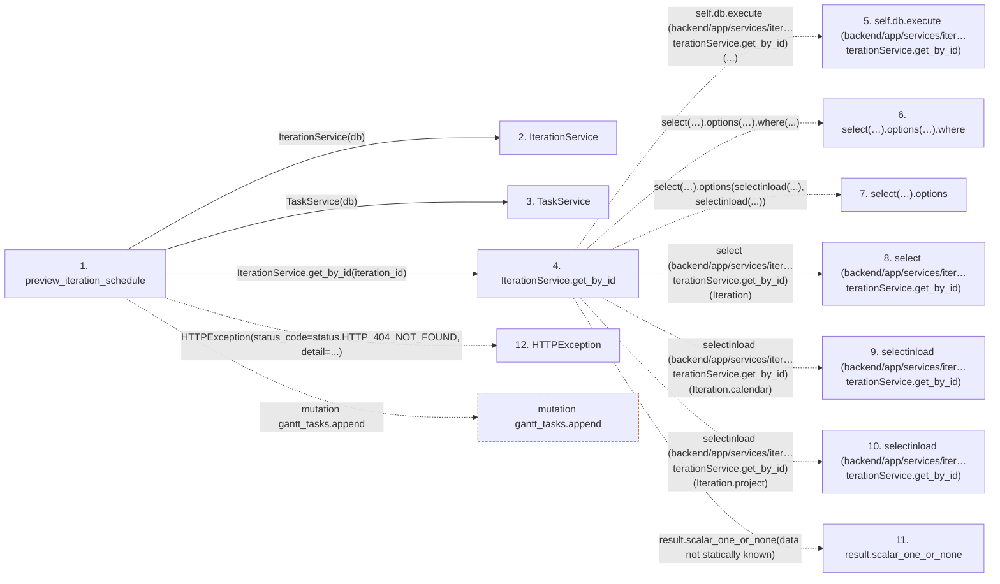

# preview_iteration_schedule

**Entry point:** `preview_iteration_schedule` (`http`)
**Source:** [routers_gantt](../modules/routers_gantt.md)
**Modules touched:** [authority](../modules/authority.md), [commands](../modules/commands.md), [config](../modules/config.md), [delivery_dependency_service](../modules/delivery_dependency_service.md), and 15 more

**Complete modules touched:**

- [authority](../modules/authority.md)
- [commands](../modules/commands.md)
- [config](../modules/config.md)
- [delivery_dependency_service](../modules/delivery_dependency_service.md)
- [discussion_service](../modules/discussion_service.md)
- [identity_service](../modules/identity_service.md)
- [iteration_service](../modules/iteration_service.md)
- [models_outbound_webhook](../modules/models_outbound_webhook.md)
- [mutation_versions](../modules/mutation_versions.md)
- [query_limits](../modules/query_limits.md)
- [routers_gantt](../modules/routers_gantt.md)
- [schemas_gantt](../modules/schemas_gantt.md)
- [schemas_task](../modules/schemas_task.md)
- [services_work_metrics](../modules/services_work_metrics.md)
- [task_brief_service](../modules/task_brief_service.md)
- [task_hierarchy_service](../modules/task_hierarchy_service.md)
- [task_service](../modules/task_service.md)
- [tasks](../modules/tasks.md)
- [time](../modules/time.md)

## Call sequence

> Static overview in presentation order, not runtime execution order. Arrows retain captured callers; representative internal continuations and boundary examples precede repeated helper detail.

<!-- Auto-generated from static call edges. Dashed arrows are external or unresolved calls. Reviewed runtime conditions and side effects belong in Behavior. -->

```mermaid
sequenceDiagram
    participant p0 as preview_iteration_schedule
    participant p1 as command_transaction
    participant p2 as apply_batch_update_items
    participant p3 as TaskService.get_by_iteration
    participant p4 as _task_to_gantt
    participant p5 as IterationService
    participant p6 as TaskService
    participant p7 as IterationService.get_by_id
    participant p8 as lock_iterations
    participant p9 as _overdue_task_ids
    participant p10 as SchedulePreviewResponse
    participant p11 as TaskService._task_graph_query
    participant p12 as task_signals
    participant p13 as DeliveryDependencyService.reconcile
    participant p14 as TaskService._load_iteration_tree
    participant p15 as DiscussionService.enqueue
    participant p16 as TaskHierarchyService._load_iteration_tree
    participant p17 as working_today
    participant p18 as DeliveryDependencyService.validate_cycles
    participant p19 as DiscussionService.recipient_authorized
    participant p20 as TaskService.reserve_task_version
    participant p21 as clear_execution_evidence
    participant p22 as DeliveryDependencyService.graph
    participant p23 as IdentityService.context
    participant p24 as lock_planning
    participant p25 as require_mutation_revision
    participant p26 as current_command
    participant p27 as CommandState
    participant p28 as DeliveryDependencyService
    participant p29 as HTTPException
    participant p30 as service.schedule_iteration
    p0->>p1: command_transaction
    p0->>p2: apply_batch_update_items
    p0->>p3: TaskService.get_by_iteration
    p0->>p4: _task_to_gantt
    p0->>p5: IterationService
    p0->>p6: TaskService
    p0->>p7: IterationService.get_by_id
    p0->>p8: lock_iterations
    p0->>p9: _overdue_task_ids
    p0->>p10: SchedulePreviewResponse
    p3->>p11: TaskService._task_graph_query
    p4->>p12: task_signals
    p1->>p13: DeliveryDependencyService.reconcile
    p3->>p14: TaskService._load_iteration_tree
    p1->>p15: DiscussionService.enqueue
    p14->>p16: TaskHierarchyService._load_iteration_tree
    p12->>p17: working_today
    p13->>p18: DeliveryDependencyService.validate_cycles
    p15->>p19: DiscussionService.recipient_authorized
    p13->>p20: TaskService.reserve_task_version
    p13->>p21: clear_execution_evidence
    p18->>p22: DeliveryDependencyService.graph
    p19->>p23: IdentityService.context
    p8->>p24: lock_planning
    p8->>p25: require_mutation_revision
    p1->>p26: current_command
    p1->>p27: CommandState
    p1->>p28: DeliveryDependencyService
    p0-->>p29: HTTPException(status_code=status.HTTP_404_NOT_FOUND, detail=...)
    p0-->>p30: service.schedule_iteration(iteration_id, commit=False, expected_planning_revision=data.expected_planning_revision)
```

> Call sequence diagram shows 30 of 399 interactions; 369 omitted to keep the visualization within the 30-interaction and generated-diagram limits, with uncertain identities omitted rather than inferred.

> Captured boundary calls: external 1 of 121 (120 omitted); unresolved 1 of 196 (195 omitted). These counts cover the captured static trace.

Omitted captured detail, grouped by actual caller occurrence and target module:

| Caller | Parent step | Target module | Kind | Omitted interactions |
| --- | --- | --- | --- | --- |
| `backend/app/services/iteration_service.py:IterationService.get_by_id` | 4 | - | unresolved | 4 |
| `backend/app/services/iteration_service.py:IterationService.get_by_id` | 4 | - | external | 3 |
| `backend/app/commands.py:current_command` | 14 | - | external | 2 |
| `backend/app/commands.py:current_command` | 14 | - | unresolved | 1 |
| `backend/app/commands.py:command_transaction` | 13 | - | external | 4 |
| `backend/app/commands.py:command_transaction` | 13 | - | unresolved | 12 |
| `backend/app/services/delivery_dependency_service.py:DeliveryDependencyService.reconcile` | 25 | - | unresolved | 23 |
| `backend/app/services/delivery_dependency_service.py:DeliveryDependencyService.reconcile` | 25 | - | external | 10 |
> Omission summary shows 8 of 82 groups; 74 further groups are not expanded here. Counts above include all omitted interactions.
> Detailed flow queries retain their own coverage and limits; omitted paths may execute at runtime.

> Trace truncated at the depth limit; deeper calls are omitted.

## Data flow

<!-- Auto-generated static analysis. Treat values and boundaries as best-effort hints, not runtime proof. -->

### Analysis coverage

**Effect analysis partially available.** Flow assembly and source effect analysis are separate; empty observations do not prove an empty handler body.

Source steps: 83; effect analysis evaluated: 49, partial: 0, unavailable: 34. Counts include steps omitted from the displayed trace.

Collector observations for 49 source steps with known totals: observed: 247, emitted: 247, omitted: 0. Unavailable totals are excluded.

- Callable record unavailable for one or more source steps; those steps have no represented callable body.
- Effect collector totals unavailable; observed counts cover captured records only.

| Step | Callable record | Effect analysis | Collector totals | Observed | Emitted | Omitted |
|---|---|---|---|---:|---:|---:|
| `preview_iteration_schedule` | `available` | `evaluated` | `available` | `9` | `9` | `0` |
| `IterationService` | `unavailable` | `unavailable` | `unavailable` | — | — | — |
| `TaskService` | `unavailable` | `unavailable` | `unavailable` | — | — | — |
| `IterationService.get_by_id` | `available` | `evaluated` | `available` | `3` | `3` | `0` |
| `self.db.execute (backend/app/services/iter…terationService.get_by_id)` | `not_applicable` | `not_applicable` | `not_applicable` | — | — | — |
| `select(…).options(…).where` | `not_applicable` | `not_applicable` | `not_applicable` | — | — | — |
| `select(…).options` | `not_applicable` | `not_applicable` | `not_applicable` | — | — | — |
| `select (backend/app/services/iter…terationService.get_by_id)` | `not_applicable` | `not_applicable` | `not_applicable` | — | — | — |
| `selectinload (backend/app/services/iter…terationService.get_by_id)` | `not_applicable` | `not_applicable` | `not_applicable` | — | — | — |
| `selectinload (backend/app/services/iter…terationService.get_by_id)` | `not_applicable` | `not_applicable` | `not_applicable` | — | — | — |
| `result.scalar_one_or_none` | `not_applicable` | `not_applicable` | `not_applicable` | — | — | — |
| `HTTPException` | `not_applicable` | `not_applicable` | `not_applicable` | — | — | — |

```mermaid
flowchart LR
    s1["1. preview_iteration_schedule"]
    s2["2. IterationService"]
    s3["3. TaskService"]
    s4["4. IterationService.get_by_id"]
    s5["5. self.db.execute (backend/app/services/iter…terationService.get_by_id)"]
    s6["6. select(…).options(…).where"]
    s7["7. select(…).options"]
    s8["8. select (backend/app/services/iter…terationService.get_by_id)"]
    s9["9. selectinload (backend/app/services/iter…terationService.get_by_id)"]
    s10["10. selectinload (backend/app/services/iter…terationService.get_by_id)"]
    s11["11. result.scalar_one_or_none"]
    s12["12. HTTPException"]
    s1 -->|"IterationService(db)"| s2
    s1 -->|"TaskService(db)"| s3
    s1 -->|"IterationService.get_by_id(iteration_id)"| s4
    s4 -. "self.db.execute (backend/app/services/iter…terationService.get_by_id)(...)" .-> s5
    s4 -. "select(…).options(…).where(...)" .-> s6
    s4 -. "select(…).options(selectinload(...), selectinload(...))" .-> s7
    s4 -. "select (backend/app/services/iter…terationService.get_by_id)(Iteration)" .-> s8
    s4 -. "selectinload (backend/app/services/iter…terationService.get_by_id)(Iteration.calendar)" .-> s9
    s4 -. "selectinload (backend/app/services/iter…terationService.get_by_id)(Iteration.project)" .-> s10
    s4 -. "result.scalar_one_or_none(data not statically known)" .-> s11
    s1 -. "HTTPException(status_code=status.HTTP_404_NOT_FOUND, detail=...)" .-> s12
    b0["mutation gantt_tasks.append"]
    s1 -. "mutation gantt_tasks.append" .-> b0
    click s1 "../modules/routers_gantt.md"
    click s2 "../modules/iteration_service.md"
    click s3 "../modules/task_service.md"
    click s4 "../modules/iteration_service.md"
    classDef boundary stroke:#b45309,stroke-dasharray: 4 2
    class b0 boundary
```

### Step data

| Step | Inputs | Reads | Writes | Returns |
|---|---|---|---|---|
| `preview_iteration_schedule` | `iteration_id: int`, `data: SchedulePreviewRequest`, `service: Annotated[SchedulerService, Depends(get_scheduler_service)]`, `db: Annotated[AsyncSession, Depends(get_db, scope='function')]` | `status`, `status`, `status` | - | `SchedulePreviewResponse(...)` |
| `IterationService` | - | - | - | - |
| `TaskService` | - | - | - | - |
| `IterationService.get_by_id` | `iteration_id: int` | `Iteration` | - | `result.scalar_one_or_none(...)` |
| `self.db.execute (backend/app/services/iter…terationService.get_by_id)` | - | - | - | - |
| `select(…).options(…).where` | - | - | - | - |
| `select(…).options` | - | - | - | - |
| `select (backend/app/services/iter…terationService.get_by_id)` | - | - | - | - |
| `selectinload (backend/app/services/iter…terationService.get_by_id)` | - | - | - | - |
| `selectinload (backend/app/services/iter…terationService.get_by_id)` | - | - | - | - |
| `result.scalar_one_or_none` | - | - | - | - |
| `HTTPException` | - | - | - | - |

### Call data

| From | To | Line | Call |
|---|---|---:|---|
| preview_iteration_schedule | IterationService | 72 | `IterationService(db)` |
| preview_iteration_schedule | TaskService | 73 | `TaskService(db)` |
| preview_iteration_schedule | IterationService.get_by_id | 74 | `iteration_service.get_by_id(iteration_id)` |
| IterationService.get_by_id | self.db.execute (backend/app/services/iter…terationService.get_by_id) | 323 | `self.db.execute(...)` |
| IterationService.get_by_id | select(…).options(…).where | 324 | `select(Iteration).options(selectinload(Iteration.calendar), selectinload(Iteration.project)).where(...)` |
| IterationService.get_by_id | select(…).options | 324 | `select(Iteration).options(selectinload(...), selectinload(...))` |
| IterationService.get_by_id | select (backend/app/services/iter…terationService.get_by_id) | 324 | `select(Iteration)` |
| IterationService.get_by_id | selectinload (backend/app/services/iter…terationService.get_by_id) | 326 | `selectinload(Iteration.calendar)` |
| IterationService.get_by_id | selectinload (backend/app/services/iter…terationService.get_by_id) | 327 | `selectinload(Iteration.project)` |
| IterationService.get_by_id | result.scalar_one_or_none | 331 | `result.scalar_one_or_none(data not statically known)` |
| preview_iteration_schedule | HTTPException | 76 | `HTTPException(status_code=status.HTTP_404_NOT_FOUND, detail=...)` |

### Boundary effects

| Kind | Target | Step | Line |
|---|---|---|---:|
| mutation | `gantt_tasks.append` | `preview_iteration_schedule` | 100 |

### Static analysis gaps

| Kind | Step | Target | Line |
|---|---|---|---:|
| unresolved_call | `IterationService.get_by_id` | `self.db.execute` | 323 |
| unresolved_call | `IterationService.get_by_id` | `select(Iteration).options(selectinload(Iteration.calendar), selectinload(Iteration.project)).where` | 324 |
| unresolved_call | `IterationService.get_by_id` | `select(Iteration).options` | 324 |
| external_call | `IterationService.get_by_id` | `select` | 324 |
| external_call | `IterationService.get_by_id` | `selectinload` | 326 |
| external_call | `IterationService.get_by_id` | `selectinload` | 327 |
| unresolved_call | `IterationService.get_by_id` | `result.scalar_one_or_none` | 331 |
| external_call | `preview_iteration_schedule` | `HTTPException` | 76 |
| step_limit | `preview_iteration_schedule` | `first 12 steps` | 0 |
| truncated_flow | `preview_iteration_schedule` | `depth limit` | 0 |

## Behavior

Applies sandbox inputs and the real scheduler inside a rollback-only owner. The result carries observed iteration and shared planning revisions plus capacity constraints. Domain rows, current versions, recovery retention and notification intents are all rolled back.
