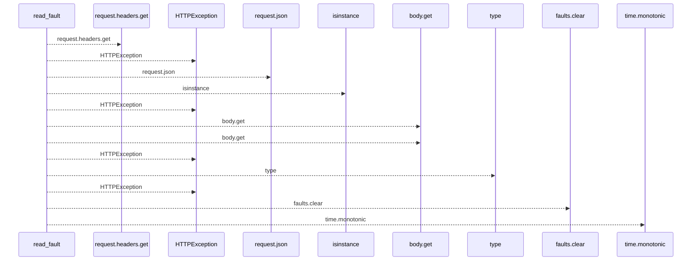
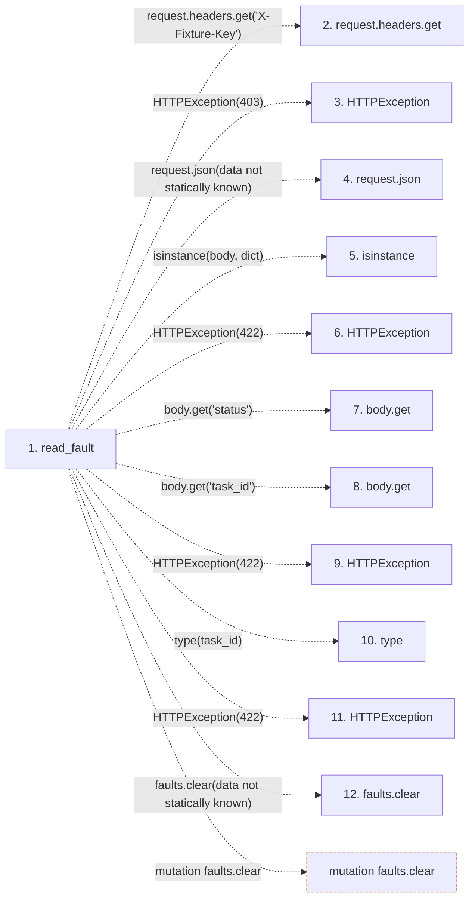

# read_fault

**Entry point:** `read_fault` (`http`)
**Source:** [serve_disposable_api](../modules/serve_disposable_api.md)
**Modules touched:** [serve_disposable_api](../modules/serve_disposable_api.md)

## Call sequence

<!-- Auto-generated from static call edges. Dashed arrows are external or unresolved calls. Reviewed runtime conditions and side effects belong in Behavior. -->

## Data flow

<!-- Auto-generated static analysis. Treat values and boundaries as best-effort hints, not runtime proof. -->

### Step data

| Step | Inputs | Reads | Writes | Returns |
|---|---|---|---|---|
| `read_fault` | `request: Request`, `task_id: int` | - | `faults[...]` | `{...}` |
| `request.headers.get` | - | - | - | - |
| `HTTPException` | - | - | - | - |
| `request.json` | - | - | - | - |
| `isinstance` | - | - | - | - |
| `HTTPException` | - | - | - | - |
| `body.get` | - | - | - | - |
| `body.get` | - | - | - | - |
| `HTTPException` | - | - | - | - |
| `type` | - | - | - | - |
| `HTTPException` | - | - | - | - |
| `faults.clear` | - | - | - | - |

### Call data

| From | To | Line | Call |
|---|---|---:|---|
| read_fault | request.headers.get | 84 | `request.headers.get('X-Fixture-Key')` |
| read_fault | HTTPException | 85 | `HTTPException(403)` |
| read_fault | request.json | 86 | `request.json(data not statically known)` |
| read_fault | isinstance | 87 | `isinstance(body, dict)` |
| read_fault | HTTPException | 88 | `HTTPException(422)` |
| read_fault | body.get | 89 | `body.get('status')` |
| read_fault | body.get | 90 | `body.get('task_id')` |
| read_fault | HTTPException | 91 | `HTTPException(422)` |
| read_fault | type | 92 | `type(task_id)` |
| read_fault | HTTPException | 93 | `HTTPException(422)` |
| read_fault | faults.clear | 94 | `faults.clear(data not statically known)` |

### Boundary effects

| Kind | Target | Step | Line |
|---|---|---|---:|
| mutation | `faults.clear` | `read_fault` | 94 |

### Static analysis gaps

| Kind | Step | Target | Line |
|---|---|---|---:|
| unresolved_call | `read_fault` | `request.headers.get` | 84 |
| unresolved_call | `read_fault` | `HTTPException` | 85 |
| unresolved_call | `read_fault` | `request.json` | 86 |
| external_call | `read_fault` | `isinstance` | 87 |
| unresolved_call | `read_fault` | `HTTPException` | 88 |
| unresolved_call | `read_fault` | `body.get` | 89 |
| unresolved_call | `read_fault` | `body.get` | 90 |
| unresolved_call | `read_fault` | `HTTPException` | 91 |
| external_call | `read_fault` | `type` | 92 |
| unresolved_call | `read_fault` | `HTTPException` | 93 |
| step_limit | `read_fault` | `first 12 steps` | 0 |

## Behavior

The route is registered only by the safety-fenced temporary SQLite application when an invocation nonce is configured. It retains ordinary task-edit authority, checks the matching nonce header and path/body task ID, accepts a positive bounded task ID and a limited failure status, replaces the single in-memory override and expires it after thirty seconds. Status zero removes the effect. Middleware applies the override only to task GET reads; it does not change stored tasks or authorize ordinary mutations. Static boundary detection misses these dynamic registration and middleware effects.
