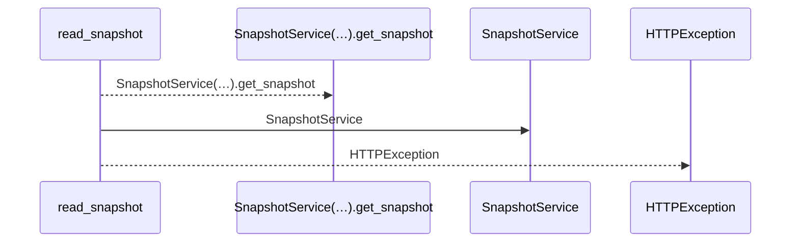
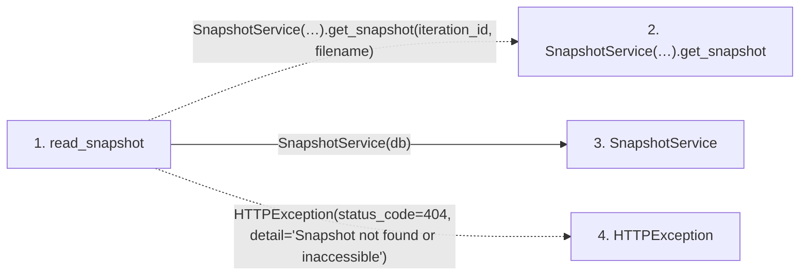

# read_snapshot

**Entry point:** `read_snapshot` (`http`)
**Source:** [snapshots](../modules/snapshots.md)
**Modules touched:** [snapshot_service](../modules/snapshot_service.md), [snapshots](../modules/snapshots.md)

## Call sequence

<!-- Auto-generated from static call edges. Dashed arrows are external or unresolved calls. Reviewed runtime conditions and side effects belong in Behavior. -->

## Data flow

<!-- Auto-generated static analysis. Treat values and boundaries as best-effort hints, not runtime proof. -->

### Step data

| Step | Inputs | Reads | Writes | Returns |
|---|---|---|---|---|
| `read_snapshot` | `iteration_id: int`, `filename: str`, `db: Annotated[AsyncSession, Depends(get_db, scope='function')]` | - | - | `payload` |
| `SnapshotService(…).get_snapshot` | - | - | - | - |
| `SnapshotService` | - | - | - | - |
| `HTTPException` | - | - | - | - |

### Call data

| From | To | Line | Call |
|---|---|---:|---|
| read_snapshot | SnapshotService(…).get_snapshot | 283 | `SnapshotService(db).get_snapshot(iteration_id, filename)` |
| read_snapshot | SnapshotService | 283 | `SnapshotService(db)` |
| read_snapshot | HTTPException | 285 | `HTTPException(status_code=404, detail='Snapshot not found or inaccessible')` |

### Boundary effects

*No boundary effects detected.*

### Static analysis gaps

| Kind | Step | Target | Line |
|---|---|---|---:|
| unresolved_call | `read_snapshot` | `SnapshotService(db).get_snapshot` | 283 |
| external_call | `read_snapshot` | `HTTPException` | 285 |

## Behavior

This flow starts at `read_snapshot` and is classified as `http`. The generated call and data-flow sections are bounded static projections; runtime conditions and side effects require source-level confirmation.
