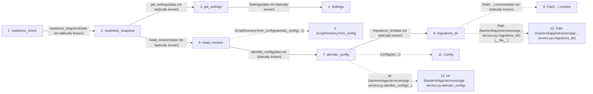

# readiness_check

**Entry point:** `readiness_check` (`http`)
**Source:** [app_main](../modules/app_main.md)
**Modules touched:** [app_database](../modules/app_database.md), [app_main](../modules/app_main.md), [config](../modules/config.md), [database_config](../modules/database_config.md), and 4 more

**Complete modules touched:**

- [app_database](../modules/app_database.md)
- [app_main](../modules/app_main.md)
- [config](../modules/config.md)
- [database_config](../modules/database_config.md)
- [maintenance](../modules/maintenance.md)
- [observability](../modules/observability.md)
- [time](../modules/time.md)
- [upgrade_service](../modules/upgrade_service.md)

## Call sequence

```mermaid
sequenceDiagram
    participant p0 as readiness_check
    participant p1 as readiness_snapshot
    participant p2 as get_settings
    participant p3 as Settings
    participant p4 as head_revision
    participant p5 as ScriptDirectory.from_config
    participant p6 as alembic_config
    participant p7 as migrations_dir
    participant p8 as Path(…).resolve
    participant p9 as Path (backend/app/services/upgr…service.py:migrations_dir)
    participant p10 as Config
    participant p11 as str (backend/app/services/upgr…service.py:alembic_config)
    participant p12 as config.set_main_option
    participant p13 as alembic_safe_url
    participant p14 as isinstance
    participant p15 as make_url (backend/app/database_config.py:alembic_safe_url)
    participant p16 as url.render_as_string(…).replace
    participant p17 as url.render_as_string
    participant p18 as database_configuration
    participant p19 as parse_database_configuration
    participant p20 as make_url (backend/app/database_conf…se_database_configuration)
    participant p21 as str (backend/app/database_conf…se_database_configuration)
    participant p22 as _settings_value
    participant p23 as DatabaseConfigurationError
    participant p24 as str(…).strip (backend/app/database_conf…se_database_configuration)
    participant p25 as _APPLICATION_NAME_PATTERN.fullmatch
    p0->>p1: readiness_snapshot
    p1->>p2: get_settings
    p2->>p3: Settings
    p1->>p4: head_revision
    p4-->>p5: ScriptDirectory.from_config
    p4->>p6: alembic_config
    p6->>p7: migrations_dir
    p7-->>p8: Path(…).resolve
    p7-->>p9: Path (backend/app/services/upgr…service.py:migrations_dir)
    p6-->>p10: Config
    p6-->>p11: str (backend/app/services/upgr…service.py:alembic_config)
    p6-->>p12: config.set_main_option
    p6-->>p11: str (backend/app/services/upgr…service.py:alembic_config)
    p6-->>p12: config.set_main_option
    p6->>p13: alembic_safe_url
    p13-->>p14: isinstance
    p13-->>p15: make_url (backend/app/database_config.py:alembic_safe_url)
    p13-->>p16: url.render_as_string(…).replace
    p13-->>p17: url.render_as_string
    p6->>p18: database_configuration
    p18->>p19: parse_database_configuration
    p19-->>p20: make_url (backend/app/database_conf…se_database_configuration)
    p19-->>p21: str (backend/app/database_conf…se_database_configuration)
    p19->>p22: _settings_value
    p19->>p23: DatabaseConfigurationError
    p19-->>p24: str(…).strip (backend/app/database_conf…se_database_configuration)
    p19-->>p21: str (backend/app/database_conf…se_database_configuration)
    p19->>p22: _settings_value
    p19-->>p25: _APPLICATION_NAME_PATTERN.fullmatch
    p19->>p23: DatabaseConfigurationError
```

<!-- Auto-generated from static call edges. Dashed arrows are external or unresolved calls. Reviewed runtime conditions and side effects belong in Behavior. -->

> Call sequence diagram shows 30 of 205 interactions; 175 omitted to keep the visualization within the 30-interaction and generated-diagram limits.

> Trace truncated at the depth limit; deeper calls are omitted.

## Data flow

<!-- Auto-generated static analysis. Treat values and boundaries as best-effort hints, not runtime proof. -->

### Step data

| Step | Inputs | Reads | Writes | Returns |
|---|---|---|---|---|
| `readiness_check` | `request: Request` | - | - | `JSONResponse(...)` |
| `readiness_snapshot` | - | `SQLAlchemyError`, `SQLAlchemyError`, `SQLAlchemyError`, `SQLAlchemyError` | - | `(...)`, `(...)` |
| `get_settings` | - | - | - | `Settings(...)` |
| `Settings` | - | - | - | - |
| `head_revision` | - | - | - | `heads[...]` |
| `ScriptDirectory.from_config` | - | - | - | - |
| `alembic_config` | `connection: Connection \| None` | - | `config.attributes[...]` | `config` |
| `migrations_dir` | - | - | - | `...` |
| `Path(…).resolve` | - | - | - | - |
| `Path (backend/app/services/upgr…service.py:migrations_dir)` | - | - | - | - |
| `Config` | - | - | - | - |
| `str (backend/app/services/upgr…service.py:alembic_config)` | - | - | - | - |

### Call data

| From | To | Line | Call |
|---|---|---:|---|
| readiness_check | readiness_snapshot | 255 | `readiness_snapshot(data not statically known)` |
| readiness_snapshot | get_settings | 252 | `get_settings(data not statically known)` |
| get_settings | Settings | 481 | `Settings(data not statically known)` |
| readiness_snapshot | head_revision | 253 | `head_revision(data not statically known)` |
| head_revision | ScriptDirectory.from_config | 90 | `ScriptDirectory.from_config(alembic_config(...))` |
| head_revision | alembic_config | 90 | `alembic_config(data not statically known)` |
| alembic_config | migrations_dir | 70 | `migrations_dir(data not statically known)` |
| migrations_dir | Path(…).resolve | 59 | `Path(__file__).resolve(data not statically known)` |
| migrations_dir | Path (backend/app/services/upgr…service.py:migrations_dir) | 59 | `Path(__file__)` |
| alembic_config | Config | 71 | `Config(str(...))` |
| alembic_config | str (backend/app/services/upgr…service.py:alembic_config) | 71 | `str(...)` |

### Boundary effects

*No boundary effects detected.*

### Static analysis gaps

| Kind | Step | Target | Line |
|---|---|---|---:|
| external_call | `head_revision` | `ScriptDirectory.from_config` | 90 |
| unresolved_call | `migrations_dir` | `Path(__file__).resolve` | 59 |
| external_call | `alembic_config` | `Config` | 71 |
| step_limit | `readiness_check` | `first 12 steps` | 0 |
| truncated_flow | `readiness_check` | `depth limit` | 0 |

## Behavior

This flow starts at `readiness_check` and is classified as `http`. The generated call and data-flow sections are bounded static projections; runtime conditions and side effects require source-level confirmation.
