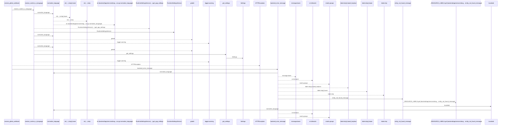
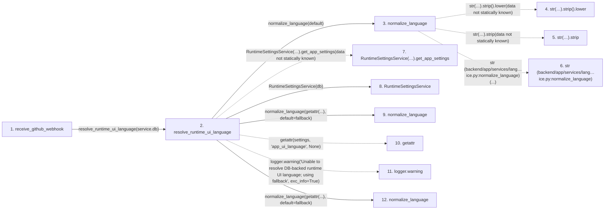

# receive_github_webhook

**Entry point:** `receive_github_webhook` (`http`)
**Source:** [routers_github](../modules/routers_github.md)
**Modules touched:** [authority](../modules/authority.md), [config](../modules/config.md), [identity_service](../modules/identity_service.md), [language_service](../modules/language_service.md), and 2 more

**Complete modules touched:**

- [authority](../modules/authority.md)
- [config](../modules/config.md)
- [identity_service](../modules/identity_service.md)
- [language_service](../modules/language_service.md)
- [routers_github](../modules/routers_github.md)
- [system_settings_service](../modules/system_settings_service.md)

## Call sequence

<!-- Auto-generated from static call edges. Dashed arrows are external or unresolved calls. Reviewed runtime conditions and side effects belong in Behavior. -->

> Call sequence diagram shows 30 of 138 interactions; 108 omitted to keep the visualization within the 30-interaction and generated-diagram limits.

## Data flow

<!-- Auto-generated static analysis. Treat values and boundaries as best-effort hints, not runtime proof. -->

### Step data

| Step | Inputs | Reads | Writes | Returns |
|---|---|---|---|---|
| `receive_github_webhook` | `request: Request`, `service: Annotated[GitHubWebhookService, Depends(get_github_webhook_service)]`, `github_event: Annotated[Optional[str], Header(alias='X-GitHub-Event')]`, `github_delivery: Annotated[Optional[str], Header(alias='X-GitHub-Delivery')]`, `github_signature: Annotated[Optional[str], Header(alias='X-Hub-Signature-256')]` | `status`, `GitHubWebhookConfigurationError`, `status`, `GitHubWebhookSignatureError`, `status`, `GitHubWebhookPayloadError`, `status` | - | `...` |
| `resolve_runtime_ui_language` | `db: Any`, `default: LanguageCode \| None` | - | - | `normalize_language(...)`, `normalize_language(...)`, `fallback` |
| `normalize_language` | `value: Any`, `default: LanguageCode` | - | - | `normalized`, `default` |
| `str(…).strip().lower` | - | - | - | - |
| `str(…).strip` | - | - | - | - |
| `str (backend/app/services/lang…ice.py:normalize_language)` | - | - | - | - |
| `RuntimeSettingsService(…).get_app_settings` | - | - | - | - |
| `RuntimeSettingsService` | - | - | - | - |
| `normalize_language` | `value: Any`, `default: LanguageCode` | - | - | `normalized`, `default` |
| `getattr` | - | - | - | - |
| `logger.warning` | - | - | - | - |
| `normalize_language` | `value: Any`, `default: LanguageCode` | - | - | `normalized`, `default` |

### Call data

| From | To | Line | Call |
|---|---|---:|---|
| receive_github_webhook | resolve_runtime_ui_language | 151 | `resolve_runtime_ui_language(service.db)` |
| resolve_runtime_ui_language | normalize_language | 406 | `normalize_language(default)` |
| normalize_language | str(…).strip().lower | 35 | `str(value or '').strip().lower(data not statically known)` |
| normalize_language | str(…).strip | 35 | `str(value or '').strip(data not statically known)` |
| normalize_language | str (backend/app/services/lang…ice.py:normalize_language) | 35 | `str(...)` |
| resolve_runtime_ui_language | RuntimeSettingsService(…).get_app_settings | 411 | `RuntimeSettingsService(db).get_app_settings(data not statically known)` |
| resolve_runtime_ui_language | RuntimeSettingsService | 411 | `RuntimeSettingsService(db)` |
| resolve_runtime_ui_language | normalize_language | 412 | `normalize_language(getattr(...), default=fallback)` |
| resolve_runtime_ui_language | getattr | 412 | `getattr(settings, 'app_ui_language', None)` |
| resolve_runtime_ui_language | logger.warning | 415 | `logger.warning('Unable to resolve DB-backed runtime UI language; using fallback', exc_info=True)` |
| resolve_runtime_ui_language | normalize_language | 422 | `normalize_language(getattr(...), default=fallback)` |

### Boundary effects

*No boundary effects detected.*

### Static analysis gaps

| Kind | Step | Target | Line |
|---|---|---|---:|
| unresolved_call | `normalize_language` | `str(value or '').strip().lower` | 35 |
| unresolved_call | `normalize_language` | `str(value or '').strip` | 35 |
| unresolved_call | `resolve_runtime_ui_language` | `RuntimeSettingsService(db).get_app_settings` | 411 |
| external_call | `resolve_runtime_ui_language` | `getattr` | 412 |
| unresolved_call | `resolve_runtime_ui_language` | `logger.warning` | 415 |
| step_limit | `receive_github_webhook` | `first 12 steps` | 0 |

## Behavior

This flow starts at `receive_github_webhook` and is classified as `http`. The generated call and data-flow sections are bounded static projections; runtime conditions and side effects require source-level confirmation.
