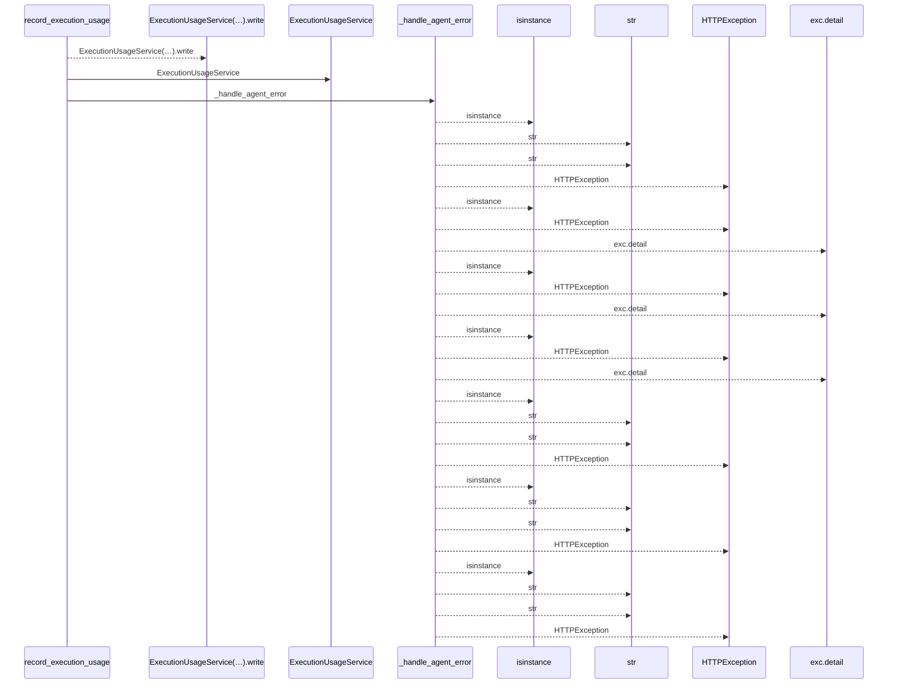
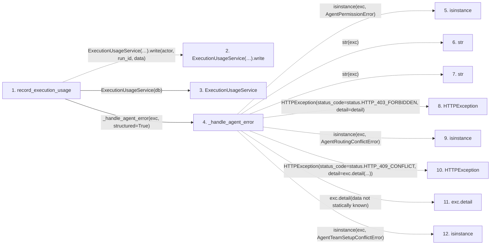

# record_execution_usage

**Entry point:** `record_execution_usage` (`http`)
**Source:** [routers_agent](../modules/routers_agent.md)
**Modules touched:** [execution_usage_service](../modules/execution_usage_service.md), [routers_agent](../modules/routers_agent.md)

## Call sequence

<!-- Auto-generated from static call edges. Dashed arrows are external or unresolved calls. Reviewed runtime conditions and side effects belong in Behavior. -->

## Data flow

<!-- Auto-generated static analysis. Treat values and boundaries as best-effort hints, not runtime proof. -->

### Step data

| Step | Inputs | Reads | Writes | Returns |
|---|---|---|---|---|
| `record_execution_usage` | `run_id: int`, `data: ExecutionUsageWrite`, `actor: Annotated[AgentActor, Depends(get_agent_actor)]`, `db: Annotated[AsyncSession, Depends(get_db, scope='function')]` | - | - | `...` |
| `ExecutionUsageService(…).write` | - | - | - | - |
| `ExecutionUsageService` | - | - | - | - |
| `_handle_agent_error` | `exc: Exception`, `structured: bool` | `AgentPermissionError`, `status`, `AgentRoutingConflictError`, `status`, `AgentTeamSetupConflictError`, `status`, `TaskVersionConflictError`, `status` | - | - |
| `isinstance` | - | - | - | - |
| `str` | - | - | - | - |
| `str` | - | - | - | - |
| `HTTPException` | - | - | - | - |
| `isinstance` | - | - | - | - |
| `HTTPException` | - | - | - | - |
| `exc.detail` | - | - | - | - |
| `isinstance` | - | - | - | - |

### Call data

| From | To | Line | Call |
|---|---|---:|---|
| record_execution_usage | ExecutionUsageService(…).write | 1354 | `ExecutionUsageService(db).write(actor, run_id, data)` |
| record_execution_usage | ExecutionUsageService | 1354 | `ExecutionUsageService(db)` |
| record_execution_usage | _handle_agent_error | 1356 | `_handle_agent_error(exc, structured=True)` |
| _handle_agent_error | isinstance | 254 | `isinstance(exc, AgentPermissionError)` |
| _handle_agent_error | str | 256 | `str(exc)` |
| _handle_agent_error | str | 258 | `str(exc)` |
| _handle_agent_error | HTTPException | 260 | `HTTPException(status_code=status.HTTP_403_FORBIDDEN, detail=detail)` |
| _handle_agent_error | isinstance | 261 | `isinstance(exc, AgentRoutingConflictError)` |
| _handle_agent_error | HTTPException | 262 | `HTTPException(status_code=status.HTTP_409_CONFLICT, detail=exc.detail(...))` |
| _handle_agent_error | exc.detail | 262 | `exc.detail(data not statically known)` |
| _handle_agent_error | isinstance | 263 | `isinstance(exc, AgentTeamSetupConflictError)` |

### Boundary effects

*No boundary effects detected.*

### Static analysis gaps

| Kind | Step | Target | Line |
|---|---|---|---:|
| unresolved_call | `record_execution_usage` | `ExecutionUsageService(db).write` | 1354 |
| external_call | `_handle_agent_error` | `isinstance` | 254 |
| external_call | `_handle_agent_error` | `HTTPException` | 260 |
| external_call | `_handle_agent_error` | `isinstance` | 261 |
| external_call | `_handle_agent_error` | `HTTPException` | 262 |
| unresolved_call | `_handle_agent_error` | `exc.detail` | 262 |
| external_call | `_handle_agent_error` | `isinstance` | 263 |
| step_limit | `record_execution_usage` | `first 12 steps` | 0 |

## Behavior

This flow starts at `record_execution_usage` and is classified as `http`. The generated call and data-flow sections are bounded static projections; runtime conditions and side effects require source-level confirmation.
