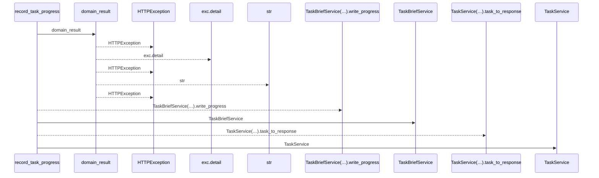
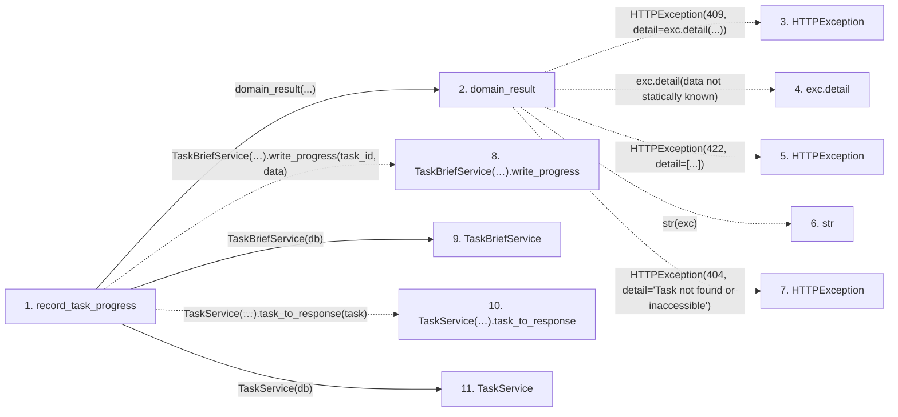

# record_task_progress

**Entry point:** `record_task_progress` (`http`)
**Source:** [routers_task_domain](../modules/routers_task_domain.md)
**Modules touched:** [routers_task_domain](../modules/routers_task_domain.md), [task_brief_service](../modules/task_brief_service.md), [task_service](../modules/task_service.md)

## Call sequence

<!-- Auto-generated from static call edges. Dashed arrows are external or unresolved calls. Reviewed runtime conditions and side effects belong in Behavior. -->

## Data flow

<!-- Auto-generated static analysis. Treat values and boundaries as best-effort hints, not runtime proof. -->

### Step data

| Step | Inputs | Reads | Writes | Returns |
|---|---|---|---|---|
| `record_task_progress` | `task_id: int`, `data: ProgressWrite`, `db: DB` | - | - | `...` |
| `domain_result` | `awaitable` | `TaskVersionConflictError` | - | `result` |
| `HTTPException` | - | - | - | - |
| `exc.detail` | - | - | - | - |
| `HTTPException` | - | - | - | - |
| `str` | - | - | - | - |
| `HTTPException` | - | - | - | - |
| `TaskBriefService(…).write_progress` | - | - | - | - |
| `TaskBriefService` | - | - | - | - |
| `TaskService(…).task_to_response` | - | - | - | - |
| `TaskService` | - | - | - | - |

### Call data

| From | To | Line | Call |
|---|---|---:|---|
| record_task_progress | domain_result | 164 | `domain_result(...)` |
| domain_result | HTTPException | 29 | `HTTPException(409, detail=exc.detail(...))` |
| domain_result | exc.detail | 29 | `exc.detail(data not statically known)` |
| domain_result | HTTPException | 31 | `HTTPException(422, detail=[...])` |
| domain_result | str | 31 | `str(exc)` |
| domain_result | HTTPException | 33 | `HTTPException(404, detail='Task not found or inaccessible')` |
| record_task_progress | TaskBriefService(…).write_progress | 164 | `TaskBriefService(db).write_progress(task_id, data)` |
| record_task_progress | TaskBriefService | 164 | `TaskBriefService(db)` |
| record_task_progress | TaskService(…).task_to_response | 165 | `TaskService(db).task_to_response(task)` |
| record_task_progress | TaskService | 165 | `TaskService(db)` |

### Boundary effects

*No boundary effects detected.*

### Static analysis gaps

| Kind | Step | Target | Line |
|---|---|---|---:|
| external_call | `domain_result` | `HTTPException` | 29 |
| unresolved_call | `domain_result` | `exc.detail` | 29 |
| external_call | `domain_result` | `HTTPException` | 31 |
| external_call | `domain_result` | `HTTPException` | 33 |
| unresolved_call | `record_task_progress` | `TaskBriefService(db).write_progress` | 164 |
| unresolved_call | `record_task_progress` | `TaskService(db).task_to_response` | 165 |

## Behavior

This flow starts at `record_task_progress` and is classified as `http`. The generated call and data-flow sections are bounded static projections; runtime conditions and side effects require source-level confirmation.
