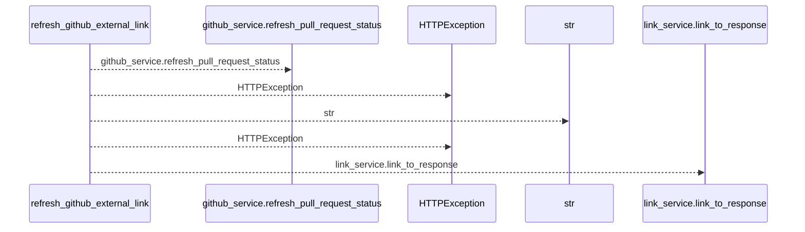
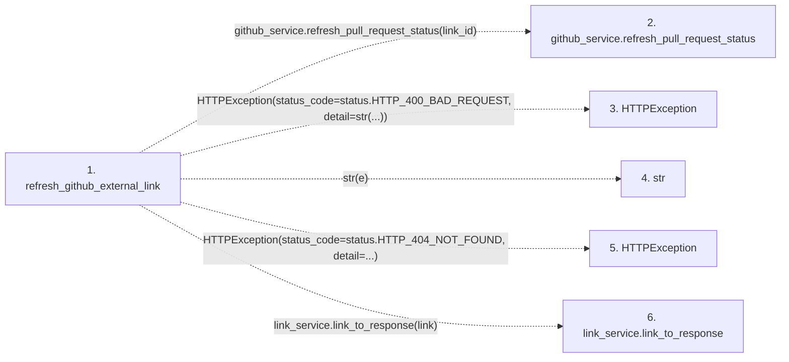

# refresh_github_external_link

**Entry point:** `refresh_github_external_link` (`http`)
**Source:** [tasks](../modules/tasks.md)
**Modules touched:** [tasks](../modules/tasks.md)

## Call sequence

<!-- Auto-generated from static call edges. Dashed arrows are external or unresolved calls. Reviewed runtime conditions and side effects belong in Behavior. -->

## Data flow

<!-- Auto-generated static analysis. Treat values and boundaries as best-effort hints, not runtime proof. -->

### Step data

| Step | Inputs | Reads | Writes | Returns |
|---|---|---|---|---|
| `refresh_github_external_link` | `link_id: int`, `github_service: Annotated[GitHubStatusService, Depends(get_github_status_service)]`, `link_service: Annotated[ExternalLinkService, Depends(get_external_link_service)]` | `ExternalLinkValidationError`, `status`, `status` | - | `link_service.link_to_response(...)` |
| `github_service.refresh_pull_request_status` | - | - | - | - |
| `HTTPException` | - | - | - | - |
| `str` | - | - | - | - |
| `HTTPException` | - | - | - | - |
| `link_service.link_to_response` | - | - | - | - |

### Call data

| From | To | Line | Call |
|---|---|---:|---|
| refresh_github_external_link | github_service.refresh_pull_request_status | 501 | `github_service.refresh_pull_request_status(link_id)` |
| refresh_github_external_link | HTTPException | 503 | `HTTPException(status_code=status.HTTP_400_BAD_REQUEST, detail=str(...))` |
| refresh_github_external_link | str | 505 | `str(e)` |
| refresh_github_external_link | HTTPException | 509 | `HTTPException(status_code=status.HTTP_404_NOT_FOUND, detail=...)` |
| refresh_github_external_link | link_service.link_to_response | 513 | `link_service.link_to_response(link)` |

### Boundary effects

*No boundary effects detected.*

### Static analysis gaps

| Kind | Step | Target | Line |
|---|---|---|---:|
| unresolved_call | `refresh_github_external_link` | `github_service.refresh_pull_request_status` | 501 |
| external_call | `refresh_github_external_link` | `HTTPException` | 503 |
| external_call | `refresh_github_external_link` | `HTTPException` | 509 |
| unresolved_call | `refresh_github_external_link` | `link_service.link_to_response` | 513 |

## Behavior

This flow starts at `refresh_github_external_link` and is classified as `http`. The generated call and data-flow sections are bounded static projections; runtime conditions and side effects require source-level confirmation.
