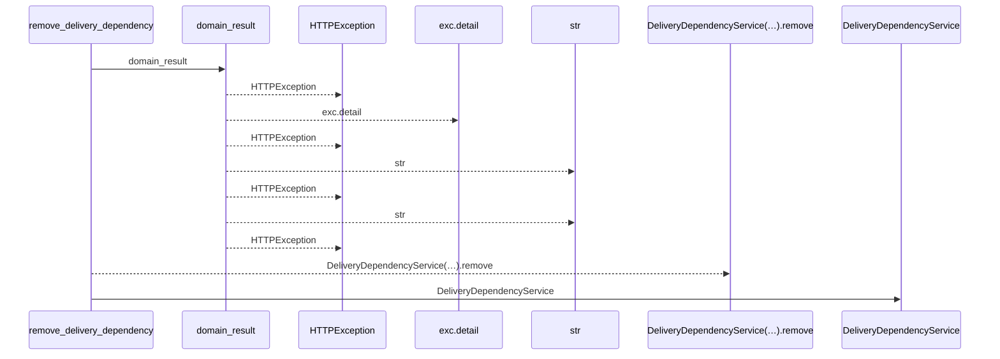
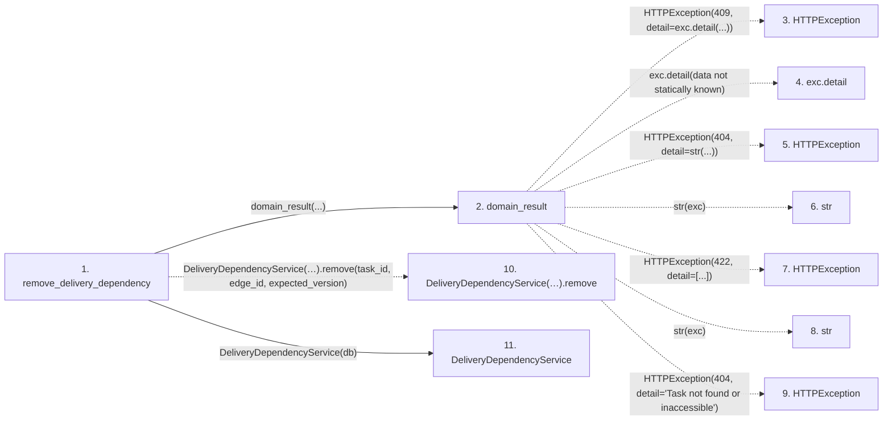

# remove_delivery_dependency

**Entry point:** `remove_delivery_dependency` (`http`)
**Source:** [delivery_dependencies](../modules/delivery_dependencies.md)
**Modules touched:** [delivery_dependencies](../modules/delivery_dependencies.md), [delivery_dependency_service](../modules/delivery_dependency_service.md), [routers_task_domain](../modules/routers_task_domain.md)

## Call sequence

<!-- Auto-generated from static call edges. Dashed arrows are external or unresolved calls. Reviewed runtime conditions and side effects belong in Behavior. -->

## Data flow

<!-- Auto-generated static analysis. Treat values and boundaries as best-effort hints, not runtime proof. -->

### Step data

| Step | Inputs | Reads | Writes | Returns |
|---|---|---|---|---|
| `remove_delivery_dependency` | `task_id: int`, `edge_id: int`, `db: DeliveryDatabase`, `expected_version: int` | - | - | `...` |
| `domain_result` | `awaitable` | `TaskVersionConflictError` | - | `result` |
| `HTTPException` | - | - | - | - |
| `exc.detail` | - | - | - | - |
| `HTTPException` | - | - | - | - |
| `str` | - | - | - | - |
| `HTTPException` | - | - | - | - |
| `str` | - | - | - | - |
| `HTTPException` | - | - | - | - |
| `DeliveryDependencyService(…).remove` | - | - | - | - |
| `DeliveryDependencyService` | - | - | - | - |

### Call data

| From | To | Line | Call |
|---|---|---:|---|
| remove_delivery_dependency | domain_result | 35 | `domain_result(...)` |
| domain_result | HTTPException | 42 | `HTTPException(409, detail=exc.detail(...))` |
| domain_result | exc.detail | 42 | `exc.detail(data not statically known)` |
| domain_result | HTTPException | 44 | `HTTPException(404, detail=str(...))` |
| domain_result | str | 44 | `str(exc)` |
| domain_result | HTTPException | 46 | `HTTPException(422, detail=[...])` |
| domain_result | str | 46 | `str(exc)` |
| domain_result | HTTPException | 48 | `HTTPException(404, detail='Task not found or inaccessible')` |
| remove_delivery_dependency | DeliveryDependencyService(…).remove | 35 | `DeliveryDependencyService(db).remove(task_id, edge_id, expected_version)` |
| remove_delivery_dependency | DeliveryDependencyService | 35 | `DeliveryDependencyService(db)` |

### Boundary effects

*No boundary effects detected.*

### Static analysis gaps

| Kind | Step | Target | Line |
|---|---|---|---:|
| external_call | `domain_result` | `HTTPException` | 42 |
| unresolved_call | `domain_result` | `exc.detail` | 42 |
| external_call | `domain_result` | `HTTPException` | 44 |
| external_call | `domain_result` | `HTTPException` | 46 |
| external_call | `domain_result` | `HTTPException` | 48 |
| unresolved_call | `remove_delivery_dependency` | `DeliveryDependencyService(db).remove` | 35 |

## Behavior

Uses the dependent task’s current version and edit permission. An inaccessible target can still be unlinked by an authorized dependent-task editor. Actual changes invalidate execution evidence and downstream context in the owning transaction.
