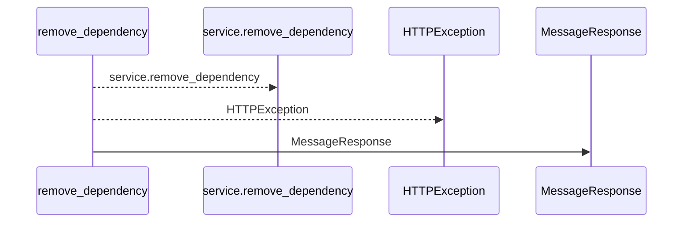
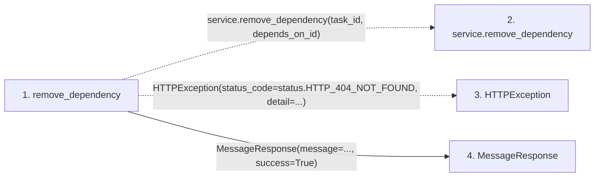

# remove_dependency

**Entry point:** `remove_dependency` (`http`)
**Source:** [tasks](../modules/tasks.md)
**Modules touched:** [schemas_common](../modules/schemas_common.md), [tasks](../modules/tasks.md)

## Call sequence

<!-- Auto-generated from static call edges. Dashed arrows are external or unresolved calls. Reviewed runtime conditions and side effects belong in Behavior. -->

## Data flow

<!-- Auto-generated static analysis. Treat values and boundaries as best-effort hints, not runtime proof. -->

### Step data

| Step | Inputs | Reads | Writes | Returns |
|---|---|---|---|---|
| `remove_dependency` | `task_id: int`, `depends_on_id: int`, `service: Annotated[TaskService, Depends(get_task_service)]` | `status` | - | `MessageResponse(...)` |
| `service.remove_dependency` | - | - | - | - |
| `HTTPException` | - | - | - | - |
| `MessageResponse` | - | - | - | - |

### Call data

| From | To | Line | Call |
|---|---|---:|---|
| remove_dependency | service.remove_dependency | 644 | `service.remove_dependency(task_id, depends_on_id)` |
| remove_dependency | HTTPException | 646 | `HTTPException(status_code=status.HTTP_404_NOT_FOUND, detail=...)` |
| remove_dependency | MessageResponse | 650 | `MessageResponse(message=..., success=True)` |

### Boundary effects

*No boundary effects detected.*

### Static analysis gaps

| Kind | Step | Target | Line |
|---|---|---|---:|
| unresolved_call | `remove_dependency` | `service.remove_dependency` | 644 |
| external_call | `remove_dependency` | `HTTPException` | 646 |

## Behavior

This flow starts at `remove_dependency` and is classified as `http`. The generated call and data-flow sections are bounded static projections; runtime conditions and side effects require source-level confirmation.

Actual dependency changes invalidate current progress and acceptance through general updates and individual add/remove commands. Immutable evidence history remains available, a command reserves one task version, and no-op dependency requests retain their current version. Locked graph relationships are loaded explicitly before applying a dependency update.
