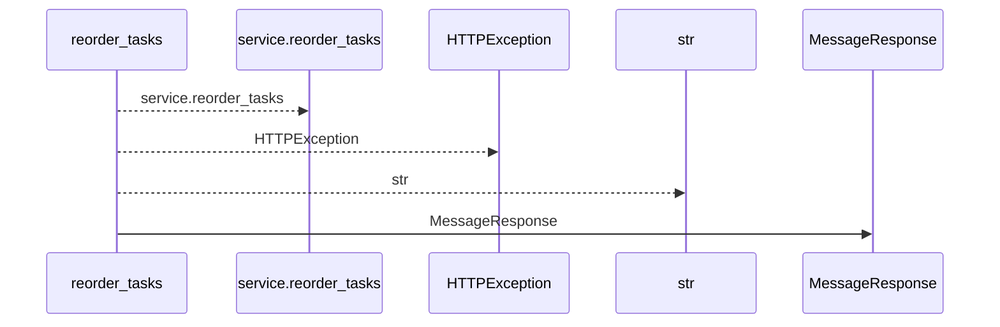
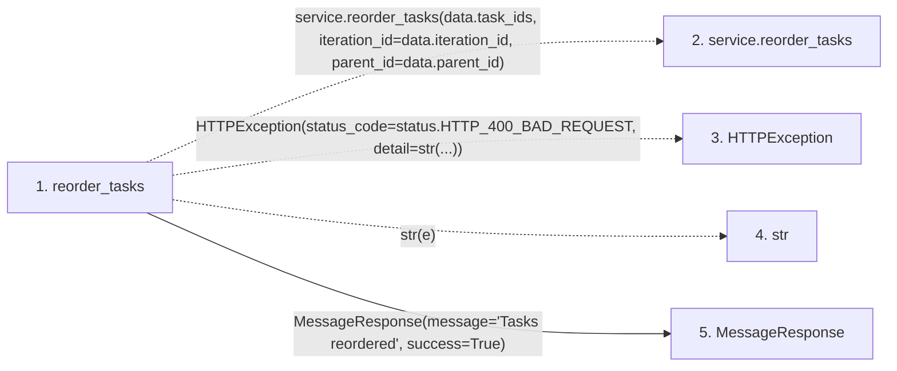

# reorder_tasks

**Entry point:** `reorder_tasks` (`http`)
**Source:** [tasks](../modules/tasks.md)
**Modules touched:** [schemas_common](../modules/schemas_common.md), [tasks](../modules/tasks.md)

## Call sequence

<!-- Auto-generated from static call edges. Dashed arrows are external or unresolved calls. Reviewed runtime conditions and side effects belong in Behavior. -->

## Data flow

<!-- Auto-generated static analysis. Treat values and boundaries as best-effort hints, not runtime proof. -->

### Step data

| Step | Inputs | Reads | Writes | Returns |
|---|---|---|---|---|
| `reorder_tasks` | `data: TaskReorder`, `service: Annotated[TaskService, Depends(get_task_service)]` | `status` | - | `MessageResponse(...)` |
| `service.reorder_tasks` | - | - | - | - |
| `HTTPException` | - | - | - | - |
| `str` | - | - | - | - |
| `MessageResponse` | - | - | - | - |

### Call data

| From | To | Line | Call |
|---|---|---:|---|
| reorder_tasks | service.reorder_tasks | 673 | `service.reorder_tasks(data.task_ids, iteration_id=data.iteration_id, parent_id=data.parent_id)` |
| reorder_tasks | HTTPException | 679 | `HTTPException(status_code=status.HTTP_400_BAD_REQUEST, detail=str(...))` |
| reorder_tasks | str | 679 | `str(e)` |
| reorder_tasks | MessageResponse | 680 | `MessageResponse(message='Tasks reordered', success=True)` |

### Boundary effects

*No boundary effects detected.*

### Static analysis gaps

| Kind | Step | Target | Line |
|---|---|---|---:|
| unresolved_call | `reorder_tasks` | `service.reorder_tasks` | 673 |
| external_call | `reorder_tasks` | `HTTPException` | 679 |

## Behavior

This flow starts at `reorder_tasks` and is classified as `http`. The generated call and data-flow sections are bounded static projections; runtime conditions and side effects require source-level confirmation.
