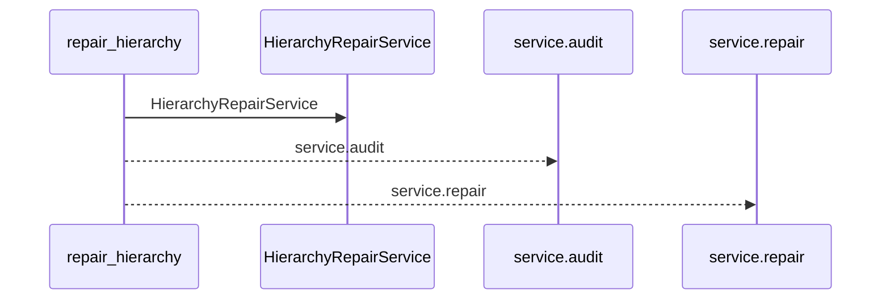
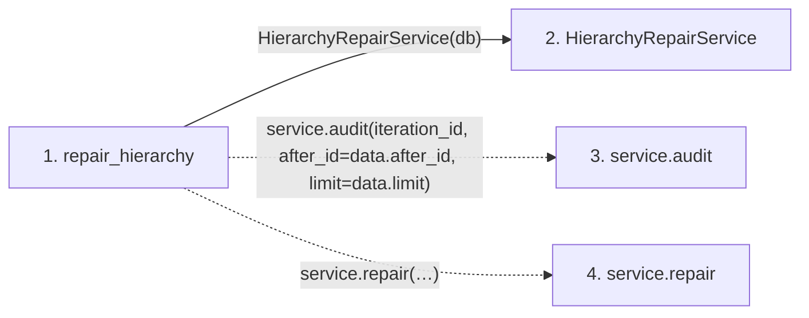

# repair_hierarchy

**Entry point:** `repair_hierarchy` (`http`)
**Source:** [snapshots](../modules/snapshots.md)
**Modules touched:** [hierarchy_repair_service](../modules/hierarchy_repair_service.md), [snapshots](../modules/snapshots.md)

## Call sequence

<!-- Auto-generated from static call edges. Dashed arrows are external or unresolved calls. Reviewed runtime conditions and side effects belong in Behavior. -->

## Data flow

<!-- Auto-generated static analysis. Treat values and boundaries as best-effort hints, not runtime proof. -->

### Step data

| Step | Inputs | Reads | Writes | Returns |
|---|---|---|---|---|
| `repair_hierarchy` | `iteration_id: int`, `data: HierarchyRepairRequest`, `db: Annotated[AsyncSession, Depends(get_db, scope='function')]`, `_operator: Annotated[None, Depends(require_admin_api_key)]` | - | - | `...`, `...` |
| `HierarchyRepairService` | - | - | - | - |
| `service.audit` | - | - | - | - |
| `service.repair` | - | - | - | - |

### Call data

| From | To | Line | Call |
|---|---|---:|---|
| repair_hierarchy | HierarchyRepairService | 262 | `HierarchyRepairService(db)` |
| repair_hierarchy | service.audit | 264 | `service.audit(iteration_id, after_id=data.after_id, limit=data.limit)` |
| repair_hierarchy | service.repair | 265 | `service.repair(iteration_id, expected_versions=data.expected_versions, expected_revision=data.expected_revision, reason=data.reason, after_id=data.after_id, limit=data.limit)` |

### Boundary effects

*No boundary effects detected.*

### Static analysis gaps

| Kind | Step | Target | Line |
|---|---|---|---:|
| unresolved_call | `repair_hierarchy` | `service.audit` | 264 |
| unresolved_call | `repair_hierarchy` | `service.repair` | 265 |

## Behavior

This flow starts at `repair_hierarchy` and is classified as `http`. The generated call and data-flow sections are bounded static projections; runtime conditions and side effects require source-level confirmation.
