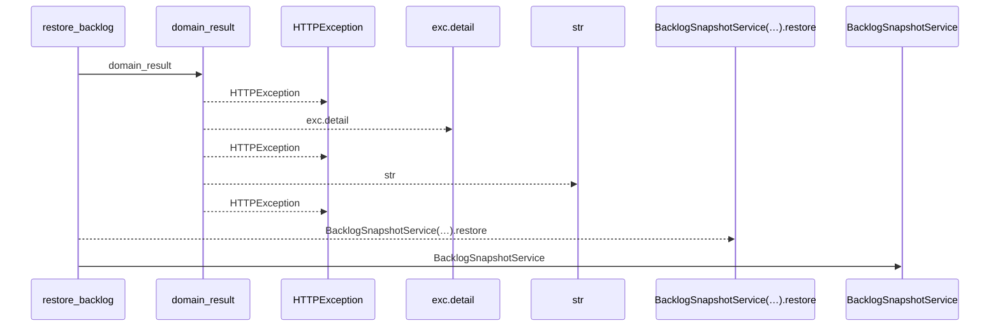
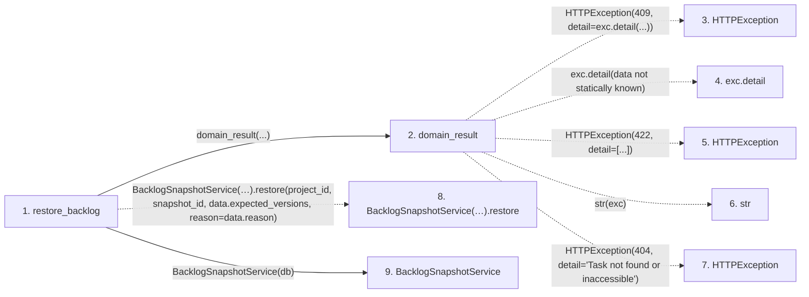

# restore_backlog

**Entry point:** `restore_backlog` (`http`)
**Source:** [routers_task_domain](../modules/routers_task_domain.md)
**Modules touched:** [backlog_snapshot_service](../modules/backlog_snapshot_service.md), [routers_task_domain](../modules/routers_task_domain.md)

## Call sequence

<!-- Auto-generated from static call edges. Dashed arrows are external or unresolved calls. Reviewed runtime conditions and side effects belong in Behavior. -->

## Data flow

<!-- Auto-generated static analysis. Treat values and boundaries as best-effort hints, not runtime proof. -->

### Step data

| Step | Inputs | Reads | Writes | Returns |
|---|---|---|---|---|
| `restore_backlog` | `project_id: int`, `snapshot_id: int`, `data: BacklogRestoreRequest`, `db: DB` | - | - | `...` |
| `domain_result` | `awaitable` | `TaskVersionConflictError` | - | `result` |
| `HTTPException` | - | - | - | - |
| `exc.detail` | - | - | - | - |
| `HTTPException` | - | - | - | - |
| `str` | - | - | - | - |
| `HTTPException` | - | - | - | - |
| `BacklogSnapshotService(…).restore` | - | - | - | - |
| `BacklogSnapshotService` | - | - | - | - |

### Call data

| From | To | Line | Call |
|---|---|---:|---|
| restore_backlog | domain_result | 207 | `domain_result(...)` |
| domain_result | HTTPException | 29 | `HTTPException(409, detail=exc.detail(...))` |
| domain_result | exc.detail | 29 | `exc.detail(data not statically known)` |
| domain_result | HTTPException | 31 | `HTTPException(422, detail=[...])` |
| domain_result | str | 31 | `str(exc)` |
| domain_result | HTTPException | 33 | `HTTPException(404, detail='Task not found or inaccessible')` |
| restore_backlog | BacklogSnapshotService(…).restore | 207 | `BacklogSnapshotService(db).restore(project_id, snapshot_id, data.expected_versions, reason=data.reason)` |
| restore_backlog | BacklogSnapshotService | 207 | `BacklogSnapshotService(db)` |

### Boundary effects

*No boundary effects detected.*

### Static analysis gaps

| Kind | Step | Target | Line |
|---|---|---|---:|
| external_call | `domain_result` | `HTTPException` | 29 |
| unresolved_call | `domain_result` | `exc.detail` | 29 |
| external_call | `domain_result` | `HTTPException` | 31 |
| external_call | `domain_result` | `HTTPException` | 33 |
| unresolved_call | `restore_backlog` | `BacklogSnapshotService(db).restore` | 207 |

## Behavior

This flow starts at `restore_backlog` and is classified as `http`. The generated call and data-flow sections are bounded static projections; runtime conditions and side effects require source-level confirmation.

Scheduled and backlog restoration share a version allocator under the owning scope lock. It advances above the saved version, live task, retained history and durable deletion fence. Current progress and acceptance are cleared; immutable history survives. A deleted task without a reliable deletion fence returns snapshot_version_history_unknown (409), requiring recovery from a complete matching database backup.

Delivery prerequisites survive scoped recovery; removing a referenced target requires explicit unlinking. Original task identity makes retained discussion readable again after restoration.
