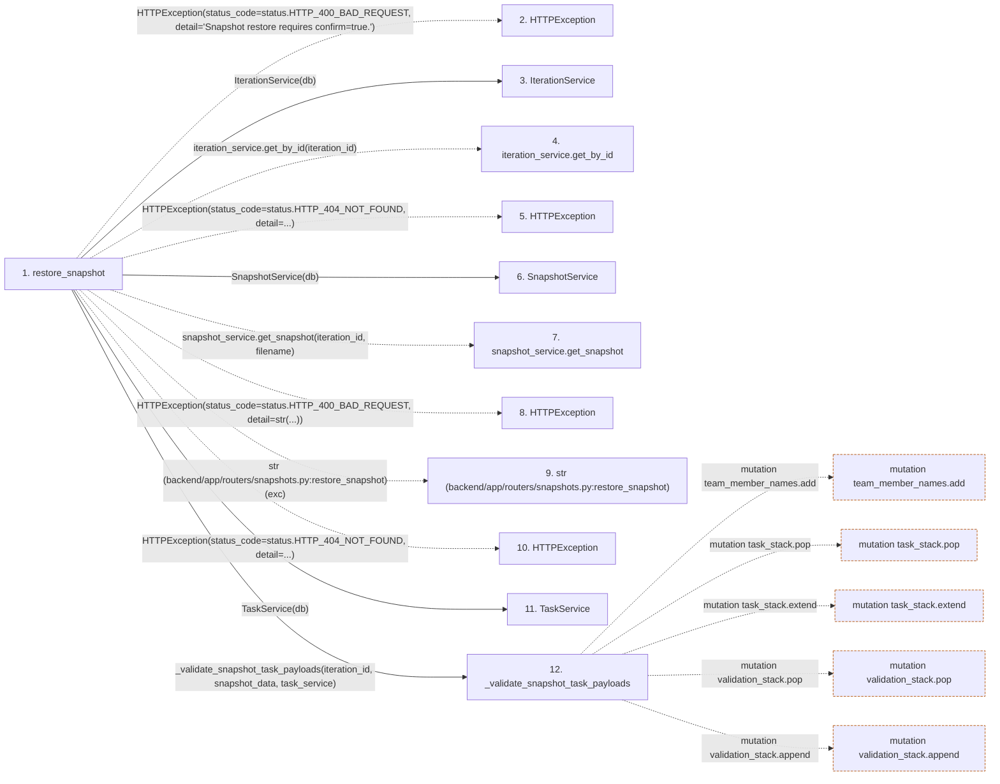

# restore_snapshot

**Entry point:** `restore_snapshot` (`http`)
**Source:** [snapshots](../modules/snapshots.md)
**Modules touched:** [export](../modules/export.md), [iteration_service](../modules/iteration_service.md), [models_task](../modules/models_task.md), [schemas_common](../modules/schemas_common.md), and 7 more

**Complete modules touched:**

- [export](../modules/export.md)
- [iteration_service](../modules/iteration_service.md)
- [models_task](../modules/models_task.md)
- [schemas_common](../modules/schemas_common.md)
- [schemas_task](../modules/schemas_task.md)
- [schemas_team](../modules/schemas_team.md)
- [snapshot](../modules/snapshot.md)
- [snapshot_service](../modules/snapshot_service.md)
- [snapshots](../modules/snapshots.md)
- [task_service](../modules/task_service.md)
- [team_service](../modules/team_service.md)

## Call sequence

```mermaid
sequenceDiagram
    participant p0 as restore_snapshot
    participant p1 as HTTPException
    participant p2 as IterationService
    participant p3 as iteration_service.get_by_id
    participant p4 as SnapshotService
    participant p5 as snapshot_service.get_snapshot
    participant p6 as str (backend/app/routers/snapshots.py:restore_snapshot)
    participant p7 as TaskService
    participant p8 as _validate_snapshot_task_payloads
    participant p9 as isinstance (backend/app/routers/snaps…te_snapshot_task_payloads)
    participant p10 as ValueError (backend/app/routers/snaps…te_snapshot_task_payloads)
    participant p11 as snapshot_data.get (backend/app/routers/snaps…te_snapshot_task_payloads)
    participant p12 as set (backend/app/routers/snaps…te_snapshot_task_payloads)
    participant p13 as TeamMemberCreate
    participant p14 as member_data.get (backend/app/routers/snaps…te_snapshot_task_payloads)
    participant p15 as team_member_names.add
    participant p16 as str (backend/app/routers/snaps…te_snapshot_task_payloads)
    p0-->>p1: HTTPException
    p0->>p2: IterationService
    p0-->>p3: iteration_service.get_by_id
    p0-->>p1: HTTPException
    p0->>p4: SnapshotService
    p0-->>p5: snapshot_service.get_snapshot
    p0-->>p1: HTTPException
    p0-->>p6: str (backend/app/routers/snapshots.py:restore_snapshot)
    p0-->>p1: HTTPException
    p0->>p7: TaskService
    p0->>p8: _validate_snapshot_task_payloads
    p8-->>p9: isinstance (backend/app/routers/snaps…te_snapshot_task_payloads)
    p8-->>p10: ValueError (backend/app/routers/snaps…te_snapshot_task_payloads)
    p8-->>p11: snapshot_data.get (backend/app/routers/snaps…te_snapshot_task_payloads)
    p8-->>p11: snapshot_data.get (backend/app/routers/snaps…te_snapshot_task_payloads)
    p8-->>p9: isinstance (backend/app/routers/snaps…te_snapshot_task_payloads)
    p8-->>p10: ValueError (backend/app/routers/snaps…te_snapshot_task_payloads)
    p8-->>p9: isinstance (backend/app/routers/snaps…te_snapshot_task_payloads)
    p8-->>p10: ValueError (backend/app/routers/snaps…te_snapshot_task_payloads)
    p8-->>p12: set (backend/app/routers/snaps…te_snapshot_task_payloads)
    p8-->>p9: isinstance (backend/app/routers/snaps…te_snapshot_task_payloads)
    p8-->>p10: ValueError (backend/app/routers/snaps…te_snapshot_task_payloads)
    p8->>p13: TeamMemberCreate
    p8-->>p14: member_data.get (backend/app/routers/snaps…te_snapshot_task_payloads)
    p8-->>p14: member_data.get (backend/app/routers/snaps…te_snapshot_task_payloads)
    p8-->>p14: member_data.get (backend/app/routers/snaps…te_snapshot_task_payloads)
    p8-->>p14: member_data.get (backend/app/routers/snaps…te_snapshot_task_payloads)
    p8-->>p15: team_member_names.add
    p8-->>p16: str (backend/app/routers/snaps…te_snapshot_task_payloads)
    p8-->>p14: member_data.get (backend/app/routers/snaps…te_snapshot_task_payloads)
```

<!-- Auto-generated from static call edges. Dashed arrows are external or unresolved calls. Reviewed runtime conditions and side effects belong in Behavior. -->

> Call sequence diagram shows 30 of 161 interactions; 131 omitted to keep the visualization within the 30-interaction and generated-diagram limits.

## Data flow

<!-- Auto-generated static analysis. Treat values and boundaries as best-effort hints, not runtime proof. -->

### Step data

| Step | Inputs | Reads | Writes | Returns |
|---|---|---|---|---|
| `restore_snapshot` | `iteration_id: int`, `filename: str`, `data: SnapshotRestoreRequest`, `db: Annotated[AsyncSession, Depends(get_db)]`, `_admin: Annotated[None, Depends(require_admin_api_key)]` | `status`, `status`, `SnapshotPathError`, `status`, `status`, `status`, `status`, `status` | `db.commit`, `db.commit`, `db.commit`, `db.commit` | `SnapshotRestoreResponse(...)` |
| `HTTPException` | - | - | - | - |
| `IterationService` | - | - | - | - |
| `iteration_service.get_by_id` | - | - | - | - |
| `HTTPException` | - | - | - | - |
| `SnapshotService` | - | - | - | - |
| `snapshot_service.get_snapshot` | - | - | - | - |
| `HTTPException` | - | - | - | - |
| `str (backend/app/routers/snapshots.py:restore_snapshot)` | - | - | - | - |
| `HTTPException` | - | - | - | - |
| `TaskService` | - | - | - | - |
| `_validate_snapshot_task_payloads` | `iteration_id: int`, `snapshot_data: dict`, `task_service: TaskService` | `ValidationError` | - | - |

### Call data

| From | To | Line | Call |
|---|---|---:|---|
| restore_snapshot | HTTPException | 217 | `HTTPException(status_code=status.HTTP_400_BAD_REQUEST, detail='Snapshot restore requires confirm=true.')` |
| restore_snapshot | IterationService | 222 | `IterationService(db)` |
| restore_snapshot | iteration_service.get_by_id | 223 | `iteration_service.get_by_id(iteration_id)` |
| restore_snapshot | HTTPException | 226 | `HTTPException(status_code=status.HTTP_404_NOT_FOUND, detail=...)` |
| restore_snapshot | SnapshotService | 231 | `SnapshotService(db)` |
| restore_snapshot | snapshot_service.get_snapshot | 233 | `snapshot_service.get_snapshot(iteration_id, filename)` |
| restore_snapshot | HTTPException | 235 | `HTTPException(status_code=status.HTTP_400_BAD_REQUEST, detail=str(...))` |
| restore_snapshot | str (backend/app/routers/snapshots.py:restore_snapshot) | 235 | `str(exc)` |
| restore_snapshot | HTTPException | 238 | `HTTPException(status_code=status.HTTP_404_NOT_FOUND, detail=...)` |
| restore_snapshot | TaskService | 243 | `TaskService(db)` |
| restore_snapshot | _validate_snapshot_task_payloads | 245 | `_validate_snapshot_task_payloads(iteration_id, snapshot_data, task_service)` |

### Boundary effects

| Kind | Target | Step | Line |
|---|---|---|---:|
| mutation | `team_member_names.add` | `_validate_snapshot_task_payloads` | 56 |
| mutation | `task_stack.pop` | `_validate_snapshot_task_payloads` | 104 |
| mutation | `task_stack.extend` | `_validate_snapshot_task_payloads` | 106 |
| mutation | `validation_stack.pop` | `_validate_snapshot_task_payloads` | 176 |
| mutation | `validation_stack.append` | `_validate_snapshot_task_payloads` | 179 |

### Static analysis gaps

| Kind | Step | Target | Line |
|---|---|---|---:|
| external_call | `restore_snapshot` | `HTTPException` | 217 |
| unresolved_call | `restore_snapshot` | `iteration_service.get_by_id` | 223 |
| external_call | `restore_snapshot` | `HTTPException` | 226 |
| unresolved_call | `restore_snapshot` | `snapshot_service.get_snapshot` | 233 |
| external_call | `restore_snapshot` | `HTTPException` | 235 |
| external_call | `restore_snapshot` | `HTTPException` | 238 |
| step_limit | `restore_snapshot` | `first 12 steps` | 0 |

## Behavior

This flow starts at `restore_snapshot` and is classified as `http`. The generated call and data-flow sections are bounded static projections; runtime conditions and side effects require source-level confirmation.
