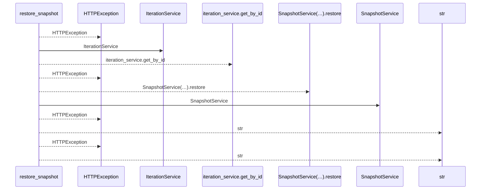
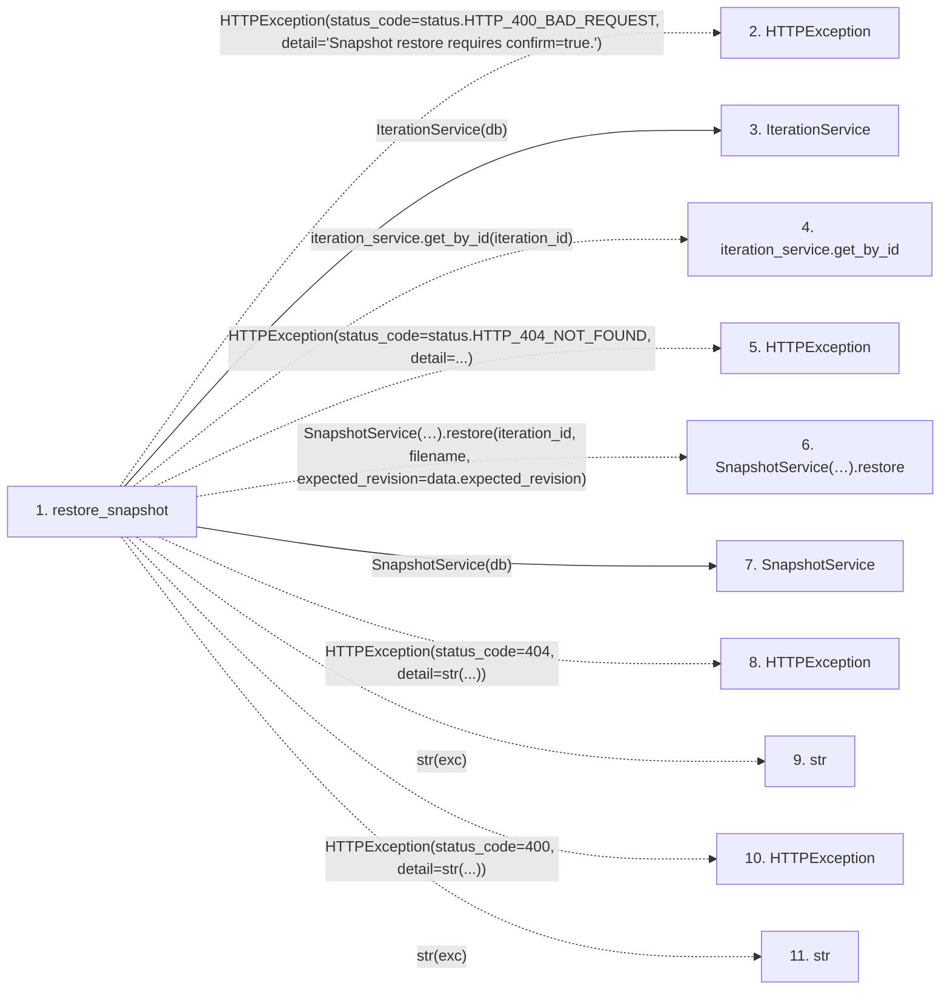

# restore_snapshot

**Entry point:** `restore_snapshot` (`http`)
**Source:** [snapshots](../modules/snapshots.md)
**Modules touched:** [iteration_service](../modules/iteration_service.md), [snapshot_service](../modules/snapshot_service.md), [snapshots](../modules/snapshots.md)

## Call sequence

<!-- Auto-generated from static call edges. Dashed arrows are external or unresolved calls. Reviewed runtime conditions and side effects belong in Behavior. -->

## Data flow

<!-- Auto-generated static analysis. Treat values and boundaries as best-effort hints, not runtime proof. -->

### Step data

| Step | Inputs | Reads | Writes | Returns |
|---|---|---|---|---|
| `restore_snapshot` | `iteration_id: int`, `filename: str`, `data: SnapshotRestoreRequest`, `db: Annotated[AsyncSession, Depends(get_db, scope='function')]`, `_admin: Annotated[None, Depends(require_admin_api_key)]` | `status`, `status` | - | `...` |
| `HTTPException` | - | - | - | - |
| `IterationService` | - | - | - | - |
| `iteration_service.get_by_id` | - | - | - | - |
| `HTTPException` | - | - | - | - |
| `SnapshotService(…).restore` | - | - | - | - |
| `SnapshotService` | - | - | - | - |
| `HTTPException` | - | - | - | - |
| `str` | - | - | - | - |
| `HTTPException` | - | - | - | - |
| `str` | - | - | - | - |

### Call data

| From | To | Line | Call |
|---|---|---:|---|
| restore_snapshot | HTTPException | 219 | `HTTPException(status_code=status.HTTP_400_BAD_REQUEST, detail='Snapshot restore requires confirm=true.')` |
| restore_snapshot | IterationService | 224 | `IterationService(db)` |
| restore_snapshot | iteration_service.get_by_id | 225 | `iteration_service.get_by_id(iteration_id)` |
| restore_snapshot | HTTPException | 228 | `HTTPException(status_code=status.HTTP_404_NOT_FOUND, detail=...)` |
| restore_snapshot | SnapshotService(…).restore | 234 | `SnapshotService(db).restore(iteration_id, filename, expected_revision=data.expected_revision)` |
| restore_snapshot | SnapshotService | 234 | `SnapshotService(db)` |
| restore_snapshot | HTTPException | 236 | `HTTPException(status_code=404, detail=str(...))` |
| restore_snapshot | str | 236 | `str(exc)` |
| restore_snapshot | HTTPException | 238 | `HTTPException(status_code=400, detail=str(...))` |
| restore_snapshot | str | 238 | `str(exc)` |

### Boundary effects

*No boundary effects detected.*

### Static analysis gaps

| Kind | Step | Target | Line |
|---|---|---|---:|
| external_call | `restore_snapshot` | `HTTPException` | 219 |
| unresolved_call | `restore_snapshot` | `iteration_service.get_by_id` | 225 |
| external_call | `restore_snapshot` | `HTTPException` | 228 |
| unresolved_call | `restore_snapshot` | `SnapshotService(db).restore` | 234 |
| external_call | `restore_snapshot` | `HTTPException` | 236 |
| external_call | `restore_snapshot` | `HTTPException` | 238 |

## Behavior

This flow starts at `restore_snapshot` and is classified as `http`. The generated call and data-flow sections are bounded static projections; runtime conditions and side effects require source-level confirmation.

Requires operator authority and explicit restore confirmation. Checks the observed revision and captured provenance before restoring supported IDs and planning state, recording a pre-restore point and invalidating current acceptance.
