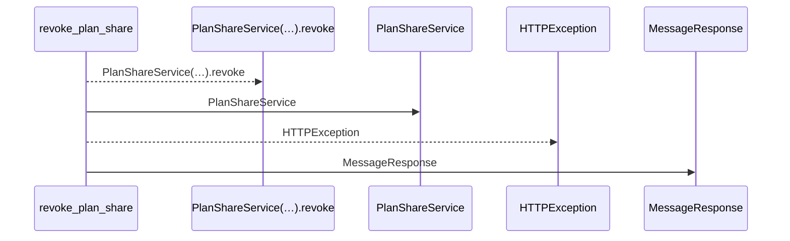
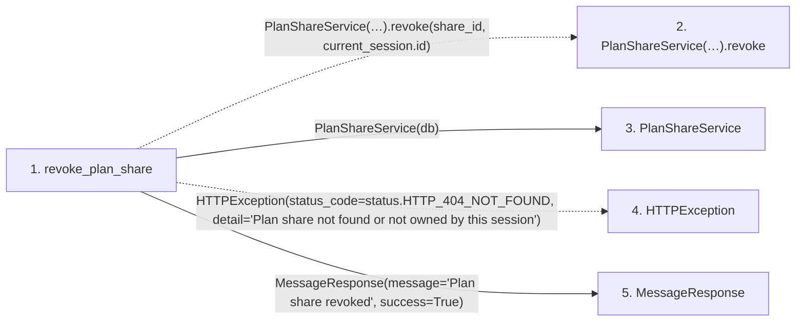

# revoke_plan_share

**Entry point:** `revoke_plan_share` (`http`)
**Source:** [plan_shares](../modules/plan_shares.md)
**Modules touched:** [plan_share_service](../modules/plan_share_service.md), [plan_shares](../modules/plan_shares.md), [schemas_common](../modules/schemas_common.md)

## Call sequence

<!-- Auto-generated from static call edges. Dashed arrows are external or unresolved calls. Reviewed runtime conditions and side effects belong in Behavior. -->

## Data flow

<!-- Auto-generated static analysis. Treat values and boundaries as best-effort hints, not runtime proof. -->

### Step data

| Step | Inputs | Reads | Writes | Returns |
|---|---|---|---|---|
| `revoke_plan_share` | `share_id: int`, `response: Response`, `current_session: Annotated[UserSession, Depends(session_service.get_current_session)]`, `db: Annotated[AsyncSession, Depends(get_db, scope='function')]` | `status` | `response.headers[...]` | `MessageResponse(...)` |
| `PlanShareService(…).revoke` | - | - | - | - |
| `PlanShareService` | - | - | - | - |
| `HTTPException` | - | - | - | - |
| `MessageResponse` | - | - | - | - |

### Call data

| From | To | Line | Call |
|---|---|---:|---|
| revoke_plan_share | PlanShareService(…).revoke | 100 | `PlanShareService(db).revoke(share_id, current_session.id)` |
| revoke_plan_share | PlanShareService | 100 | `PlanShareService(db)` |
| revoke_plan_share | HTTPException | 102 | `HTTPException(status_code=status.HTTP_404_NOT_FOUND, detail='Plan share not found or not owned by this session')` |
| revoke_plan_share | MessageResponse | 106 | `MessageResponse(message='Plan share revoked', success=True)` |

### Boundary effects

*No boundary effects detected.*

### Static analysis gaps

| Kind | Step | Target | Line |
|---|---|---|---:|
| unresolved_call | `revoke_plan_share` | `PlanShareService(db).revoke` | 100 |
| external_call | `revoke_plan_share` | `HTTPException` | 102 |

## Behavior

This flow starts at `revoke_plan_share` and is classified as `http`. The generated call and data-flow sections are bounded static projections; runtime conditions and side effects require source-level confirmation.
