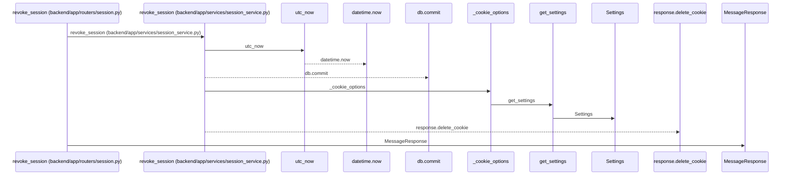
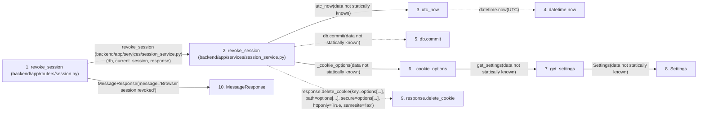

# revoke_session

**Entry point:** `revoke_session` (`http`)
**Source:** [routers_session](../modules/routers_session.md)
**Modules touched:** [config](../modules/config.md), [routers_session](../modules/routers_session.md), [schemas_common](../modules/schemas_common.md), [session_service](../modules/session_service.md), [time](../modules/time.md)

## Call sequence

<!-- Auto-generated from static call edges. Dashed arrows are external or unresolved calls. Reviewed runtime conditions and side effects belong in Behavior. -->

## Data flow

<!-- Auto-generated static analysis. Treat values and boundaries as best-effort hints, not runtime proof. -->

### Step data

| Step | Inputs | Reads | Writes | Returns |
|---|---|---|---|---|
| `revoke_session (backend/app/routers/session.py)` | `response: Response`, `current_session: Annotated[UserSession, Depends(session_service.get_current_session)]`, `db: Annotated[AsyncSession, Depends(get_db)]` | - | - | `MessageResponse(...)` |
| `revoke_session (backend/app/services/session_service.py)` | `db: AsyncSession`, `session: UserSession`, `response: Response` | - | `session.revoked_at` | - |
| `utc_now` | - | `UTC` | - | `datetime.now(...)` |
| `datetime.now` | - | - | - | - |
| `db.commit` | - | - | - | - |
| `_cookie_options` | - | - | - | `{...}` |
| `get_settings` | - | - | - | `Settings(...)` |
| `Settings` | - | - | - | - |
| `response.delete_cookie` | - | - | - | - |
| `MessageResponse` | - | - | - | - |

### Call data

| From | To | Line | Call |
|---|---|---:|---|
| revoke_session (backend/app/routers/session.py) | revoke_session (backend/app/services/session_service.py) | 43 | `session_service.revoke_session(db, current_session, response)` |
| revoke_session (backend/app/services/session_service.py) | utc_now | 198 | `utc_now(data not statically known)` |
| utc_now | datetime.now | 13 | `datetime.now(UTC)` |
| revoke_session (backend/app/services/session_service.py) | db.commit | 199 | `db.commit(data not statically known)` |
| revoke_session (backend/app/services/session_service.py) | _cookie_options | 200 | `_cookie_options(data not statically known)` |
| _cookie_options | get_settings | 35 | `get_settings(data not statically known)` |
| get_settings | Settings | 469 | `Settings(data not statically known)` |
| revoke_session (backend/app/services/session_service.py) | response.delete_cookie | 201 | `response.delete_cookie(key=options[...], path=options[...], secure=options[...], httponly=True, samesite='lax')` |
| revoke_session (backend/app/routers/session.py) | MessageResponse | 44 | `MessageResponse(message='Browser session revoked')` |

### Boundary effects

*No boundary effects detected.*

### Static analysis gaps

| Kind | Step | Target | Line |
|---|---|---|---:|
| external_call | `utc_now` | `datetime.now` | 13 |
| unresolved_call | `revoke_session` | `db.commit` | 199 |
| unresolved_call | `revoke_session` | `response.delete_cookie` | 201 |

## Behavior

This flow starts at `revoke_session` and is classified as `http`. The generated call and data-flow sections are bounded static projections; runtime conditions and side effects require source-level confirmation.
