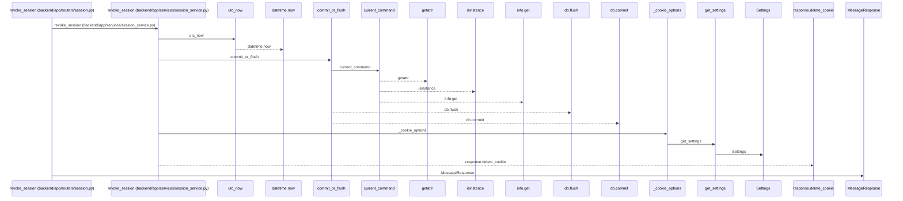
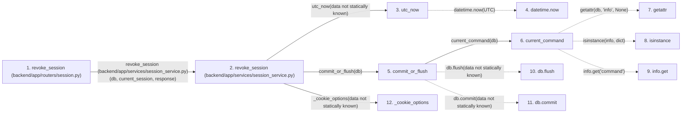

# revoke_session

**Entry point:** `revoke_session` (`http`)
**Source:** [routers_session](../modules/routers_session.md)
**Modules touched:** [commands](../modules/commands.md), [config](../modules/config.md), [routers_session](../modules/routers_session.md), [schemas_common](../modules/schemas_common.md), and 2 more

**Complete modules touched:**

- [commands](../modules/commands.md)
- [config](../modules/config.md)
- [routers_session](../modules/routers_session.md)
- [schemas_common](../modules/schemas_common.md)
- [session_service](../modules/session_service.md)
- [time](../modules/time.md)

## Call sequence

<!-- Auto-generated from static call edges. Dashed arrows are external or unresolved calls. Reviewed runtime conditions and side effects belong in Behavior. -->

## Data flow

<!-- Auto-generated static analysis. Treat values and boundaries as best-effort hints, not runtime proof. -->

### Step data

| Step | Inputs | Reads | Writes | Returns |
|---|---|---|---|---|
| `revoke_session (backend/app/routers/session.py)` | `response: Response`, `current_session: Annotated[UserSession, Depends(session_service.get_current_session)]`, `db: Annotated[AsyncSession, Depends(get_db, scope='function')]` | - | - | `MessageResponse(...)` |
| `revoke_session (backend/app/services/session_service.py)` | `db: AsyncSession`, `session: UserSession`, `response: Response` | - | `session.revoked_at` | - |
| `utc_now` | - | `UTC` | - | `datetime.now(...)` |
| `datetime.now` | - | - | - | - |
| `commit_or_flush` | `db` | - | - | - |
| `current_command` | `db` | - | - | `...` |
| `getattr` | - | - | - | - |
| `isinstance` | - | - | - | - |
| `info.get` | - | - | - | - |
| `db.flush` | - | - | - | - |
| `db.commit` | - | - | - | - |
| `_cookie_options` | - | - | - | `{...}` |

### Call data

| From | To | Line | Call |
|---|---|---:|---|
| revoke_session (backend/app/routers/session.py) | revoke_session (backend/app/services/session_service.py) | 43 | `session_service.revoke_session(db, current_session, response)` |
| revoke_session (backend/app/services/session_service.py) | utc_now | 217 | `utc_now(data not statically known)` |
| utc_now | datetime.now | 13 | `datetime.now(UTC)` |
| revoke_session (backend/app/services/session_service.py) | commit_or_flush | 218 | `commit_or_flush(db)` |
| commit_or_flush | current_command | 45 | `current_command(db)` |
| current_command | getattr | 39 | `getattr(db, 'info', None)` |
| current_command | isinstance | 40 | `isinstance(info, dict)` |
| current_command | info.get | 40 | `info.get('command')` |
| commit_or_flush | db.flush | 46 | `db.flush(data not statically known)` |
| commit_or_flush | db.commit | 48 | `db.commit(data not statically known)` |
| revoke_session (backend/app/services/session_service.py) | _cookie_options | 219 | `_cookie_options(data not statically known)` |

### Boundary effects

*No boundary effects detected.*

### Static analysis gaps

| Kind | Step | Target | Line |
|---|---|---|---:|
| external_call | `utc_now` | `datetime.now` | 13 |
| external_call | `current_command` | `getattr` | 39 |
| external_call | `current_command` | `isinstance` | 40 |
| unresolved_call | `current_command` | `info.get` | 40 |
| unresolved_call | `commit_or_flush` | `db.flush` | 46 |
| unresolved_call | `commit_or_flush` | `db.commit` | 48 |
| step_limit | `revoke_session` | `first 12 steps` | 0 |

## Behavior

This flow starts at `revoke_session` and is classified as `http`. The generated call and data-flow sections are bounded static projections; runtime conditions and side effects require source-level confirmation.
