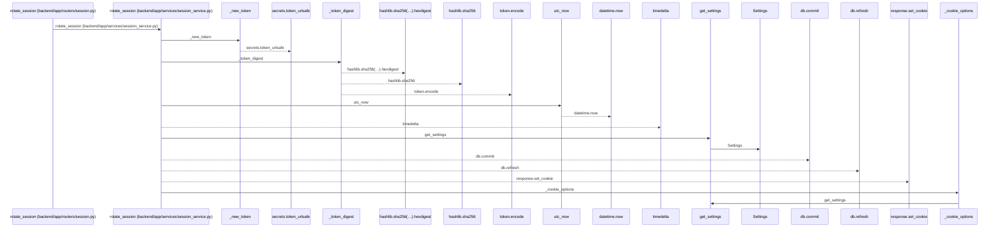
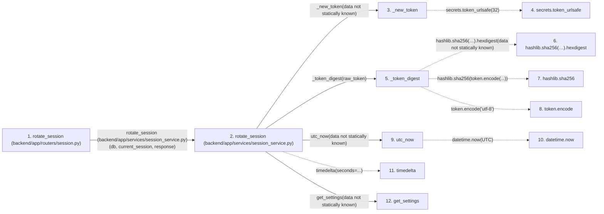

# rotate_session

**Entry point:** `rotate_session` (`http`)
**Source:** [routers_session](../modules/routers_session.md)
**Modules touched:** [config](../modules/config.md), [routers_session](../modules/routers_session.md), [session_service](../modules/session_service.md), [time](../modules/time.md)

## Call sequence

<!-- Auto-generated from static call edges. Dashed arrows are external or unresolved calls. Reviewed runtime conditions and side effects belong in Behavior. -->

## Data flow

<!-- Auto-generated static analysis. Treat values and boundaries as best-effort hints, not runtime proof. -->

### Step data

| Step | Inputs | Reads | Writes | Returns |
|---|---|---|---|---|
| `rotate_session (backend/app/routers/session.py)` | `response: Response`, `current_session: Annotated[UserSession, Depends(session_service.get_current_session)]`, `db: Annotated[AsyncSession, Depends(get_db)]` | - | - | `...` |
| `rotate_session (backend/app/services/session_service.py)` | `db: AsyncSession`, `session: UserSession`, `response: Response` | - | `session.session_token_hash`, `session.expires_at`, `session.revoked_at` | `session` |
| `_new_token` | - | - | - | `secrets.token_urlsafe(...)` |
| `secrets.token_urlsafe` | - | - | - | - |
| `_token_digest` | `token: str` | - | - | `...` |
| `hashlib.sha256(…).hexdigest` | - | - | - | - |
| `hashlib.sha256` | - | - | - | - |
| `token.encode` | - | - | - | - |
| `utc_now` | - | `UTC` | - | `datetime.now(...)` |
| `datetime.now` | - | - | - | - |
| `timedelta` | - | - | - | - |
| `get_settings` | - | - | - | `Settings(...)` |

### Call data

| From | To | Line | Call |
|---|---|---:|---|
| rotate_session (backend/app/routers/session.py) | rotate_session (backend/app/services/session_service.py) | 33 | `session_service.rotate_session(db, current_session, response)` |
| rotate_session (backend/app/services/session_service.py) | _new_token | 180 | `_new_token(data not statically known)` |
| _new_token | secrets.token_urlsafe | 31 | `secrets.token_urlsafe(32)` |
| rotate_session (backend/app/services/session_service.py) | _token_digest | 181 | `_token_digest(raw_token)` |
| _token_digest | hashlib.sha256(…).hexdigest | 27 | `hashlib.sha256(token.encode('utf-8')).hexdigest(data not statically known)` |
| _token_digest | hashlib.sha256 | 27 | `hashlib.sha256(token.encode(...))` |
| _token_digest | token.encode | 27 | `token.encode('utf-8')` |
| rotate_session (backend/app/services/session_service.py) | utc_now | 182 | `utc_now(data not statically known)` |
| utc_now | datetime.now | 13 | `datetime.now(UTC)` |
| rotate_session (backend/app/services/session_service.py) | timedelta | 182 | `timedelta(seconds=...)` |
| rotate_session (backend/app/services/session_service.py) | get_settings | 183 | `get_settings(data not statically known)` |

### Boundary effects

*No boundary effects detected.*

### Static analysis gaps

| Kind | Step | Target | Line |
|---|---|---|---:|
| external_call | `_new_token` | `secrets.token_urlsafe` | 31 |
| unresolved_call | `_token_digest` | `hashlib.sha256(token.encode('utf-8')).hexdigest` | 27 |
| external_call | `_token_digest` | `hashlib.sha256` | 27 |
| unresolved_call | `_token_digest` | `token.encode` | 27 |
| external_call | `utc_now` | `datetime.now` | 13 |
| external_call | `rotate_session` | `timedelta` | 182 |
| step_limit | `rotate_session` | `first 12 steps` | 0 |

## Behavior

This flow starts at `rotate_session` and is classified as `http`. The generated call and data-flow sections are bounded static projections; runtime conditions and side effects require source-level confirmation.
