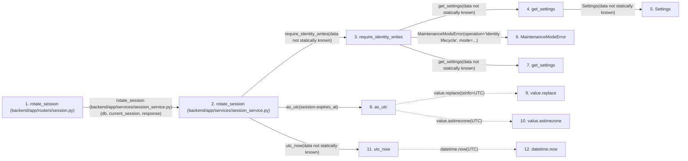

# rotate_session

**Entry point:** `rotate_session` (`http`)
**Source:** [routers_session](../modules/routers_session.md)
**Modules touched:** [authority](../modules/authority.md), [commands](../modules/commands.md), [config](../modules/config.md), [identity_service](../modules/identity_service.md), and 4 more

**Complete modules touched:**

- [authority](../modules/authority.md)
- [commands](../modules/commands.md)
- [config](../modules/config.md)
- [identity_service](../modules/identity_service.md)
- [maintenance](../modules/maintenance.md)
- [routers_session](../modules/routers_session.md)
- [session_service](../modules/session_service.md)
- [time](../modules/time.md)

## Call sequence

```mermaid
sequenceDiagram
    participant p0 as rotate_session (backend/app/routers/session.py)
    participant p1 as rotate_session (backend/app/services/session_service.py)
    participant p2 as require_identity_writes
    participant p3 as get_settings
    participant p4 as Settings
    participant p5 as MaintenanceModeError
    participant p6 as as_utc
    participant p7 as value.replace
    participant p8 as value.astimezone
    participant p9 as utc_now
    participant p10 as datetime.now
    participant p11 as AuthorityError
    participant p12 as _new_token
    participant p13 as secrets.token_urlsafe (backend/app/services/session_service.py:_new_token)
    participant p14 as secrets.token_urlsafe (backend/app/services/sess…_service.py:rotate_session)
    participant p15 as _token_digest
    participant p16 as hashlib.sha256(…).hexdigest
    participant p17 as hashlib.sha256
    participant p18 as token.encode
    participant p19 as timedelta
    participant p20 as commit_or_flush
    participant p21 as current_command
    participant p22 as getattr
    participant p23 as isinstance
    participant p24 as info.get
    participant p25 as db.flush
    participant p26 as db.commit
    p0->>p1: rotate_session (backend/app/services/session_service.py)
    p1->>p2: require_identity_writes
    p2->>p3: get_settings
    p3->>p4: Settings
    p2->>p5: MaintenanceModeError
    p2->>p3: get_settings
    p1->>p6: as_utc
    p6-->>p7: value.replace
    p6-->>p8: value.astimezone
    p1->>p9: utc_now
    p9-->>p10: datetime.now
    p1->>p11: AuthorityError
    p1->>p12: _new_token
    p12-->>p13: secrets.token_urlsafe (backend/app/services/session_service.py:_new_token)
    p1-->>p14: secrets.token_urlsafe (backend/app/services/sess…_service.py:rotate_session)
    p1->>p15: _token_digest
    p15-->>p16: hashlib.sha256(…).hexdigest
    p15-->>p17: hashlib.sha256
    p15-->>p18: token.encode
    p1->>p9: utc_now
    p1-->>p19: timedelta
    p1->>p3: get_settings
    p1->>p3: get_settings
    p1->>p20: commit_or_flush
    p20->>p21: current_command
    p21-->>p22: getattr
    p21-->>p23: isinstance
    p21-->>p24: info.get
    p20-->>p25: db.flush
    p20-->>p26: db.commit
```

<!-- Auto-generated from static call edges. Dashed arrows are external or unresolved calls. Reviewed runtime conditions and side effects belong in Behavior. -->

> Call sequence diagram shows 30 of 35 interactions; 5 omitted to keep the visualization within the 30-interaction and generated-diagram limits.

## Data flow

<!-- Auto-generated static analysis. Treat values and boundaries as best-effort hints, not runtime proof. -->

### Step data

| Step | Inputs | Reads | Writes | Returns |
|---|---|---|---|---|
| `rotate_session (backend/app/routers/session.py)` | `response: Response`, `current_session: Annotated[UserSession, Depends(session_service.get_current_session)]`, `db: Annotated[AsyncSession, Depends(get_db, scope='function')]` | - | - | `...` |
| `rotate_session (backend/app/services/session_service.py)` | `db: AsyncSession`, `session: UserSession`, `response: Response` | - | `session.csrf_token`, `session.session_token_hash`, `session.expires_at`, `options[...]` | `session` |
| `require_identity_writes` | - | - | - | - |
| `get_settings` | - | - | - | `Settings(...)` |
| `Settings` | - | - | - | - |
| `MaintenanceModeError` | - | - | - | - |
| `get_settings` | - | - | - | `Settings(...)` |
| `as_utc` | `value: datetime` | `UTC`, `UTC` | - | `value.replace(...)`, `value.astimezone(...)` |
| `value.replace` | - | - | - | - |
| `value.astimezone` | - | - | - | - |
| `utc_now` | - | `UTC` | - | `datetime.now(...)` |
| `datetime.now` | - | - | - | - |

### Call data

| From | To | Line | Call |
|---|---|---:|---|
| rotate_session (backend/app/routers/session.py) | rotate_session (backend/app/services/session_service.py) | 33 | `session_service.rotate_session(db, current_session, response)` |
| rotate_session (backend/app/services/session_service.py) | require_identity_writes | 193 | `require_identity_writes(data not statically known)` |
| require_identity_writes | get_settings | 31 | `get_settings(data not statically known)` |
| get_settings | Settings | 480 | `Settings(data not statically known)` |
| require_identity_writes | MaintenanceModeError | 32 | `MaintenanceModeError(operation='identity lifecycle', mode=...)` |
| require_identity_writes | get_settings | 32 | `get_settings(data not statically known)` |
| rotate_session (backend/app/services/session_service.py) | as_utc | 194 | `as_utc(session.expires_at)` |
| as_utc | value.replace | 24 | `value.replace(tzinfo=UTC)` |
| as_utc | value.astimezone | 25 | `value.astimezone(UTC)` |
| rotate_session (backend/app/services/session_service.py) | utc_now | 194 | `utc_now(data not statically known)` |
| utc_now | datetime.now | 13 | `datetime.now(UTC)` |

### Boundary effects

*No boundary effects detected.*

### Static analysis gaps

| Kind | Step | Target | Line |
|---|---|---|---:|
| unresolved_call | `as_utc` | `value.replace` | 24 |
| unresolved_call | `as_utc` | `value.astimezone` | 25 |
| external_call | `utc_now` | `datetime.now` | 13 |
| step_limit | `rotate_session` | `first 12 steps` | 0 |

## Behavior

This flow starts at `rotate_session` and is classified as `http`. The generated call and data-flow sections are bounded static projections; runtime conditions and side effects require source-level confirmation.
