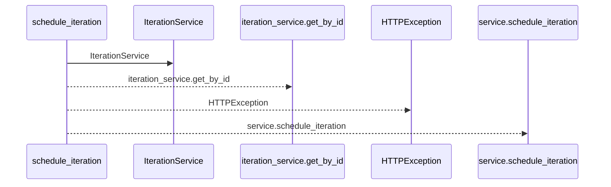
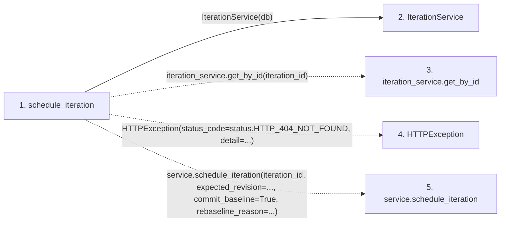

# schedule_iteration

**Entry point:** `schedule_iteration` (`http`)
**Source:** [routers_gantt](../modules/routers_gantt.md)
**Modules touched:** [iteration_service](../modules/iteration_service.md), [routers_gantt](../modules/routers_gantt.md)

## Call sequence

<!-- Auto-generated from static call edges. Dashed arrows are external or unresolved calls. Reviewed runtime conditions and side effects belong in Behavior. -->

## Data flow

<!-- Auto-generated static analysis. Treat values and boundaries as best-effort hints, not runtime proof. -->

### Step data

| Step | Inputs | Reads | Writes | Returns |
|---|---|---|---|---|
| `schedule_iteration` | `iteration_id: int`, `service: Annotated[SchedulerService, Depends(get_scheduler_service)]`, `db: Annotated[AsyncSession, Depends(get_db, scope='function')]`, `data: ScheduleApplyRequest \| None` | `status` | - | `result` |
| `IterationService` | - | - | - | - |
| `iteration_service.get_by_id` | - | - | - | - |
| `HTTPException` | - | - | - | - |
| `service.schedule_iteration` | - | - | - | - |

### Call data

| From | To | Line | Call |
|---|---|---:|---|
| schedule_iteration | IterationService | 40 | `IterationService(db)` |
| schedule_iteration | iteration_service.get_by_id | 41 | `iteration_service.get_by_id(iteration_id)` |
| schedule_iteration | HTTPException | 44 | `HTTPException(status_code=status.HTTP_404_NOT_FOUND, detail=...)` |
| schedule_iteration | service.schedule_iteration | 49 | `service.schedule_iteration(iteration_id, expected_revision=..., commit_baseline=True, rebaseline_reason=...)` |

### Boundary effects

*No boundary effects detected.*

### Static analysis gaps

| Kind | Step | Target | Line |
|---|---|---|---:|
| unresolved_call | `schedule_iteration` | `iteration_service.get_by_id` | 41 |
| external_call | `schedule_iteration` | `HTTPException` | 44 |
| unresolved_call | `schedule_iteration` | `service.schedule_iteration` | 49 |

## Behavior

This flow starts at `schedule_iteration` and is classified as `http`. The generated call and data-flow sections are bounded static projections; runtime conditions and side effects require source-level confirmation.
