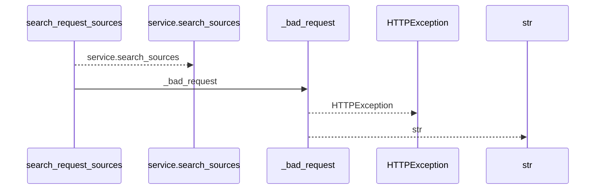
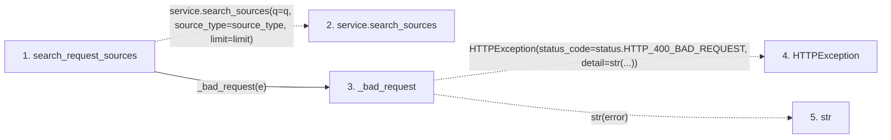

# search_request_sources

**Entry point:** `search_request_sources` (`http`)
**Source:** [request_sources](../modules/request_sources.md)
**Modules touched:** [request_sources](../modules/request_sources.md)

## Call sequence

<!-- Auto-generated from static call edges. Dashed arrows are external or unresolved calls. Reviewed runtime conditions and side effects belong in Behavior. -->

## Data flow

<!-- Auto-generated static analysis. Treat values and boundaries as best-effort hints, not runtime proof. -->

### Step data

| Step | Inputs | Reads | Writes | Returns |
|---|---|---|---|---|
| `search_request_sources` | `service: Annotated[RequestSourceService, Depends(get_request_source_service)]`, `q: Optional[str]`, `source_type: Optional[str]`, `limit: int` | `RequestSourceValidationError` | - | `...` |
| `service.search_sources` | - | - | - | - |
| `_bad_request` | `error: Exception` | `status` | - | `HTTPException(...)` |
| `HTTPException` | - | - | - | - |
| `str` | - | - | - | - |

### Call data

| From | To | Line | Call |
|---|---|---:|---|
| search_request_sources | service.search_sources | 50 | `service.search_sources(q=q, source_type=source_type, limit=limit)` |
| search_request_sources | _bad_request | 52 | `_bad_request(e)` |
| _bad_request | HTTPException | 34 | `HTTPException(status_code=status.HTTP_400_BAD_REQUEST, detail=str(...))` |
| _bad_request | str | 34 | `str(error)` |

### Boundary effects

*No boundary effects detected.*

### Static analysis gaps

| Kind | Step | Target | Line |
|---|---|---|---:|
| unresolved_call | `search_request_sources` | `service.search_sources` | 50 |
| external_call | `_bad_request` | `HTTPException` | 34 |

## Behavior

This flow starts at `search_request_sources` and is classified as `http`. The generated call and data-flow sections are bounded static projections; runtime conditions and side effects require source-level confirmation.
